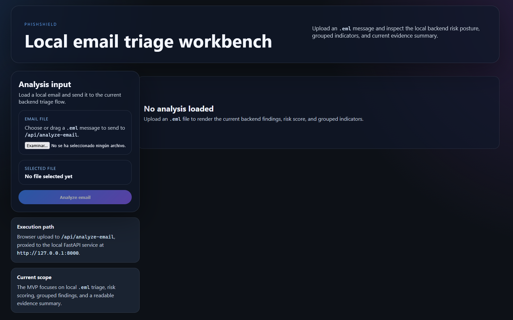
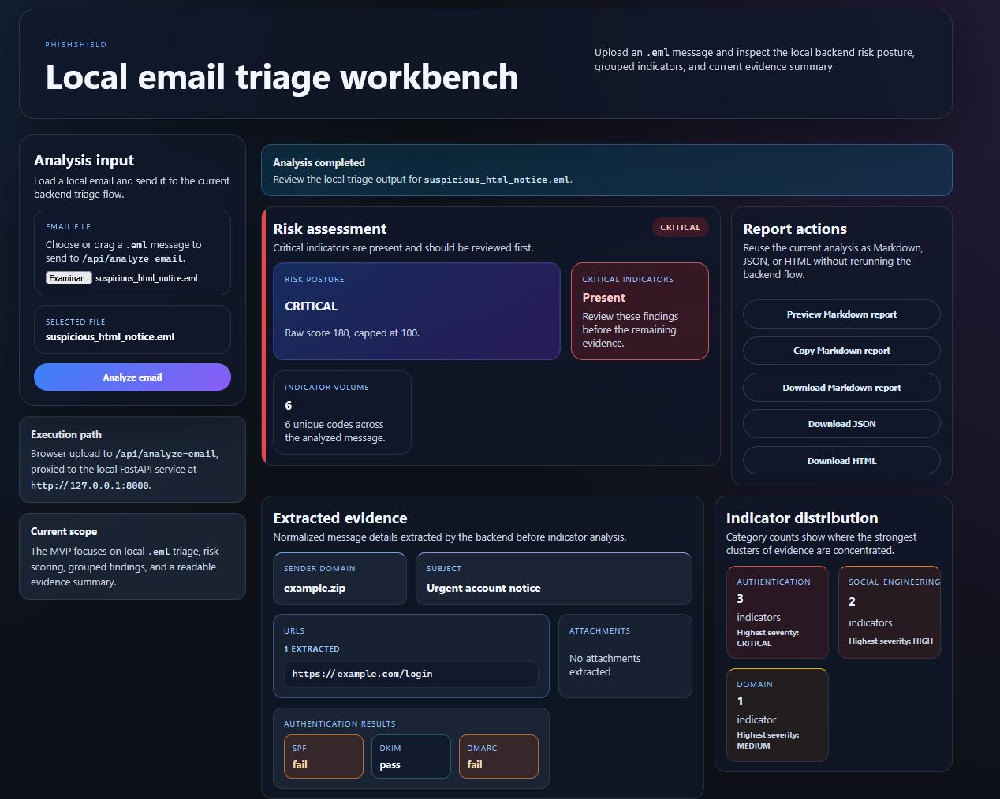
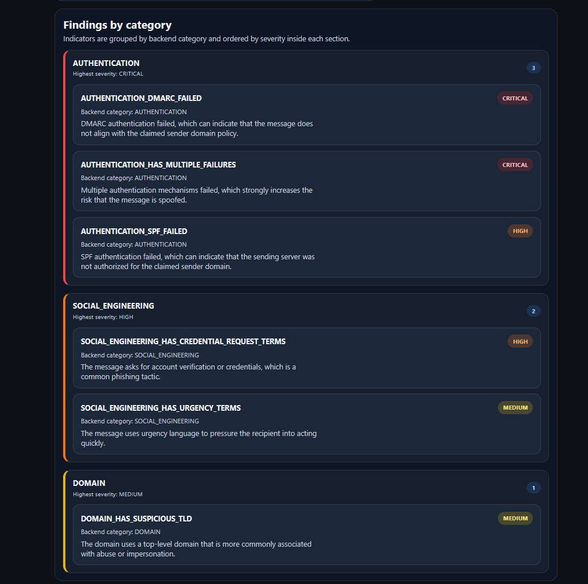
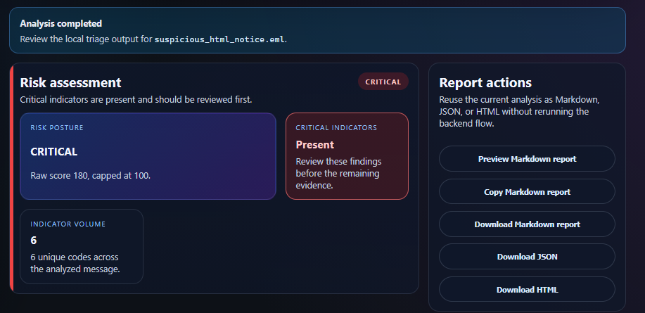
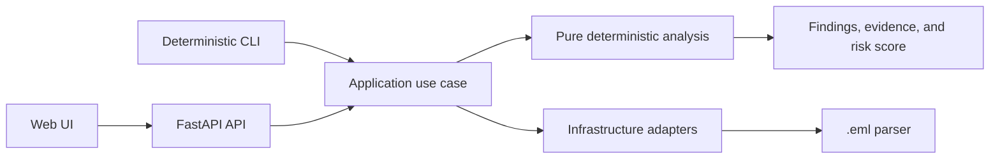

# PhishShield

**Local, explainable phishing-email triage for `.eml` files.**

PhishShield helps security analysts and help-desk teams inspect a suspicious
email before deciding whether to escalate it, report it, or investigate
further. It processes the message locally, explains the evidence behind each
finding, and produces deterministic risk and exportable reports.

**Use it when:** a user reports an email as suspicious and you need a safe,
repeatable first look at the `.eml` without opening it in a normal mail client.
It is local-first, account-free, and does not resolve links or execute
attachments.

```text
Upload .eml
    -> inspect sender, URLs, attachments, and authentication
    -> review explainable findings and deterministic risk
    -> export evidence or automate the same analysis
```

## MVP Status

The current release candidate includes:

- local deterministic `.eml` analysis;
- MIME, plain-text, and HTML email extraction;
- sender, domain, URL, attachment, authentication, and social-engineering analysis;
- explainable findings with category, severity, and evidence;
- deterministic risk scoring;
- analyst Web UI;
- FastAPI API;
- Markdown, JSON, and HTML report exports;
- single-email deterministic CLI;
- GitHub Actions artifact analysis workflow;
- one-command local Docker Compose deployment, validated in CI and manual testing.

The optional advisory model is experimental, disabled by default, and never
changes deterministic findings or `risk_score`.

## Technology Stack

| Area | Technology | Purpose |
| --- | --- | --- |
| Backend | Python, FastAPI, Pydantic | Deterministic analysis API and application flow. |
| Frontend | React, TypeScript, Vite | Analyst-oriented web interface. |
| AI advisory | scikit-learn, TF-IDF, Logistic Regression | Optional local experimental assessment. |
| Deployment | Docker, Docker Compose, GHCR | Reproducible local-first distribution. |
| Quality | pytest, Vitest, GitHub Actions, pre-commit | Automated validation and delivery safeguards. |

## Project Structure

```text
src/
  domain/          Pure analysis rules, models, and deterministic scoring.
  application/     Use cases and port contracts.
  infrastructure/  FastAPI, CLI, parsers, and technical adapters.
frontend/          React analyst workbench.
tests/             Unit, integration, frontend, and smoke tests.
docs/              Product, architecture, API, deployment, and ML documentation.
samples/           Safe synthetic .eml files for reproducible demos.
```

## Experimental AI-Assisted Assessment

PhishShield includes an optional local advisory model based on TF-IDF features
and Logistic Regression. It is experimental, disabled by default, and kept
separate from deterministic findings and `risk_score`.

The advisory flow applies a deterministic scope gate before model assessment. It
can return `benign`, `suspicious`, or `inconclusive` when a message falls
outside a supported notification family or model confidence is insufficient.
The deterministic analysis remains authoritative for findings, evidence, risk,
and CI decisions.

The model is not a universal phishing classifier, malware verdict, CI gate, or
replacement for analyst judgment. It does not resolve links, execute
attachments, or send email content to a cloud service.

The advisory model remains experimental because the project does not yet have
an authorized, representative, family-labeled, and independently validated
corpus suitable for product promotion. Real email data can contain confidential
and personal information, while public corpora may be historically limited,
non-representative, or insufficiently independent for deployment decisions.

The implementation, evaluation boundary, abstention behavior, and future
training requirements are documented in the
[experimental advisory inference closure](docs/EXPERIMENTAL_ADVISORY_INFERENCE.md),
[ML training and evaluation strategy](docs/ML_TRAINING_EVALUATION_STRATEGY.md),
and [ML dataset research](docs/ML_DATASET_RESEARCH.md).

## Analyst Workbench

The primary workflow is visual and evidence-driven:



Inspect suspicious messages before acting on them. Review sender identity,
authentication, URLs, attachments, findings, and deterministic risk in one
workspace.

### Explainable Suspicious Analysis





### Export Evidence



## Quick Start

### Try It In Two Minutes

The fastest safe evaluation uses the published release images and the synthetic
sample included in this repository. The sample contains no real credentials,
malware, or active payload.

```bash
cp .env.images.example .env
docker compose -f compose.images.yaml pull
docker compose -f compose.images.yaml up
```

On PowerShell, use `Copy-Item .env.images.example .env` instead of `cp`. Open
`http://localhost:8080`, upload
[`samples/suspicious-lookalike-domain.eml`](samples/suspicious-lookalike-domain.eml),
and review the findings and report exports.

The sample is designed to show a lookalike domain, a suspicious URL, and the
evidence used by the deterministic analysis. PhishShield reports indicators for
triage; it is not a malware verdict.

The target MVP deployment is a single command:

```bash
docker compose up --build
```

Then open:

```text
http://localhost:8080
```

The complete frontend-plus-backend Compose deployment is the RC.2 product path
and is validated in CI and manual local testing. For the current development
setup and native commands, see
[`docs/index.md`](docs/index.md).

### Run Published Images

To run the release candidate without building images locally:

```bash
cp .env.images.example .env
docker compose -f compose.images.yaml pull
docker compose -f compose.images.yaml up
```

The published images use the explicit release tag `v0.1.0-rc.2`:

- [Backend image on GHCR](https://github.com/josenieto/PhishShield/pkgs/container/phishshield-backend)
- [Frontend image on GHCR](https://github.com/josenieto/PhishShield/pkgs/container/phishshield-frontend)

See the [deployment guide](docs/DEPLOYMENT.md) for image configuration and
runtime limits. Release candidates do not use a floating `latest` tag.

For a source build instead of the published images, use `docker compose up
--build` as described below.

## CLI

Analyze one email without starting the Web UI:

```bash
phishshield analyze sample.eml
phishshield analyze sample.eml --format json
phishshield analyze sample.eml --fail-on high
```

The CLI reuses the deterministic application flow and does not invoke the
optional advisory model. Exit codes are stable:

```text
0  analysis completed and threshold not reached
1  analysis completed and --fail-on threshold reached
2  usage or argument error
3  file missing or unreadable
4  email invalid, oversized, or analysis failed
```

## Architecture



PhishShield follows a hexagonal architecture:

```text
Domain <- Application <- Infrastructure / Entrypoints
```

The analysis rules remain independent from FastAPI, Docker, the email parser,
and optional model tooling.

## Privacy And Limits

- The main analysis flow is local-first.
- The application does not resolve links, execute attachments, or render pages.
- Do not upload confidential, personal, or production email to an untrusted deployment.
- Deterministic triage is evidence, not a malware verdict.
- The advisory model is not a universal phishing classifier and is not a CI gate.
- PhishShield does not replace organizational email security controls or incident response.

## Documentation

Start with the documentation map:

```text
docs/index.md
```

Useful entry points:

- [Documentation index](docs/index.md)
- [CLI guide](docs/CLI.md)
- [API contract](docs/API.md)
- [Deployment guide](docs/DEPLOYMENT.md)
- [Release plan](docs/RC2_RELEASE_PLAN.md)
- [Public roadmap](docs/ROADMAP.md)
- [Community feedback prompt](docs/COMMUNITY_FEEDBACK.md)
- [Distribution message drafts](docs/DISTRIBUTION_MESSAGES.md)
- [Post-MVP roadmap](docs/POST_MVP_ROADMAP.md)
- [Presentation content](docs/PRESENTATION_CONTENT.md): English slide source for the public deck.
- [Presentation backup (PDF)](docs/presentation/PhishShield%20Presentation.pdf): universal offline copy of the public slides.
- [Presentation deck (PPTX)](docs/presentation/PhishShield-Presentation.pptx): editable offline copy of the public slides.

The repository also includes a safe synthetic message for the two-minute demo:
[`samples/suspicious-lookalike-domain.eml`](samples/suspicious-lookalike-domain.eml).

Release hygiene documents include the MIT license, contribution guide, security
policy, deployment guide, and public roadmap.

Technical and research documentation remains under [`docs/`](docs/), including
the ADR, scoring calibration, parser plans, and experimental advisory inference
records.

## Project Delivery

- Public repository: <https://github.com/josenieto/PhishShield>
- Published container images: [frontend on GHCR](https://github.com/josenieto/PhishShield/pkgs/container/phishshield-frontend) and [backend on GHCR](https://github.com/josenieto/PhishShield/pkgs/container/phishshield-backend).
- Presentation slides: [PhishShield Presentation on Google Slides](https://docs.google.com/presentation/d/1Uaeqi8ZDhjRx-cwRhd_XX2M-JMCT7ExWDmkYDBb4dx4/edit?usp=sharing).
- Presentation backup: [PDF](docs/presentation/PhishShield%20Presentation.pdf) and [PPTX](docs/presentation/PhishShield-Presentation.pptx).
- Project video: [Watch the TFM project video on YouTube](https://youtu.be/yPSsuH5y2OY).
- Test credentials: Not applicable. PhishShield does not require authentication.

## Community

Community suggestions and use cases are welcome through GitHub Discussions.
Maintainers retain final ownership of prioritization, scope, and delivery.
Roadmap items are directions, not delivery commitments.

## License

PhishShield is released under the MIT License.
