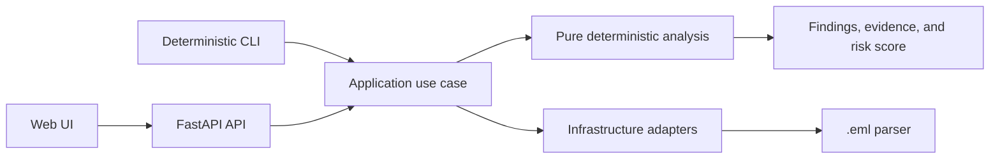

# PhishShield

**Local, explainable phishing-email triage for `.eml` files.**

PhishShield helps IT and security analysts inspect a suspicious email before
deciding whether to escalate it, report it, or investigate further. It extracts
email evidence locally and presents deterministic findings, severity, and risk
in an analyst-focused workspace.

```text
Upload .eml
    -> inspect sender, URLs, attachments, and authentication
    -> review explainable findings and deterministic risk
    -> export evidence or automate the same analysis
```

## MVP Status

The current release candidate includes:

- local deterministic `.eml` analysis;
- MIME, plain-text, and HTML email extraction;
- sender, domain, URL, attachment, authentication, and social-engineering analysis;
- explainable findings with category, severity, and evidence;
- deterministic risk scoring;
- analyst Web UI;
- FastAPI API;
- Markdown, JSON, and HTML report exports;
- single-email deterministic CLI;
- GitHub Actions artifact analysis workflow;
- local Docker Compose deployment under preparation for `v0.1.0-rc.2`.

The optional advisory model is experimental, disabled by default, and never
changes deterministic findings or `risk_score`.

## Quick Start

The target MVP deployment is a single command:

```bash
docker compose up --build
```

Then open:

```text
http://localhost:8080
```

The complete frontend-plus-backend Compose deployment is part of the RC.2
release work. For the current development setup and native commands, see
[`doc/index.md`](doc/index.md).

## CLI

Analyze one email without starting the Web UI:

```bash
phishshield analyze sample.eml
phishshield analyze sample.eml --format json
phishshield analyze sample.eml --fail-on high
```

The CLI reuses the deterministic application flow and does not invoke the
optional advisory model. Exit codes are stable:

```text
0  analysis completed and threshold not reached
1  analysis completed and --fail-on threshold reached
2  usage or argument error
3  file missing or unreadable
4  email invalid, oversized, or analysis failed
```

## Architecture



PhishShield follows a hexagonal architecture:

```text
Domain <- Application <- Infrastructure / Entrypoints
```

The analysis rules remain independent from FastAPI, Docker, the email parser,
and optional model tooling.

## Privacy And Limits

- The main analysis flow is local-first.
- The application does not resolve links, execute attachments, or render pages.
- Do not upload confidential, personal, or production email to an untrusted deployment.
- Deterministic triage is evidence, not a malware verdict.
- The advisory model is not a universal phishing classifier and is not a CI gate.
- PhishShield does not replace organizational email security controls or incident response.

## Documentation

Start with the documentation map:

```text
doc/index.md
```

Useful entry points:

- [Documentation index](doc/index.md)
- [CLI guide](doc/CLI.md)
- [API contract](doc/API.md)
- [Deployment guide](doc/DEPLOYMENT.md)
- [Release plan](doc/RC2_RELEASE_PLAN.md)
- [Public roadmap](doc/ROADMAP.md)
- [Post-MVP roadmap](doc/POST_MVP_ROADMAP.md)

Release hygiene documents, including the MIT license, contribution guide,
security policy, and deployment guide, are part of the RC.2 completion work.

Technical and research documentation remains under [`doc/`](doc/), including
the ADR, scoring calibration, parser plans, and experimental advisory inference
records.

## Community

Community suggestions and use cases are welcome through GitHub Discussions.
Maintainers retain final ownership of prioritization, scope, and delivery.
Roadmap items are directions, not delivery commitments.

## License

PhishShield is intended to be released under the MIT License as part of the
`v0.1.0-rc.2` release preparation.
