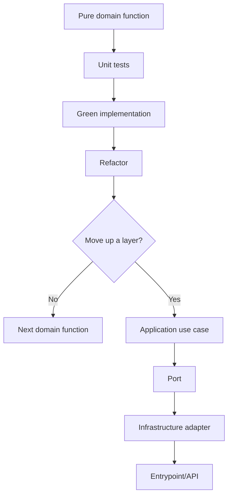
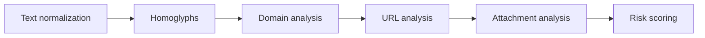

# Engineering Journey

## Purpose

This document records meaningful engineering steps in PhishShield.

It is not a changelog and it should not duplicate every commit.  
Its goal is to preserve architectural reasoning, TDD cycles, layer progression, and key decisions so the project can be reviewed visually and reused as a learning reference for future projects.

---

## When to add an entry

Add an entry when a relevant engineering step occurs, such as:

- completing a TDD cycle;
- making an architectural decision;
- deciding not to move up a layer;
- creating a new domain function group;
- adding a new port;
- adding a new adapter;
- introducing a new use case;
- changing folder architecture;
- adding a new project skill;
- creating or changing a testing strategy;
- making an important rejection decision.

Do not document every small code edit. Document meaningful engineering steps that explain how the project evolves.

---

## Entry template

```md
## YYYY-MM-DD - [Short title]

Type: TDD | Architecture | Testing | Skill | Documentation | Refactor  
Layer: Domain | Application | Infrastructure | Entrypoint | Cross-cutting  
Status: Proposed | Done | Rejected | Deferred

### Context

Why this step happened.

### Decision

What was decided or completed.

### Files changed

- ...

### Tests

Command:

```bash
...
```

Result:

```text
...
```

### Next step

...
```

---

## Architecture progression map



---

## Domain roadmap



---

## 2026-06-23 - Invisible character helpers TDD cycle

Type: TDD  
Layer: Domain  
Status: Done

### Context

The first production code snippet was intentionally kept small and pure.  
The selected domain group was `Text normalization`, starting with suspicious invisible Unicode characters.

The goal was to establish the first TDD cycle before moving to additional domain functions or upper layers.

### Decision

Implemented two pure domain helpers:

```python
contains_invisible_chars(text: str) -> bool
strip_invisible_chars(text: str) -> str
```

No ports were created because the functions are pure, deterministic, synchronous, and dependency-free.  
No Application use case was created yet because there is no higher-level workflow consuming the full text normalization group.

### Files changed

- `tests/unit/domain/services/text_normalization/test_invisible_characters.py`
- `src/domain/services/text_normalization/invisible_characters.py`
- `pytest.ini`

### TDD flow

```text
RED      -> ModuleNotFoundError: No module named 'domain'
GREEN    -> 13 tests passed
REFACTOR -> renamed constant and added docstrings
```

### Tests

Command:

```bash
python -m pytest tests/unit/domain/services/text_normalization/test_invisible_characters.py
```

Result:

```text
13 passed
```

### Next step

Continue the same domain group with:

```python
normalize_whitespace(text: str) -> str
```

Start with RED tests before implementation.

---

## 2026-06-23 - Whitespace normalization TDD cycle

Type: TDD  
Layer: Domain  
Status: Done

### Context

The project continued the `Text normalization` domain group after completing invisible character helpers.

The goal was to add another pure, dependency-free text normalization helper while preserving the TDD workflow.

### Decision

Implemented one pure domain helper:

```python
normalize_whitespace(text: str) -> str
```

No ports were created because the function is pure, deterministic, synchronous, and dependency-free.  
No Application use case was created yet because the text normalization group is still being completed inside the Domain layer.

### Files changed

- `tests/unit/domain/services/text_normalization/test_whitespace_normalization.py`
- `src/domain/services/text_normalization/whitespace.py`

### TDD flow

```text
RED      -> ModuleNotFoundError: No module named 'domain.services.text_normalization.whitespace'
GREEN    -> 8 tests passed
REFACTOR -> added docstring
```

### Tests

Command:

```bash
python -m pytest tests/unit/domain/services/text_normalization/test_whitespace_normalization.py
```

Result:

```text
8 passed
```

### Next step

Continue the same domain group with:

```python
normalize_unicode_text(text: str) -> str
```

Start with RED tests before implementation.

---

## 2026-06-23 - Unicode text normalization TDD cycle

Type: TDD  
Layer: Domain  
Status: Done

### Context

The project continued the `Text normalization` domain group after completing whitespace normalization.

The goal was to add Unicode normalization as a pure, deterministic helper before moving to suspicious Unicode or homoglyph detection rules.

### Decision

Implemented one pure domain helper:

```python
normalize_unicode_text(text: str) -> str
```

The function uses Python standard library Unicode NFKC compatibility normalization to normalize visually different but compatible text forms while preserving readable content.

No ports were created because the function is pure, deterministic, synchronous, and dependency-free.  
No Application use case was created yet because there is no higher-level workflow consuming the full text normalization group.

### Files changed

- `tests/unit/domain/services/text_normalization/test_unicode_normalization.py`
- `src/domain/services/text_normalization/unicode_text.py`
- `doc/ENGINEERING_JOURNEY.md`

### TDD flow

```text
RED      -> ModuleNotFoundError: No module named 'domain.services.text_normalization.unicode_text'
GREEN    -> 6 tests passed
REFACTOR -> added docstring
```

### Tests

Command:

```bash
python -m pytest tests/unit/domain/services/text_normalization/test_unicode_normalization.py
```

Result:

```text
6 passed
```

Command:

```bash
python -m pytest tests/unit/domain/services/text_normalization
```

Result:

```text
27 passed
```

### Next step

Continue the domain roadmap with the `Homoglyphs / suspicious Unicode` group, starting with a small TDD cycle for script detection or mixed-script detection.

---

## 2026-06-23 - Unicode script detection TDD cycle

Type: TDD  
Layer: Domain  
Status: Done

### Context

The project moved from the `Text normalization` domain group to the `Homoglyphs / suspicious Unicode` group.

The goal was to start detecting phishing-relevant Unicode script usage before implementing mixed-script or confusable-character rules.

### Decision

Implemented one pure domain helper:

```python
detect_unicode_scripts(text: str) -> set[str]
```

The function detects Latin, Cyrillic, and Greek script ranges using internal Unicode codepoint checks. Numbers, punctuation, hyphens, dots, and other neutral characters do not add scripts.

No ports were created because the function is pure, deterministic, synchronous, and dependency-free.  
No Application use case was created yet because the suspicious Unicode domain group is still being built from pure functions.

### Files changed

- `tests/unit/domain/services/homoglyphs/test_script_detection.py`
- `src/domain/services/homoglyphs/scripts.py`
- `doc/ENGINEERING_JOURNEY.md`

### TDD flow

```text
RED      -> ModuleNotFoundError: No module named 'domain.services.homoglyphs'
GREEN    -> 7 tests passed
REFACTOR -> not needed
```

### Tests

Command:

```bash
python -m pytest tests/unit/domain/services/homoglyphs/test_script_detection.py
```

Result:

```text
7 passed
```

Command:

```bash
python -m pytest
```

Result:

```text
34 passed
```

### Next step

Continue the same domain group with:

```python
contains_mixed_scripts(text: str) -> bool
```

Start with RED tests and reuse `detect_unicode_scripts` internally if the contract remains suitable.

---

## 2026-06-23 - Mixed Unicode script detection TDD cycle

Type: TDD  
Layer: Domain  
Status: Done

### Context

The project continued the `Homoglyphs / suspicious Unicode` domain group after adding Unicode script detection.

The goal was to create a pure domain rule that flags text containing more than one relevant Unicode script, a common signal in homoglyph phishing attempts.

### Decision

Implemented one pure domain helper:

```python
contains_mixed_scripts(text: str) -> bool
```

The function reuses `detect_unicode_scripts` and returns `True` when more than one relevant script is present. Neutral characters such as digits, punctuation, dots, and hyphens do not cause mixed-script detection by themselves.

No ports were created because the function is pure, deterministic, synchronous, and dependency-free.  
No Application use case was created yet because the suspicious Unicode domain group is still being completed inside the Domain layer.

### Files changed

- `tests/unit/domain/services/homoglyphs/test_script_detection.py`
- `src/domain/services/homoglyphs/scripts.py`
- `doc/ENGINEERING_JOURNEY.md`

### TDD flow

```text
RED      -> ImportError: cannot import name 'contains_mixed_scripts'
GREEN    -> 15 tests passed
REFACTOR -> not needed
```

### Tests

Command:

```bash
python -m pytest tests/unit/domain/services/homoglyphs/test_script_detection.py
```

Result:

```text
15 passed
```

Command:

```bash
python -m pytest
```

Result:

```text
42 passed
```

### Next step

Continue the same domain group with:

```python
contains_confusable_characters(text: str) -> bool
```

Start with RED tests and a minimal internal table for phishing-relevant confusable characters.

---

## 2026-06-23 - Confusable character detection TDD cycle

Type: TDD  
Layer: Domain  
Status: Done

### Context

The project continued the `Homoglyphs / suspicious Unicode` domain group after mixed-script detection.

The goal was to detect a small, explicit set of phishing-relevant Unicode characters that visually resemble common Latin characters.

### Decision

Implemented one pure domain helper:

```python
contains_confusable_characters(text: str) -> bool
```

The function uses a minimal internal table for Cyrillic and Greek characters commonly used in homoglyph-style phishing attempts. The table is intentionally small and dependency-free at this stage.

No ports were created because the function is pure, deterministic, synchronous, and dependency-free.  
No Application use case was created yet because the suspicious Unicode domain group is still being completed inside the Domain layer.

### Files changed

- `tests/unit/domain/services/homoglyphs/test_confusable_characters.py`
- `src/domain/services/homoglyphs/confusables.py`
- `doc/ENGINEERING_JOURNEY.md`

### TDD flow

```text
RED      -> ModuleNotFoundError: No module named 'domain.services.homoglyphs.confusables'
GREEN    -> 9 tests passed
REFACTOR -> not needed
```

### Tests

Command:

```bash
python -m pytest tests/unit/domain/services/homoglyphs/test_confusable_characters.py
```

Result:

```text
9 passed
```

Command:

```bash
python -m pytest
```

Result:

```text
51 passed
```

### Next step

Continue the same domain group with:

```python
find_confusable_characters(text: str) -> list[str]
```

Start with RED tests and preserve discovery order in the returned list.

---

## 2026-06-23 - Confusable character discovery TDD cycle

Type: TDD  
Layer: Domain  
Status: Done

### Context

The project continued the `Homoglyphs / suspicious Unicode` domain group after adding confusable character detection.

The goal was to expose the actual suspicious characters found in text, not only a boolean flag, so later application-level analysis can report concrete evidence.

### Decision

Implemented one pure domain helper:

```python
find_confusable_characters(text: str) -> list[str]
```

The function returns phishing-relevant confusable characters in discovery order and preserves duplicates. This supports later reporting without introducing application-level models prematurely.

`contains_confusable_characters` now reuses `find_confusable_characters` so the filtering logic has a single source of truth.

No ports were created because the function is pure, deterministic, synchronous, and dependency-free.  
No Application use case was created yet; the next step is an architectural checkpoint to decide whether the suspicious Unicode group is stable enough to move upward.

### Files changed

- `tests/unit/domain/services/homoglyphs/test_confusable_characters.py`
- `src/domain/services/homoglyphs/confusables.py`
- `doc/ENGINEERING_JOURNEY.md`

### TDD flow

```text
RED      -> ImportError: cannot import name 'find_confusable_characters'
GREEN    -> 14 tests passed
REFACTOR -> contains_confusable_characters reuses find_confusable_characters
```

### Tests

Command:

```bash
python -m pytest tests/unit/domain/services/homoglyphs/test_confusable_characters.py
```

Result:

```text
14 passed
```

Command:

```bash
python -m pytest
```

Result:

```text
56 passed
```

### Next step

Run an architectural checkpoint for the completed `Homoglyphs / suspicious Unicode` domain group and decide whether to introduce an Application use case or continue with the next pure domain group.

---

## 2026-06-23 - Domain label splitting TDD cycle

Type: TDD  
Layer: Domain  
Status: Done

### Context

The project continued with the next pure domain group after completing the initial `Homoglyphs / suspicious Unicode` helpers.

The goal was to start `Domain analysis` with a small deterministic helper for splitting host or domain text into meaningful labels before adding Punycode or structural domain rules.

### Decision

Implemented one pure domain helper:

```python
split_domain_labels(domain: str) -> list[str]
```

The function trims surrounding whitespace, removes leading and trailing dots, splits by `.`, and ignores empty labels caused by repeated dots. This keeps the function tolerant and useful for later forensic rules without performing DNS validation or IO.

No ports were created because the function is pure, deterministic, synchronous, and dependency-free.  
No Application use case was created yet because the `Domain analysis` group is just starting and its contracts are not stable enough to move upward.

### Files changed

- `tests/unit/domain/services/domain_analysis/test_domain_labels.py`
- `src/domain/services/domain_analysis/domains.py`
- `doc/ENGINEERING_JOURNEY.md`

### TDD flow

```text
RED      -> ModuleNotFoundError: No module named 'domain.services.domain_analysis'
GREEN    -> 6 tests passed
REFACTOR -> not needed
```

### Tests

Command:

```bash
python -m pytest tests/unit/domain/services/domain_analysis/test_domain_labels.py
```

Result:

```text
6 passed
```

Command:

```bash
python -m pytest
```

Result:

```text
62 passed
```

### Next step

Continue the same domain group with:

```python
is_punycode_label(label: str) -> bool
```

Start with RED tests and keep the implementation pure and dependency-free.
