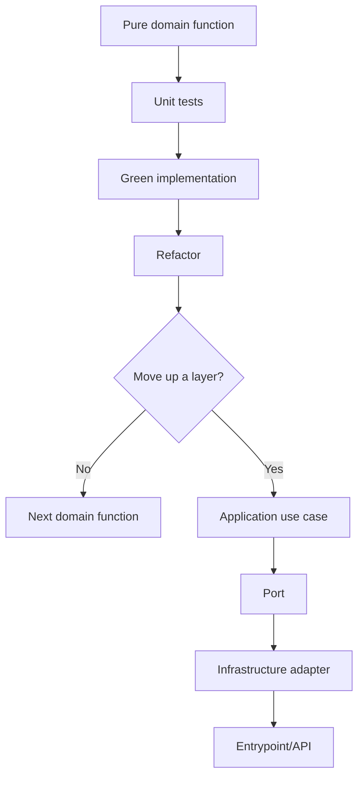
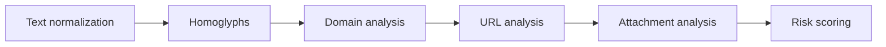

# Engineering Journey

## Purpose

This document records meaningful engineering steps in PhishShield.

It is not a changelog and it should not duplicate every commit.
Its goal is to preserve architectural reasoning, TDD cycles, layer progression, and key decisions so the project can be reviewed visually and reused as a learning reference for future projects.

---

## When to add an entry

Add an entry when a relevant engineering step occurs, such as:

- completing a TDD cycle;
- making an architectural decision;
- deciding not to move up a layer;
- creating a new domain function group;
- adding a new port;
- adding a new adapter;
- introducing a new use case;
- changing folder architecture;
- adding a new project skill;
- creating or changing a testing strategy;
- making an important rejection decision.

Do not document every small code edit. Document meaningful engineering steps that explain how the project evolves.

---

## Entry template

```md
## YYYY-MM-DD - [Short title]

Type: TDD | Architecture | Testing | Skill | Documentation | Refactor
Layer: Domain | Application | Infrastructure | Entrypoint | Cross-cutting
Status: Proposed | Done | Rejected | Deferred

### Context

Why this step happened.

### Decision

What was decided or completed.

### Files changed

- ...

### Tests

Command:

```bash
...
```

Result:

```text
...
```

### Next step

...
```

---

## Architecture progression map



---

## Domain roadmap



---

## 2026-06-23 - Invisible character helpers TDD cycle

Type: TDD
Layer: Domain
Status: Done

### Context

The first production code snippet was intentionally kept small and pure.
The selected domain group was `Text normalization`, starting with suspicious invisible Unicode characters.

The goal was to establish the first TDD cycle before moving to additional domain functions or upper layers.

### Decision

Implemented two pure domain helpers:

```python
contains_invisible_chars(text: str) -> bool
strip_invisible_chars(text: str) -> str
```

No ports were created because the functions are pure, deterministic, synchronous, and dependency-free.
No Application use case was created yet because there is no higher-level workflow consuming the full text normalization group.

### Files changed

- `tests/unit/domain/services/text_normalization/test_invisible_characters.py`
- `src/domain/services/text_normalization/invisible_characters.py`
- `pytest.ini`

### TDD flow

```text
RED      -> ModuleNotFoundError: No module named 'domain'
GREEN    -> 13 tests passed
REFACTOR -> renamed constant and added docstrings
```

### Tests

Command:

```bash
python -m pytest tests/unit/domain/services/text_normalization/test_invisible_characters.py
```

Result:

```text
13 passed
```

### Next step

Continue the same domain group with:

```python
normalize_whitespace(text: str) -> str
```

Start with RED tests before implementation.

---

## 2026-06-23 - Whitespace normalization TDD cycle

Type: TDD
Layer: Domain
Status: Done

### Context

The project continued the `Text normalization` domain group after completing invisible character helpers.

The goal was to add another pure, dependency-free text normalization helper while preserving the TDD workflow.

### Decision

Implemented one pure domain helper:

```python
normalize_whitespace(text: str) -> str
```

No ports were created because the function is pure, deterministic, synchronous, and dependency-free.
No Application use case was created yet because the text normalization group is still being completed inside the Domain layer.

### Files changed

- `tests/unit/domain/services/text_normalization/test_whitespace_normalization.py`
- `src/domain/services/text_normalization/whitespace.py`

### TDD flow

```text
RED      -> ModuleNotFoundError: No module named 'domain.services.text_normalization.whitespace'
GREEN    -> 8 tests passed
REFACTOR -> added docstring
```

### Tests

Command:

```bash
python -m pytest tests/unit/domain/services/text_normalization/test_whitespace_normalization.py
```

Result:

```text
8 passed
```

### Next step

Continue the same domain group with:

```python
normalize_unicode_text(text: str) -> str
```

Start with RED tests before implementation.

---

## 2026-06-23 - Unicode text normalization TDD cycle

Type: TDD
Layer: Domain
Status: Done

### Context

The project continued the `Text normalization` domain group after completing whitespace normalization.

The goal was to add Unicode normalization as a pure, deterministic helper before moving to suspicious Unicode or homoglyph detection rules.

### Decision

Implemented one pure domain helper:

```python
normalize_unicode_text(text: str) -> str
```

The function uses Python standard library Unicode NFKC compatibility normalization to normalize visually different but compatible text forms while preserving readable content.

No ports were created because the function is pure, deterministic, synchronous, and dependency-free.
No Application use case was created yet because there is no higher-level workflow consuming the full text normalization group.

### Files changed

- `tests/unit/domain/services/text_normalization/test_unicode_normalization.py`
- `src/domain/services/text_normalization/unicode_text.py`
- `doc/ENGINEERING_JOURNEY.md`

### TDD flow

```text
RED      -> ModuleNotFoundError: No module named 'domain.services.text_normalization.unicode_text'
GREEN    -> 6 tests passed
REFACTOR -> added docstring
```

### Tests

Command:

```bash
python -m pytest tests/unit/domain/services/text_normalization/test_unicode_normalization.py
```

Result:

```text
6 passed
```

Command:

```bash
python -m pytest tests/unit/domain/services/text_normalization
```

Result:

```text
27 passed
```

### Next step

Continue the domain roadmap with the `Homoglyphs / suspicious Unicode` group, starting with a small TDD cycle for script detection or mixed-script detection.

---

## 2026-06-23 - Unicode script detection TDD cycle

Type: TDD
Layer: Domain
Status: Done

### Context

The project moved from the `Text normalization` domain group to the `Homoglyphs / suspicious Unicode` group.

The goal was to start detecting phishing-relevant Unicode script usage before implementing mixed-script or confusable-character rules.

### Decision

Implemented one pure domain helper:

```python
detect_unicode_scripts(text: str) -> set[str]
```

The function detects Latin, Cyrillic, and Greek script ranges using internal Unicode codepoint checks. Numbers, punctuation, hyphens, dots, and other neutral characters do not add scripts.

No ports were created because the function is pure, deterministic, synchronous, and dependency-free.
No Application use case was created yet because the suspicious Unicode domain group is still being built from pure functions.

### Files changed

- `tests/unit/domain/services/homoglyphs/test_script_detection.py`
- `src/domain/services/homoglyphs/scripts.py`
- `doc/ENGINEERING_JOURNEY.md`

### TDD flow

```text
RED      -> ModuleNotFoundError: No module named 'domain.services.homoglyphs'
GREEN    -> 7 tests passed
REFACTOR -> not needed
```

### Tests

Command:

```bash
python -m pytest tests/unit/domain/services/homoglyphs/test_script_detection.py
```

Result:

```text
7 passed
```

Command:

```bash
python -m pytest
```

Result:

```text
34 passed
```

### Next step

Continue the same domain group with:

```python
contains_mixed_scripts(text: str) -> bool
```

Start with RED tests and reuse `detect_unicode_scripts` internally if the contract remains suitable.

---

## 2026-06-23 - Mixed Unicode script detection TDD cycle

Type: TDD
Layer: Domain
Status: Done

### Context

The project continued the `Homoglyphs / suspicious Unicode` domain group after adding Unicode script detection.

The goal was to create a pure domain rule that flags text containing more than one relevant Unicode script, a common signal in homoglyph phishing attempts.

### Decision

Implemented one pure domain helper:

```python
contains_mixed_scripts(text: str) -> bool
```

The function reuses `detect_unicode_scripts` and returns `True` when more than one relevant script is present. Neutral characters such as digits, punctuation, dots, and hyphens do not cause mixed-script detection by themselves.

No ports were created because the function is pure, deterministic, synchronous, and dependency-free.
No Application use case was created yet because the suspicious Unicode domain group is still being completed inside the Domain layer.

### Files changed

- `tests/unit/domain/services/homoglyphs/test_script_detection.py`
- `src/domain/services/homoglyphs/scripts.py`
- `doc/ENGINEERING_JOURNEY.md`

### TDD flow

```text
RED      -> ImportError: cannot import name 'contains_mixed_scripts'
GREEN    -> 15 tests passed
REFACTOR -> not needed
```

### Tests

Command:

```bash
python -m pytest tests/unit/domain/services/homoglyphs/test_script_detection.py
```

Result:

```text
15 passed
```

Command:

```bash
python -m pytest
```

Result:

```text
42 passed
```

### Next step

Continue the same domain group with:

```python
contains_confusable_characters(text: str) -> bool
```

Start with RED tests and a minimal internal table for phishing-relevant confusable characters.

---

## 2026-06-23 - Confusable character detection TDD cycle

Type: TDD
Layer: Domain
Status: Done

### Context

The project continued the `Homoglyphs / suspicious Unicode` domain group after mixed-script detection.

The goal was to detect a small, explicit set of phishing-relevant Unicode characters that visually resemble common Latin characters.

### Decision

Implemented one pure domain helper:

```python
contains_confusable_characters(text: str) -> bool
```

The function uses a minimal internal table for Cyrillic and Greek characters commonly used in homoglyph-style phishing attempts. The table is intentionally small and dependency-free at this stage.

No ports were created because the function is pure, deterministic, synchronous, and dependency-free.
No Application use case was created yet because the suspicious Unicode domain group is still being completed inside the Domain layer.

### Files changed

- `tests/unit/domain/services/homoglyphs/test_confusable_characters.py`
- `src/domain/services/homoglyphs/confusables.py`
- `doc/ENGINEERING_JOURNEY.md`

### TDD flow

```text
RED      -> ModuleNotFoundError: No module named 'domain.services.homoglyphs.confusables'
GREEN    -> 9 tests passed
REFACTOR -> not needed
```

### Tests

Command:

```bash
python -m pytest tests/unit/domain/services/homoglyphs/test_confusable_characters.py
```

Result:

```text
9 passed
```

Command:

```bash
python -m pytest
```

Result:

```text
51 passed
```

### Next step

Continue the same domain group with:

```python
find_confusable_characters(text: str) -> list[str]
```

Start with RED tests and preserve discovery order in the returned list.

---

## 2026-06-23 - Confusable character discovery TDD cycle

Type: TDD
Layer: Domain
Status: Done

### Context

The project continued the `Homoglyphs / suspicious Unicode` domain group after adding confusable character detection.

The goal was to expose the actual suspicious characters found in text, not only a boolean flag, so later application-level analysis can report concrete evidence.

### Decision

Implemented one pure domain helper:

```python
find_confusable_characters(text: str) -> list[str]
```

The function returns phishing-relevant confusable characters in discovery order and preserves duplicates. This supports later reporting without introducing application-level models prematurely.

`contains_confusable_characters` now reuses `find_confusable_characters` so the filtering logic has a single source of truth.

No ports were created because the function is pure, deterministic, synchronous, and dependency-free.
No Application use case was created yet; the next step is an architectural checkpoint to decide whether the suspicious Unicode group is stable enough to move upward.

### Files changed

- `tests/unit/domain/services/homoglyphs/test_confusable_characters.py`
- `src/domain/services/homoglyphs/confusables.py`
- `doc/ENGINEERING_JOURNEY.md`

### TDD flow

```text
RED      -> ImportError: cannot import name 'find_confusable_characters'
GREEN    -> 14 tests passed
REFACTOR -> contains_confusable_characters reuses find_confusable_characters
```

### Tests

Command:

```bash
python -m pytest tests/unit/domain/services/homoglyphs/test_confusable_characters.py
```

Result:

```text
14 passed
```

Command:

```bash
python -m pytest
```

Result:

```text
56 passed
```

### Next step

Run an architectural checkpoint for the completed `Homoglyphs / suspicious Unicode` domain group and decide whether to introduce an Application use case or continue with the next pure domain group.

---

## 2026-06-23 - Domain label splitting TDD cycle

Type: TDD
Layer: Domain
Status: Done

### Context

The project continued with the next pure domain group after completing the initial `Homoglyphs / suspicious Unicode` helpers.

The goal was to start `Domain analysis` with a small deterministic helper for splitting host or domain text into meaningful labels before adding Punycode or structural domain rules.

### Decision

Implemented one pure domain helper:

```python
split_domain_labels(domain: str) -> list[str]
```

The function trims surrounding whitespace, removes leading and trailing dots, splits by `.`, and ignores empty labels caused by repeated dots. This keeps the function tolerant and useful for later forensic rules without performing DNS validation or IO.

No ports were created because the function is pure, deterministic, synchronous, and dependency-free.
No Application use case was created yet because the `Domain analysis` group is just starting and its contracts are not stable enough to move upward.

### Files changed

- `tests/unit/domain/services/domain_analysis/test_domain_labels.py`
- `src/domain/services/domain_analysis/domains.py`
- `doc/ENGINEERING_JOURNEY.md`

### TDD flow

```text
RED      -> ModuleNotFoundError: No module named 'domain.services.domain_analysis'
GREEN    -> 6 tests passed
REFACTOR -> not needed
```

### Tests

Command:

```bash
python -m pytest tests/unit/domain/services/domain_analysis/test_domain_labels.py
```

Result:

```text
6 passed
```

Command:

```bash
python -m pytest
```

Result:

```text
62 passed
```

### Next step

Continue the same domain group with:

```python
is_punycode_label(label: str) -> bool
```

Start with RED tests and keep the implementation pure and dependency-free.

---

## 2026-06-25 - Punycode label detection TDD cycle

Type: TDD
Layer: Domain
Status: Done

### Context

The project continued the `Domain analysis` group after adding domain label splitting.

The goal was to add a pure helper for recognizing domain labels that use the Punycode `xn--` prefix before implementing full-domain Punycode detection.

### Decision

Implemented one pure domain helper:

```python
is_punycode_label(label: str) -> bool
```

The function checks whether a single domain label starts with the Punycode prefix in a case-insensitive way. It does not decode IDNA, validate DNS, resolve domains, or perform IO.

No ports were created because the function is pure, deterministic, synchronous, and dependency-free.
No Application use case was created yet because the `Domain analysis` group is still being built from pure helpers.

### Files changed

- `tests/unit/domain/services/domain_analysis/test_domain_labels.py`
- `src/domain/services/domain_analysis/domains.py`
- `doc/ENGINEERING_JOURNEY.md`

### TDD flow

```text
RED      -> Tests added for missing is_punycode_label behavior
GREEN    -> 14 tests passed
REFACTOR -> not needed
```

### Tests

Command:

```bash
python -m pytest tests/unit/domain/services/domain_analysis/test_domain_labels.py
```

Result:

```text
14 passed
```

Command:

```bash
python -m pytest
```

Result:

```text
70 passed
```

### Next step

Continue the same domain group with:

```python
contains_punycode(domain: str) -> bool
```

Start with RED tests and reuse `split_domain_labels` and `is_punycode_label` internally if the contracts remain suitable.

---

## 2026-06-25 - Domain Punycode detection TDD cycle

Type: TDD
Layer: Domain
Status: Done

### Context

The project continued the `Domain analysis` group after adding single-label Punycode detection.

The goal was to detect whether any meaningful label in a domain uses the Punycode `xn--` prefix while keeping the behavior pure and dependency-free.

### Decision

Implemented one pure domain helper:

```python
contains_punycode(domain: str) -> bool
```

The function reuses `split_domain_labels` and `is_punycode_label` so domain splitting and label-level Punycode detection remain single-purpose helpers. It does not decode IDNA, validate DNS, resolve domains, or perform IO.

No ports were created because the function is pure, deterministic, synchronous, and dependency-free.
No Application use case was created yet because the `Domain analysis` group is still being completed inside the Domain layer.

### Files changed

- `tests/unit/domain/services/domain_analysis/test_domain_labels.py`
- `src/domain/services/domain_analysis/domains.py`
- `doc/ENGINEERING_JOURNEY.md`

### TDD flow

```text
RED      -> ImportError: cannot import name 'contains_punycode'
GREEN    -> 21 tests passed
REFACTOR -> not needed
```

### Tests

Command:

```bash
python -m pytest tests/unit/domain/services/domain_analysis/test_domain_labels.py
```

Result:

```text
21 passed
```

Command:

```bash
python -m pytest
```

Result:

```text
77 passed
```

### Next step

Continue the same domain group with:

```python
has_suspicious_subdomain_depth(domain: str, max_depth: int = 4) -> bool
```

Start with RED tests and reuse `split_domain_labels` if the contract remains suitable.

---

## 2026-06-25 - Suspicious subdomain depth TDD cycle

Type: TDD
Layer: Domain
Status: Done

### Context

The project continued the `Domain analysis` group after adding domain-level Punycode detection.

The goal was to add a pure helper for detecting domains with unusually deep label structures before moving to IP-like host or suspicious TLD rules.

### Decision

Implemented one pure domain helper:

```python
has_suspicious_subdomain_depth(domain: str, max_depth: int = 4) -> bool
```

The function reuses `split_domain_labels` and returns `True` when the number of meaningful labels is greater than `max_depth`. It intentionally does not use public suffix lists, DNS lookups, or external services.

No ports were created because the function is pure, deterministic, synchronous, and dependency-free.
No Application use case was created yet because the `Domain analysis` group still has host-shape and TLD helpers pending.

### Files changed

- `tests/unit/domain/services/domain_analysis/test_domain_labels.py`
- `src/domain/services/domain_analysis/domains.py`
- `doc/ENGINEERING_JOURNEY.md`

### TDD flow

```text
RED      -> ImportError: cannot import name 'has_suspicious_subdomain_depth'
GREEN    -> 30 tests passed
REFACTOR -> not needed
```

### Tests

Command:

```bash
python -m pytest tests/unit/domain/services/domain_analysis/test_domain_labels.py
```

Result:

```text
30 passed
```

Command:

```bash
python -m pytest
```

Result:

```text
86 passed
```

### Next step

Continue the same domain group with:

```python
looks_like_ip_address_host(host: str) -> bool
```

Start with RED tests and keep the implementation pure, using standard-library parsing if needed.

---

## 2026-06-25 - IP address host detection TDD cycle

Type: TDD
Layer: Domain
Status: Done

### Context

The project continued the `Domain analysis` group after adding suspicious subdomain depth detection.

The goal was to add a pure helper for identifying hosts that are valid IP addresses, which is useful before composing domain and URL indicators at the Application layer.

### Decision

Implemented one pure domain helper:

```python
looks_like_ip_address_host(host: str) -> bool
```

The function uses Python's standard-library `ipaddress` module to validate IPv4 and IPv6 host strings after trimming surrounding whitespace. It does not resolve DNS, call the network, parse URLs, or perform IO.

No ports were created because the function is pure, deterministic, synchronous, and dependency-free.
No Application use case was created yet because the `Domain analysis` group still has suspicious TLD analysis pending.

### Files changed

- `tests/unit/domain/services/domain_analysis/test_domain_labels.py`
- `src/domain/services/domain_analysis/domains.py`
- `doc/ENGINEERING_JOURNEY.md`

### TDD flow

```text
RED      -> ImportError: cannot import name 'looks_like_ip_address_host'
GREEN    -> 39 tests passed
REFACTOR -> not needed
```

### Tests

Command:

```bash
python -m pytest tests/unit/domain/services/domain_analysis/test_domain_labels.py
```

Result:

```text
39 passed
```

Command:

```bash
python -m pytest
```

Result:

```text
95 passed
```

### Next step

Continue the same domain group with:

```python
has_suspicious_tld(domain: str, suspicious_tlds: set[str]) -> bool
```

Start with RED tests and keep the suspicious TLD list supplied as an argument instead of reading global configuration.

---

## 2026-06-25 - Suspicious TLD detection TDD cycle

Type: TDD
Layer: Domain
Status: Done

### Context

The project continued the `Domain analysis` group after adding IP address host detection.

The goal was to complete the planned pure domain helpers for structural domain analysis before deciding whether to introduce an Application use case.

### Decision

Implemented one pure domain helper:

```python
has_suspicious_tld(domain: str, suspicious_tlds: set[str]) -> bool
```

The function reuses `split_domain_labels`, inspects the final domain label, and compares it against a caller-provided set of suspicious TLDs. TLD values are compared case-insensitively, and entries with or without a leading dot are accepted.

No ports were created because the function is pure, deterministic, synchronous, and dependency-free.
No Application use case was created yet; the next step is an architectural checkpoint for the completed `Domain analysis` group.

### Files changed

- `tests/unit/domain/services/domain_analysis/test_domain_labels.py`
- `src/domain/services/domain_analysis/domains.py`
- `doc/ENGINEERING_JOURNEY.md`

### TDD flow

```text
RED      -> ImportError: cannot import name 'has_suspicious_tld'
GREEN    -> 46 tests passed
REFACTOR -> not needed
```

### Tests

Command:

```bash
python -m pytest tests/unit/domain/services/domain_analysis/test_domain_labels.py
```

Result:

```text
46 passed
```

Command:

```bash
python -m pytest
```

Result:

```text
102 passed
```

### Next step

Run an architectural checkpoint for the completed `Domain analysis` group and decide whether to introduce an Application use case or continue with the next pure domain group.

---

## 2026-06-25 - Domain indicators application use case

Type: TDD
Layer: Application
Status: Done

### Context

The project completed the initial `Text normalization`, `Homoglyphs / suspicious Unicode`, and `Domain analysis` pure domain helper groups.

At this point the Application layer can add real value by composing multiple domain rules into a coherent domain-indicator analysis instead of wrapping one isolated helper.

### Decision

Introduced the first Application use case:

```python
AnalyzeDomainIndicatorsUseCase
```

The use case receives an `AnalyzeDomainIndicatorsCommand`, coordinates pure domain helpers, and returns a `DomainIndicatorsAnalysis` result with boolean indicators, discovered evidence, and finding codes.

The use case currently reports these finding codes:

```text
DOMAIN_CONTAINS_PUNYCODE
DOMAIN_HAS_MIXED_SCRIPTS
DOMAIN_HAS_CONFUSABLE_CHARACTERS
DOMAIN_HAS_SUSPICIOUS_DEPTH
DOMAIN_LOOKS_LIKE_IP_ADDRESS
DOMAIN_HAS_SUSPICIOUS_TLD
```

No ports or adapters were created because this use case does not cross an infrastructure boundary. It performs no IO, network access, DNS resolution, URL parsing, or framework work.

### Files changed

- `tests/unit/application/test_analyze_domain_indicators.py`
- `src/application/use_cases/analyze_domain_indicators.py`
- `doc/ENGINEERING_JOURNEY.md`

### TDD flow

```text
RED      -> ModuleNotFoundError: No module named 'application.use_cases.analyze_domain_indicators'
GREEN    -> normal-domain analysis passed
RED      -> Punycode finding missing
GREEN    -> DOMAIN_CONTAINS_PUNYCODE finding added
RED      -> Homoglyph findings missing
GREEN    -> mixed-script and confusable-character findings added
RED      -> structural findings missing
GREEN    -> depth, IP-address host, and suspicious-TLD findings added
REFACTOR -> finding codes extracted to module constants
```

### Tests

Command:

```bash
python -m pytest tests/unit/application/test_analyze_domain_indicators.py
```

Result:

```text
6 passed
```

Command:

```bash
python -m pytest
```

Result:

```text
108 passed
```

### Next step

Decide whether to continue with the next pure domain group (`URL analysis`) or extend Application analysis around URLs once the pure URL helpers exist.

---

## 2026-06-28 - URL scheme analysis helpers

Type: TDD
Layer: Domain
Status: Done

### Context

After completing the first Application use case for domain indicators, the next safe increment is to extend the pure Domain layer with URL analysis helpers.

The selected scope is intentionally small: URL schemes can be analyzed as strings without network access, DNS resolution, browser automation, URL visits, or framework dependencies.

### Decision

Implemented two pure domain helpers:

```python
is_url_scheme_allowed(scheme: str, allowed_schemes: set[str]) -> bool
is_suspicious_url_scheme(scheme: str) -> bool
```

The helpers normalize input by trimming whitespace and comparing case-insensitively. Suspicious schemes are limited to a deterministic built-in set for commonly abused schemes such as `javascript`, `data`, `file`, and `vbscript`.

No ports, adapters, or Application use cases were created because this step does not cross an infrastructure boundary.

### Files changed

- `tests/unit/domain/services/url_analysis/test_url_schemes.py`
- `src/domain/services/url_analysis/schemes.py`
- `doc/ENGINEERING_JOURNEY.md`

### TDD flow

```text
RED      -> ModuleNotFoundError: No module named 'domain.services.url_analysis'
GREEN    -> URL scheme helper tests passed
REFACTOR -> not needed
```

### Tests

Command:

```bash
python -m pytest tests/unit/domain/services/url_analysis/test_url_schemes.py
```

Result:

```text
20 passed
```

Command:

```bash
python -m pytest
```

Result:

```text
129 passed
```

### Next step

Continue the `URL analysis` group with embedded credential detection in URLs.

---

## 2026-06-28 - Embedded URL credential detection

Type: TDD
Layer: Domain
Status: Done

### Context

The `URL analysis` group already detects allowed and suspicious schemes. The next phishing-relevant URL signal is embedded credentials in the URL authority, which can visually mislead users about the real destination host.

This analysis can remain pure because it only parses the URL string with the Python standard library and does not visit the URL, resolve DNS, follow redirects, or perform network access.

### Decision

Implemented one pure domain helper:

```python
has_embedded_credentials(url: str) -> bool
```

The helper uses `urllib.parse.urlsplit` and checks credentials in the URL authority for HTTP and HTTPS URLs. This avoids treating `@` characters in paths, query strings, or mail addresses as embedded URL credentials.

No ports, adapters, or Application use cases were created because this step remains fully inside the pure Domain layer.

### Files changed

- `tests/unit/domain/services/url_analysis/test_embedded_credentials.py`
- `src/domain/services/url_analysis/credentials.py`
- `doc/ENGINEERING_JOURNEY.md`

### TDD flow

```text
RED      -> ModuleNotFoundError: No module named 'domain.services.url_analysis.credentials'
GREEN    -> embedded credential helper tests passed
REFACTOR -> not needed
```

### Tests

Command:

```bash
python -m pytest tests/unit/domain/services/url_analysis/test_embedded_credentials.py
```

Result:

```text
12 passed
```

Command:

```bash
python -m pytest
```

Result:

```text
141 passed
```

### Next step

Continue the `URL analysis` group with suspicious query density detection.

---

## 2026-06-28 - Suspicious URL query density detection

Type: TDD
Layer: Domain
Status: Done

### Context

The `URL analysis` group already detects suspicious schemes and embedded credentials. The next pure signal is query density: URLs with many query parameters can indicate tracking, redirection, or payload-heavy phishing links.

This helper remains deterministic and local because it only parses the URL string with the Python standard library.

### Decision

Implemented one pure domain helper:

```python
has_suspicious_query_density(url: str, threshold: int) -> bool
```

The helper uses `urllib.parse.urlsplit` to extract the query string and `urllib.parse.parse_qsl` to count parameters, including blank values. It returns `True` only when the number of query parameters is greater than the caller-provided threshold.

No ports, adapters, or Application use cases were created because this step performs no network access, DNS resolution, redirects, browser work, or framework integration.

### Files changed

- `tests/unit/domain/services/url_analysis/test_query_density.py`
- `src/domain/services/url_analysis/query.py`
- `doc/ENGINEERING_JOURNEY.md`

### TDD flow

```text
RED      -> ModuleNotFoundError: No module named 'domain.services.url_analysis.query'
GREEN    -> query density helper tests passed
REFACTOR -> not needed
```

### Tests

Command:

```bash
python -m pytest tests/unit/domain/services/url_analysis/test_query_density.py
```

Result:

```text
9 passed
```

Command:

```bash
python -m pytest
```

Result:

```text
150 passed
```

### Next step

Continue the `URL analysis` group with known shortener domain detection.

---

## 2026-06-28 - Known URL shortener domain detection

Type: TDD
Layer: Domain
Status: Done

### Context

The `URL analysis` group already detects suspicious schemes, embedded credentials, and dense query strings. The final planned pure helper for this group detects whether a domain exactly matches a caller-provided known URL shortener set.

The helper intentionally does not resolve redirects, perform HTTP requests, query DNS, or consult reputation services.

### Decision

Implemented one pure domain helper:

```python
has_url_shortener_domain(domain: str, known_shorteners: set[str]) -> bool
```

The helper normalizes the domain and known shorteners by trimming whitespace, removing trailing dots, and comparing case-insensitively. It requires an exact normalized domain match, so subdomains such as `sub.bit.ly` are not treated as the same shortener domain as `bit.ly`.

No ports, adapters, or Application use cases were created because this step remains fully inside the pure Domain layer.

### Files changed

- `tests/unit/domain/services/url_analysis/test_shortener_domains.py`
- `src/domain/services/url_analysis/shorteners.py`
- `doc/ENGINEERING_JOURNEY.md`

### TDD flow

```text
RED      -> ModuleNotFoundError: No module named 'domain.services.url_analysis.shorteners'
GREEN    -> shortener domain helper tests passed
REFACTOR -> not needed
```

### Tests

Command:

```bash
python -m pytest tests/unit/domain/services/url_analysis/test_shortener_domains.py
```

Result:

```text
10 passed
```

Command:

```bash
python -m pytest
```

Result:

```text
160 passed
```

### Next step

Run an architectural checkpoint for the completed `URL analysis` group and decide whether to introduce an Application use case.

---

## 2026-06-28 - URL indicators application use case

Type: TDD
Layer: Application
Status: Done

### Context

The project completed the planned pure `URL analysis` domain helper group: URL scheme analysis, embedded credential detection, suspicious query density detection, and known shortener domain detection.

At this point an Application use case is justified because it composes multiple cohesive URL indicator rules into a single analysis result. The use case still performs no network access, DNS resolution, redirects, browser work, adapters, or framework integration.

### Decision

Introduced the Application use case:

```python
AnalyzeUrlIndicatorsUseCase
```

The use case receives an `AnalyzeUrlIndicatorsCommand`, derives URL evidence with Python standard-library parsing, coordinates pure domain helpers, and returns a `UrlIndicatorsAnalysis` result with boolean indicators, derived evidence, and finding codes.

The use case currently reports these finding codes:

```text
URL_SCHEME_NOT_ALLOWED
URL_HAS_SUSPICIOUS_SCHEME
URL_HAS_EMBEDDED_CREDENTIALS
URL_HAS_SUSPICIOUS_QUERY_DENSITY
URL_USES_KNOWN_SHORTENER_DOMAIN
```

No ports or adapters were created because this use case does not cross an infrastructure boundary.

### Files changed

- `tests/unit/application/test_analyze_url_indicators.py`
- `src/application/use_cases/analyze_url_indicators.py`
- `doc/ENGINEERING_JOURNEY.md`

### TDD flow

```text
RED      -> ModuleNotFoundError: No module named 'application.use_cases.analyze_url_indicators'
GREEN    -> URL indicator use case tests passed
REFACTOR -> not needed
VERIFY   -> application tests and full suite passed
```

### Tests

Command:

```bash
python -m pytest tests/unit/application/test_analyze_url_indicators.py
```

Result:

```text
8 passed
```

Command:

```bash
python -m pytest tests/unit/application
```

Result:

```text
15 passed
```

Command:

```bash
python -m pytest
```

Result:

```text
168 passed
```

### Next step

Decide whether to continue with another pure domain group, such as `Attachment analysis`, or introduce higher-level Application composition once more indicator groups exist.

---

## 2026-06-28 - Executable attachment extension detection

Type: TDD
Layer: Domain
Status: Done

### Context

After completing the initial domain, URL, and Application indicator use cases, the next pure `Domain` group is `Attachment analysis`.

The first attachment helper intentionally operates only on filename metadata. It does not open files, read bytes, calculate hashes, parse Office/PDF content, run YARA, run OCR, or touch the filesystem.

### Decision

Implemented one pure domain helper:

```python
is_executable_extension(filename: str) -> bool
```

The helper detects executable filename extensions such as `.exe`, `.bat`, `.cmd`, `.scr`, `.ps1`, `.vbs`, `.js`, and `.jar`, comparing case-insensitively and supporting filenames with double extensions such as `invoice.pdf.exe`.

No ports, adapters, or Application use cases were created because this step remains fully inside the pure Domain layer.

### Files changed

- `tests/unit/domain/services/attachment_analysis/test_attachment_extensions.py`
- `src/domain/services/attachment_analysis/attachments.py`
- `doc/ENGINEERING_JOURNEY.md`

### TDD flow

```text
RED      -> ModuleNotFoundError: No module named 'domain.services.attachment_analysis'
GREEN    -> executable attachment extension tests passed
REFACTOR -> not needed
VERIFY   -> attachment tests and full suite passed
```

### Tests

Command:

```bash
python -m pytest tests/unit/domain/services/attachment_analysis/test_attachment_extensions.py
```

Result:

```text
15 passed
```

Command:

```bash
python -m pytest
```

Result:

```text
183 passed
```

### Next step

Continue the `Attachment analysis` group with Office document extension detection.

---

## 2026-06-28 - Office attachment extension detection

Type: TDD
Layer: Domain
Status: Done

### Context

The `Attachment analysis` group started with executable extension detection. The next pure helper detects Office document extensions from filename metadata only.

This remains a pure `Domain` rule: it does not parse Office files, inspect macros, read bytes, open files, run `oletools`, or touch the filesystem.

### Decision

Implemented one pure domain helper:

```python
is_office_document_extension(filename: str) -> bool
```

The helper detects Word, Excel, and PowerPoint extensions, including macro-enabled formats such as `.docm`, `.xlsm`, and `.pptm`, comparing case-insensitively.

Refactored attachment extension matching through a shared private helper because executable and Office detection now use the same deterministic filename-extension pattern.

No ports, adapters, or Application use cases were created because this step remains fully inside the pure Domain layer.

### Files changed

- `tests/unit/domain/services/attachment_analysis/test_attachment_extensions.py`
- `src/domain/services/attachment_analysis/attachments.py`
- `doc/ENGINEERING_JOURNEY.md`

### TDD flow

```text
RED      -> ImportError: cannot import name 'is_office_document_extension'
GREEN    -> Office attachment extension tests passed
REFACTOR -> shared private extension matching helper extracted
VERIFY   -> attachment tests and full suite passed
```

### Tests

Command:

```bash
python -m pytest tests/unit/domain/services/attachment_analysis/test_attachment_extensions.py
```

Result:

```text
31 passed
```

Command:

```bash
python -m pytest
```

Result:

```text
199 passed
```

### Next step

Continue the `Attachment analysis` group with PDF extension detection.

---

## 2026-06-28 - Attachment analysis domain group checkpoint

Type: TDD
Layer: Domain
Status: Done

### Context

The `Attachment analysis` group now contains the planned pure filename and extension helpers. The group stayed focused on metadata-only analysis and deliberately avoided file access, byte parsing, macro extraction, YARA, OCR, PDF tooling, Office tooling, archive tooling, and filesystem operations.

The smaller helpers after Office extension detection were not documented individually to avoid over-documenting repetitive pure helper work. This entry records the group checkpoint instead.

### Decision

Completed the initial pure `Attachment analysis` helper group with:

```python
is_pdf_extension(filename: str) -> bool
has_double_extension(filename: str) -> bool
has_suspicious_filename_chars(filename: str) -> bool
classify_attachment_extension(filename: str) -> str
```

The classification helper returns these stable categories:

```text
PDF
OFFICE
EXECUTABLE
IMAGE
ARCHIVE
TEXT
UNKNOWN
```

No ports, adapters, or Application use cases were created yet. The next step is an architectural checkpoint to decide whether `AnalyzeAttachmentIndicatorsUseCase` is justified now or whether another pure domain group should come first.

### Files changed

- `tests/unit/domain/services/attachment_analysis/test_attachment_extensions.py`
- `tests/unit/domain/services/attachment_analysis/test_attachment_filenames.py`
- `src/domain/services/attachment_analysis/attachments.py`
- `doc/ENGINEERING_JOURNEY.md`

### TDD flow

```text
RED      -> ImportError: missing attachment classification constants/helpers
GREEN    -> attachment classification tests passed
REFACTOR -> not needed
VERIFY   -> attachment tests and full suite passed
```

### Tests

Command:

```bash
python -m pytest tests/unit/domain/services/attachment_analysis
```

Result:

```text
66 passed
```

Command:

```bash
python -m pytest
```

Result:

```text
234 passed
```

### Next step

Run an architectural checkpoint for the completed `Attachment analysis` group and decide whether to introduce an Application use case.

---

## 2026-06-28 - Attachment indicators application use case

Type: TDD
Layer: Application
Status: Done

### Context

The project completed the initial pure `Attachment analysis` helper group. The helpers classify filename extensions, detect double extensions, and detect suspicious Unicode filename characters without reading files or invoking parsers, YARA, OCR, Office tooling, PDF tooling, archive tooling, or filesystem operations.

At this point an Application use case is justified because it composes multiple cohesive attachment metadata rules into a single analysis result.

### Decision

Introduced the Application use case:

```python
AnalyzeAttachmentIndicatorsUseCase
```

The use case receives an `AnalyzeAttachmentIndicatorsCommand`, coordinates pure domain helpers, and returns an `AttachmentIndicatorsAnalysis` result with extension category evidence, boolean indicators, and finding codes.

The use case currently reports these finding codes:

```text
ATTACHMENT_HAS_EXECUTABLE_EXTENSION
ATTACHMENT_HAS_OFFICE_DOCUMENT_EXTENSION
ATTACHMENT_HAS_DOUBLE_EXTENSION
ATTACHMENT_HAS_SUSPICIOUS_FILENAME_CHARS
```

PDF classification is preserved as evidence through `extension_category` and `has_pdf_extension`, but it does not emit a finding by itself because PDF attachments are common and not suspicious on their own.

No ports or adapters were created because this use case does not cross an infrastructure boundary.

### Files changed

- `tests/unit/application/test_analyze_attachment_indicators.py`
- `src/application/use_cases/analyze_attachment_indicators.py`
- `doc/ENGINEERING_JOURNEY.md`

### TDD flow

```text
RED      -> ModuleNotFoundError: No module named 'application.use_cases.analyze_attachment_indicators'
GREEN    -> attachment indicator use case tests passed
REFACTOR -> not needed
VERIFY   -> application tests and full suite passed
```

### Tests

Command:

```bash
python -m pytest tests/unit/application/test_analyze_attachment_indicators.py
```

Result:

```text
6 passed
```

Command:

```bash
python -m pytest tests/unit/application
```

Result:

```text
21 passed
```

Command:

```bash
python -m pytest
```

Result:

```text
240 passed
```

### Next step

Decide whether to continue with another pure domain group, such as `Authentication result analysis`, or defer until email header parsing infrastructure can provide computed authentication results.

---

## 2026-06-28 - Authentication indicators domain and application analysis

Type: TDD
Layer: Domain | Application
Status: Done

### Context

The project continued after the attachment metadata analysis group with another cohesive phishing signal family: already computed authentication results.

SPF, DKIM, and DMARC validation itself requires infrastructure concerns such as header parsing, DNS, and cryptographic verification. The selected scope avoids those boundaries and only interprets authentication result strings already provided by a future adapter.

### Decision

Implemented pure Domain helpers for authentication result interpretation:

```python
is_authentication_aligned(spf_result: str, dkim_result: str, dmarc_result: str) -> bool
has_authentication_failure(spf_result: str, dkim_result: str, dmarc_result: str) -> bool
classify_authentication_risk(spf_result: str, dkim_result: str, dmarc_result: str) -> str
summarize_authentication_findings(spf_result: str, dkim_result: str, dmarc_result: str) -> list[str]
```

The helpers normalize authentication values case-insensitively, preserve deterministic behavior, and classify risk with `DMARC` carrying the strongest weight:

```text
LOW
MEDIUM
HIGH
CRITICAL
UNKNOWN
```

Introduced the Application use case:

```python
AnalyzeAuthenticationIndicatorsUseCase
```

The use case receives an `AnalyzeAuthenticationIndicatorsCommand`, composes the Domain helpers, and returns an `AuthenticationIndicatorsAnalysis` result with original SPF/DKIM/DMARC evidence, booleans, risk level, and finding codes.

No ports or adapters were created because no IO boundary is crossed yet. Header parsing, DNS checks, DKIM cryptographic validation, and DMARC policy lookup remain future Infrastructure responsibilities.

### Files changed

- `tests/unit/domain/services/authentication_analysis/test_authentication_results.py`
- `src/domain/services/authentication_analysis/authentication_results.py`
- `tests/unit/application/test_analyze_authentication_indicators.py`
- `src/application/use_cases/analyze_authentication_indicators.py`
- `doc/ENGINEERING_JOURNEY.md`

### TDD flow

```text
RED      -> ModuleNotFoundError: No module named 'domain.services.authentication_analysis'
GREEN    -> authentication domain tests passed
RED      -> ModuleNotFoundError: No module named 'application.use_cases.analyze_authentication_indicators'
GREEN    -> authentication application tests passed
REFACTOR -> extracted combined failure/weak result set
VERIFY   -> targeted authentication tests and full suite passed
```

### Tests

Command:

```bash
python -m pytest tests/unit/domain/services/authentication_analysis tests/unit/application/test_analyze_authentication_indicators.py
```

Result:

```text
36 passed
```

Command:

```bash
python -m pytest
```

Result:

```text
276 passed
```

### Next step

Decide whether to continue with `Risk scoring`, which can now consume findings from domain, URL, attachment, and authentication analysis, or add another pure signal group first.

---

## 2026-06-28 - Risk scoring domain helpers

Type: TDD
Layer: Domain
Status: Done

### Context

The project already had cohesive findings from domain, URL, attachment, and authentication analysis. The next step was to add pure scoring helpers that can convert those finding codes into numeric risk evidence without introducing configuration files, infrastructure, ports, adapters, AI, external reputation, or global mutable weights.

### Decision

Implemented pure Domain helpers:

```python
calculate_indicator_score(indicators: list[str], weights: dict[str, int]) -> int
combine_risk_scores(scores: list[int]) -> int
cap_risk_score(score: int, min_score: int = 0, max_score: int = 100) -> int
classify_risk_level(score: int) -> str
has_critical_indicators(indicators: list[str], critical_indicators: set[str]) -> bool
```

The helpers keep weights and critical indicator sets explicit inputs. Unknown indicators are ignored, duplicate indicators are counted, and negative weights are allowed so future callers can model mitigating signals without adding special cases.

Risk levels are currently classified with fixed first-version thresholds:

```text
LOW      -> score < 25
MEDIUM   -> score >= 25 and score < 50
HIGH     -> score >= 50 and score < 75
CRITICAL -> score >= 75
```

No Application use case was introduced in this step. The cutoff is intentionally at completed Domain functionality so the next checkpoint can decide whether to add a separate risk score orchestration use case.

### Files changed

- `tests/unit/domain/services/risk_scoring/test_risk_scores.py`
- `src/domain/services/risk_scoring/risk_scores.py`
- `doc/ENGINEERING_JOURNEY.md`

### TDD flow

```text
RED      -> ModuleNotFoundError: No module named 'domain.services.risk_scoring'
GREEN    -> indicator score calculation tests passed
RED      -> ImportError: cannot import name 'cap_risk_score'
GREEN    -> score combination and capping tests passed
RED      -> ImportError: cannot import name 'classify_risk_level'
GREEN    -> risk level classification tests passed
RED      -> ImportError: cannot import name 'has_critical_indicators'
GREEN    -> critical indicator detection tests passed
REFACTOR -> not needed
VERIFY   -> risk scoring tests and full suite passed
```

### Tests

Command:

```bash
python -m pytest tests/unit/domain/services/risk_scoring/test_risk_scores.py
```

Result:

```text
28 passed
```

Command:

```bash
python -m pytest
```

Result:

```text
304 passed
```

### Next step

Decide whether to add an Application use case for risk score orchestration or continue with another pure signal group first.

---

## 2026-06-28 - Risk score calculation application use case

Type: TDD
Layer: Application
Status: Done

### Context

The `Risk scoring` Domain group was completed with pure helpers for indicator weights, score capping, risk level classification, and critical indicator detection.

At this point an Application use case is justified because risk score calculation composes multiple pure helpers into a single orchestration result while keeping weights and critical indicator sets explicit inputs.

### Decision

Introduced the Application use case:

```python
CalculateRiskScoreUseCase
```

The use case receives a `CalculateRiskScoreCommand`, coordinates the pure Domain helpers, and returns a `RiskScoreAnalysis` result with original indicators, raw score, capped score, risk level, and critical indicator evidence.

No default weights, global configuration, ports, adapters, or infrastructure were introduced. Score weights and critical indicator sets remain caller-provided data.

### Files changed

- `tests/unit/application/test_calculate_risk_score.py`
- `src/application/use_cases/calculate_risk_score.py`
- `doc/ENGINEERING_JOURNEY.md`

### TDD flow

```text
RED      -> ModuleNotFoundError: No module named 'application.use_cases.calculate_risk_score'
GREEN    -> risk score application tests passed
REFACTOR -> not needed
VERIFY   -> application test and full suite passed
```

### Tests

Command:

```bash
python -m pytest tests/unit/application/test_calculate_risk_score.py
```

Result:

```text
6 passed
```

Command:

```bash
python -m pytest
```

Result:

```text
310 passed
```

### Next step

Decide whether to continue with another pure signal group, such as `Social engineering heuristics`, or start defining higher-level analysis composition across existing use cases.

---

## 2026-06-28 - Social engineering domain heuristics

Type: TDD
Layer: Domain
Status: Done

### Context

The project continued after technical indicator and risk score analysis with deterministic text heuristics for social engineering signals. The selected scope avoids AI, external NLP libraries, prompt files, language models, configuration files, and infrastructure boundaries.

### Decision

Implemented pure Domain helpers:

```python
contains_urgency_terms(text: str, terms: set[str]) -> bool
contains_financial_pressure_terms(text: str, terms: set[str]) -> bool
contains_credential_request_terms(text: str, terms: set[str]) -> bool
count_social_engineering_signals(text: str, signal_terms: dict[str, set[str]]) -> dict[str, int]
classify_social_engineering_risk(signal_counts: dict[str, int]) -> str
```

The helpers perform case-insensitive deterministic matching over caller-provided term sets. Empty and blank terms are ignored, categories with no detected terms are preserved with zero counts, and negative signal counts are ignored when classifying risk.

Social engineering risk is currently classified with simple first-version thresholds:

```text
LOW      -> 0 total signals
MEDIUM   -> 1 total signal
HIGH     -> 2 total signals
CRITICAL -> 3 or more total signals
```

No Application use case was introduced yet. The cutoff remains at completed Domain functionality so the next checkpoint can decide whether to compose these heuristics in Application.

### Files changed

- `tests/unit/domain/services/social_engineering/test_text_signals.py`
- `src/domain/services/social_engineering/text_signals.py`
- `doc/ENGINEERING_JOURNEY.md`

### TDD flow

```text
RED      -> ModuleNotFoundError: No module named 'domain.services.social_engineering'
GREEN    -> urgency term tests passed
RED      -> ImportError: cannot import name 'contains_financial_pressure_terms'
GREEN    -> financial pressure term tests passed
RED      -> ImportError: cannot import name 'contains_credential_request_terms'
GREEN    -> credential request term tests passed
RED      -> ImportError: cannot import name 'count_social_engineering_signals'
GREEN    -> social engineering signal counting tests passed
RED      -> ImportError: cannot import name 'SOCIAL_ENGINEERING_CRITICAL'
GREEN    -> social engineering risk classification tests passed
REFACTOR -> extracted shared term matching helper
VERIFY   -> social engineering tests and full suite passed
```

### Tests

Command:

```bash
python -m pytest tests/unit/domain/services/social_engineering/test_text_signals.py
```

Result:

```text
31 passed
```

Command:

```bash
python -m pytest
```

Result:

```text
341 passed
```

### Next step

Decide whether to add an Application use case for social engineering indicator analysis or continue with another pure Domain group.

---

## 2026-06-28 - Social engineering indicators application use case

Type: TDD
Layer: Application
Status: Done

### Context

The `Social engineering heuristics` Domain group was completed with deterministic helpers for urgency, financial pressure, credential request wording, signal counting, and social engineering risk classification.

At this point an Application use case is justified because it composes the cohesive Domain helpers into a single analysis result while keeping term dictionaries explicit caller-provided inputs.

### Decision

Introduced the Application use case:

```python
AnalyzeSocialEngineeringIndicatorsUseCase
```

The use case receives an `AnalyzeSocialEngineeringIndicatorsCommand`, coordinates the pure Domain helpers, and returns a `SocialEngineeringIndicatorsAnalysis` result with original text, boolean indicators, signal counts, risk level, and finding codes.

The use case currently reports these finding codes:

```text
SOCIAL_ENGINEERING_HAS_URGENCY_TERMS
SOCIAL_ENGINEERING_HAS_FINANCIAL_PRESSURE_TERMS
SOCIAL_ENGINEERING_HAS_CREDENTIAL_REQUEST_TERMS
```

No default term dictionaries, ports, adapters, AI, external NLP, configuration files, or infrastructure were introduced.

### Files changed

- `tests/unit/application/test_analyze_social_engineering_indicators.py`
- `src/application/use_cases/analyze_social_engineering_indicators.py`
- `doc/ENGINEERING_JOURNEY.md`

### TDD flow

```text
RED      -> ModuleNotFoundError: No module named 'application.use_cases.analyze_social_engineering_indicators'
GREEN    -> social engineering application tests passed
REFACTOR -> not needed
VERIFY   -> application test and full suite passed
```

### Tests

Command:

```bash
python -m pytest tests/unit/application/test_analyze_social_engineering_indicators.py
```

Result:

```text
5 passed
```

Command:

```bash
python -m pytest
```

Result:

```text
346 passed
```

### Next step

Decide whether to start higher-level analysis composition across existing use cases or continue with another pure Domain group such as `Finding analysis` or `Hash analysis`.

---

## 2026-06-29 - Finding analysis domain helpers

Type: TDD
Layer: Domain
Status: Done

### Context

The project accumulated multiple Application use cases that return finding codes. Before introducing report composition or API output models, the project needed a small set of pure helpers for composing, filtering, counting, and ordering findings.

During this work, the design moved away from dictionary-based findings and introduced an immutable `Finding` value object for category and severity operations.

### Decision

Implemented pure Domain finding analysis helpers:

```python
deduplicate_finding_codes(finding_codes: list[str]) -> list[str]
filter_findings_by_category(findings: list[Finding], category: str) -> list[Finding]
count_findings_by_category(findings: list[Finding]) -> dict[str, int]
sort_findings_by_severity(findings: list[Finding]) -> list[Finding]
```

The `Finding` value object is immutable and carries:

```python
code: str
category: str
severity: str
```

Severity sorting uses this explicit order:

```text
CRITICAL
HIGH
MEDIUM
LOW
UNKNOWN
```

Sorting is stable, so findings with the same severity preserve their original order. Unrecognized severities are treated as `UNKNOWN`.

No Application report composition, API schema, finding registry, database access, or infrastructure was introduced.

### Files changed

- `tests/unit/domain/value_objects/test_finding.py`
- `src/domain/value_objects/finding.py`
- `tests/unit/domain/services/finding_analysis/test_findings.py`
- `src/domain/services/finding_analysis/findings.py`
- `doc/ENGINEERING_JOURNEY.md`

### TDD flow

```text
RED      -> ModuleNotFoundError: No module named 'domain.value_objects.finding'
GREEN    -> Finding value object tests passed
RED      -> ModuleNotFoundError: No module named 'domain.services.finding_analysis'
GREEN    -> finding code deduplication tests passed
REFACTOR -> renamed helper to deduplicate_finding_codes
RED      -> ImportError: cannot import name 'filter_findings_by_category'
GREEN    -> finding category filtering tests passed
RED      -> ImportError: cannot import name 'count_findings_by_category'
GREEN    -> finding category counting tests passed
RED      -> ImportError: cannot import name 'sort_findings_by_severity'
GREEN    -> finding severity sorting tests passed
VERIFY   -> finding analysis tests and full suite passed
```

### Tests

Command:

```bash
python -m pytest tests/unit/domain/services/finding_analysis/test_findings.py tests/unit/domain/value_objects/test_finding.py
```

Result:

```text
29 passed
```

Command:

```bash
python -m pytest
```

Result:

```text
375 passed
```

### Next step

Decide whether to add an Application-level report composition use case or continue with another pure Domain group such as `Hash analysis`.

---

## 2026-06-29 - Hash analysis domain helpers

Type: TDD
Layer: Domain
Status: Done

### Context

After completing finding analysis helpers, the project continued with pure hash analysis helpers for already calculated textual hashes.

Hash calculation from files or bytes is an infrastructure concern. The selected scope only normalizes and validates hash strings that a future adapter may provide.

### Decision

Implemented pure Domain helpers:

```python
normalize_hash(value: str) -> str
is_empty_hash(value: str) -> bool
is_valid_sha256(value: str) -> bool
```

The contract remains strict on `str` inputs. The helpers do not accept `None`, do not open files, do not read bytes, do not calculate hashes from content, and do not call external reputation services.

`is_valid_sha256` normalizes surrounding whitespace and casing before validating SHA-256 string format.

### Files changed

- `tests/unit/domain/services/hash_analysis/test_hashes.py`
- `src/domain/services/hash_analysis/hashes.py`
- `doc/ENGINEERING_JOURNEY.md`

### TDD flow

```text
RED      -> ModuleNotFoundError: No module named 'domain.services.hash_analysis'
GREEN    -> hash normalization tests passed
RED      -> ImportError: cannot import name 'is_empty_hash'
GREEN    -> empty hash detection tests passed
RED      -> ImportError: cannot import name 'is_valid_sha256'
GREEN    -> SHA-256 validation tests passed
REFACTOR -> not needed
VERIFY   -> hash analysis tests and full suite passed
```

### Tests

Command:

```bash
python -m pytest tests/unit/domain/services/hash_analysis/test_hashes.py
```

Result:

```text
15 passed
```

Command:

```bash
python -m pytest
```

Result:

```text
390 passed
```

### Next step

Decide whether hash string validation needs an Application use case now, or defer Application until an infrastructure adapter can provide calculated attachment hashes.

---

## 2026-06-29 - Analysis findings summary application use case

Type: TDD
Layer: Application
Status: Done

### Context

The project completed pure Domain helpers for `Finding` value objects, including category counting, severity sorting, and highest severity extraction.

At this point a small Application use case is justified to summarize already calculated `Finding` objects without parsing inputs, rendering reports, mapping string codes to metadata, or crossing infrastructure boundaries.

### Decision

Introduced the Application use case:

```python
SummarizeAnalysisFindingsUseCase
```

The use case receives a `SummarizeAnalysisFindingsCommand` with explicit `list[Finding]` input and returns an `AnalysisFindingsSummary` with original findings, severity-sorted findings, category counts, highest severity, and total finding count.

No finding code registry, default severity mapping, report rendering, API schema, ports, adapters, or infrastructure were introduced.

### Files changed

- `tests/unit/application/test_summarize_analysis_findings.py`
- `src/application/use_cases/summarize_analysis_findings.py`
- `doc/ENGINEERING_JOURNEY.md`

### TDD flow

```text
RED      -> ModuleNotFoundError: No module named 'application.use_cases.summarize_analysis_findings'
GREEN    -> analysis findings summary tests passed
REFACTOR -> not needed
VERIFY   -> application test and full suite passed
```

### Tests

Command:

```bash
python -m pytest tests/unit/application/test_summarize_analysis_findings.py
```

Result:

```text
6 passed
```

Command:

```bash
python -m pytest
```

Result:

```text
403 passed
```

### Next step

Decide whether to introduce a finding code registry for mapping existing string finding codes to `Finding` objects, or defer registry work until report composition needs it.

---

## 2026-06-29 - Finding code summary application use case

Type: TDD
Layer: Application
Status: Done

### Context

The project introduced an initial Domain finding definition registry that maps selected finding codes to immutable `Finding` value objects. Existing analysis use cases still return string finding codes, while `SummarizeAnalysisFindingsUseCase` expects `list[Finding]`.

This step adds a small Application bridge between those two representations without migrating existing use cases or introducing infrastructure.

### Decision

Introduced the Application use case:

```python
SummarizeFindingCodesUseCase
```

The use case receives a `SummarizeFindingCodesCommand` with `list[str]` finding codes, builds `Finding` objects through the Domain registry, and delegates summary creation to `SummarizeAnalysisFindingsUseCase`.

No full finding registry expansion, API schema, report rendering, ports, adapters, or infrastructure were introduced.

### Files changed

- `tests/unit/application/test_summarize_finding_codes.py`
- `src/application/use_cases/summarize_finding_codes.py`
- `doc/ENGINEERING_JOURNEY.md`

### TDD flow

```text
RED      -> ModuleNotFoundError: No module named 'application.use_cases.summarize_finding_codes'
GREEN    -> finding code summary tests passed
REFACTOR -> not needed
VERIFY   -> application test and full suite passed
```

### Tests

Command:

```bash
python -m pytest tests/unit/application/test_summarize_finding_codes.py
```

Result:

```text
6 passed
```

Command:

```bash
python -m pytest
```

Result:

```text
418 passed
```

### Next step

Decide whether to expand the finding definition registry incrementally or start designing the first IO boundary and port for email or attachment ingestion.

---

## 2026-06-29 - Extracted email technical indicator analysis

Type: TDD
Layer: Application
Status: Done

### Context

The project introduced `ExtractedEmailContent` as an immutable Application model for email data that has already been extracted by a future adapter. The next step was to compose existing technical indicator use cases over that extracted content without introducing `.eml` parsing, filesystem access, ports, adapters, or infrastructure.

### Decision

Introduced the Application use case:

```python
AnalyzeExtractedEmailTechnicalIndicatorsUseCase
```

The use case receives an `AnalyzeExtractedEmailTechnicalIndicatorsCommand`, analyzes the extracted sender domain, URLs, attachment filenames, and SPF/DKIM/DMARC results, and returns an `ExtractedEmailTechnicalIndicatorsAnalysis` with module analyses and flattened finding codes.

Finding codes are flattened in stable technical module order:

```text
domain
urls in input order
attachments in input order
authentication
```

Social engineering text analysis, risk scoring, finding summaries, ports, infrastructure adapters, and `.eml` parsing remain outside this step.

### Files changed

- `tests/unit/application/test_analyze_extracted_email_technical_indicators.py`
- `src/application/use_cases/analyze_extracted_email_technical_indicators.py`
- `doc/ENGINEERING_JOURNEY.md`

### TDD flow

```text
RED      -> ModuleNotFoundError: No module named 'application.use_cases.analyze_extracted_email_technical_indicators'
GREEN    -> extracted email technical indicator tests passed
REFACTOR -> not needed
VERIFY   -> application test and full suite passed
```

### Tests

Command:

```bash
python -m pytest tests/unit/application/test_analyze_extracted_email_technical_indicators.py
```

Result:

```text
7 passed
```

Command:

```bash
python -m pytest
```

Result:

```text
453 passed
```

### Next step

Decide whether to extend extracted email analysis with social engineering text indicators or add finding code aggregation and summary to the extracted email technical analysis result.

---

## 2026-06-29 - Extracted email text indicator analysis

Type: TDD
Layer: Application
Status: Done

### Context

The project already had `ExtractedEmailContent` and technical indicator analysis for extracted email data. The next step was to compose social engineering analysis over already extracted subject and body text without introducing parsing, IO, ports, adapters, AI, or infrastructure.

### Decision

Introduced the Application use case:

```python
AnalyzeExtractedEmailTextIndicatorsUseCase
```

The use case receives an `AnalyzeExtractedEmailTextIndicatorsCommand`, joins `subject` and `body_text` with a newline when both are present, runs `AnalyzeSocialEngineeringIndicatorsUseCase`, and returns an `ExtractedEmailTextIndicatorsAnalysis` with analyzed text, social engineering analysis, and finding codes.

No risk scoring, finding summaries, full email analysis composition, ports, adapters, `.eml` parsing, or infrastructure were introduced.

### Files changed

- `tests/unit/application/test_analyze_extracted_email_text_indicators.py`
- `src/application/use_cases/analyze_extracted_email_text_indicators.py`
- `doc/ENGINEERING_JOURNEY.md`

### TDD flow

```text
RED      -> ModuleNotFoundError: No module named 'application.use_cases.analyze_extracted_email_text_indicators'
GREEN    -> extracted email text indicator tests passed
REFACTOR -> not needed
VERIFY   -> application test and full suite passed
```

### Tests

Command:

```bash
python -m pytest tests/unit/application/test_analyze_extracted_email_text_indicators.py
```

Result:

```text
6 passed
```

Command:

```bash
python -m pytest
```

Result:

```text
459 passed
```

### Next step

Compose technical and text extracted email analyses into a full extracted email analysis use case, then add summary and risk scoring in later focused steps.

---

## 2026-06-29 - Extracted email analysis composition

Type: TDD
Layer: Application
Status: Done

### Context

The project had separate Application use cases for extracted email technical indicators and extracted email text indicators. The next step was to compose those analyses into a full extracted email analysis workflow while staying inside Application and avoiding IO, ports, adapters, `.eml` parsing, API schemas, and infrastructure.

### Decision

Introduced the Application use case:

```python
AnalyzeExtractedEmailUseCase
```

The use case receives an `AnalyzeExtractedEmailCommand`, runs technical analysis, runs text analysis, combines finding codes, deduplicates finding codes for reporting and risk scoring, builds a finding code summary, and calculates risk score from the unique finding codes.

Raw `finding_codes` preserve duplicated evidence. `unique_finding_codes` are used for summary and risk score to avoid double-counting repeated findings.

No IO boundary, ports, adapters, `.eml` parser, FastAPI endpoint, report renderer, or infrastructure was introduced.

### Files changed

- `tests/unit/application/test_analyze_extracted_email.py`
- `src/application/use_cases/analyze_extracted_email.py`
- `doc/ENGINEERING_JOURNEY.md`

### TDD flow

```text
RED      -> ModuleNotFoundError: No module named 'application.use_cases.analyze_extracted_email'
GREEN    -> extracted email analysis composition tests passed
REFACTOR -> not needed
VERIFY   -> application test and full suite passed
```

### Tests

Command:

```bash
python -m pytest tests/unit/application/test_analyze_extracted_email.py
```

Result:

```text
5 passed
```

Command:

```bash
python -m pytest
```

Result:

```text
464 passed
```

### Next step

Decide whether to introduce the first Application port for extracting `ExtractedEmailContent` from email bytes, or first add a small refactor around Application use case composition dependencies.

---

## 2026-06-29 - Python email content extractor adapter

Type: TDD
Layer: Infrastructure
Status: Done

### Context

The project introduced `EmailContentExtractorPort` in Application to define an IO boundary for converting raw email bytes into `ExtractedEmailContent`. The next step was to add the first concrete Infrastructure adapter while keeping the scope narrow and avoiding FastAPI, filesystem reads, URL extraction, authentication validation, hash calculation, YARA, OCR, AI, and sandbox behavior.

### Decision

Introduced the Infrastructure adapter:

```python
PythonEmailContentExtractorAdapter
```

The adapter uses Python's standard library email parser to extract sender domain, subject, plain text body, and attachment filenames from raw email bytes. URL extraction remains empty for now, and SPF/DKIM/DMARC results are returned as `unknown` because real authentication validation requires separate infrastructure concerns such as DNS and cryptographic checks.

### Files changed

- `tests/unit/infrastructure/adapters/email_parser/test_python_email_content_extractor.py`
- `src/infrastructure/adapters/email_parser/python_email_content_extractor.py`
- `doc/ENGINEERING_JOURNEY.md`

### TDD flow

```text
RED      -> ModuleNotFoundError: No module named 'infrastructure.adapters.email_parser.python_email_content_extractor'
GREEN    -> email content extractor adapter tests passed
REFACTOR -> not needed
VERIFY   -> infrastructure adapter test and full suite passed
```

### Tests

Command:

```bash
python -m pytest tests/unit/infrastructure/adapters/email_parser/test_python_email_content_extractor.py
```

Result:

```text
5 passed
```

Command:

```bash
python -m pytest
```

Result:

```text
470 passed
```

### Next step

Decide whether to add a thin Application use case that accepts raw email bytes through `EmailContentExtractorPort` and delegates to `AnalyzeExtractedEmailUseCase`, or incrementally improve the email parser adapter with URL extraction from plain text.

---

## 2026-06-29 - Raw email analysis application use case

Type: TDD
Layer: Application
Status: Done

### Context

The project introduced `EmailContentExtractorPort` and a first Infrastructure adapter for converting raw email bytes into `ExtractedEmailContent`. The next step was to add an Application use case that consumes raw email bytes through the port and delegates the extracted content to the existing extracted email analysis composition.

### Decision

Introduced the Application use case:

```python
AnalyzeRawEmailUseCase
```

The use case receives an `AnalyzeRawEmailCommand`, uses an injected `EmailContentExtractorPort` to obtain `ExtractedEmailContent`, and delegates to `AnalyzeExtractedEmailUseCase` for the actual analysis.

The use case depends on the Application port contract and does not instantiate infrastructure adapters directly.

No FastAPI endpoint, filesystem access, upload handling, API schema, or infrastructure wiring was introduced.

### Files changed

- `tests/unit/application/test_analyze_raw_email.py`
- `src/application/use_cases/analyze_raw_email.py`
- `doc/ENGINEERING_JOURNEY.md`

### TDD flow

```text
RED      -> ModuleNotFoundError: No module named 'application.use_cases.analyze_raw_email'
GREEN    -> raw email analysis use case tests passed
REFACTOR -> not needed
VERIFY   -> application test and full suite passed
```

### Tests

Command:

```bash
python -m pytest tests/unit/application/test_analyze_raw_email.py
```

Result:

```text
3 passed
```

Command:

```bash
python -m pytest
```

Result:

```text
473 passed
```

### Next step

Add an integration-style test that wires `AnalyzeRawEmailUseCase` with `PythonEmailContentExtractorAdapter`, or introduce the first FastAPI endpoint after defining API schemas.

---

## 2026-06-29 - Email parser authentication result extraction

Type: TDD
Layer: Infrastructure
Status: Done

### Context

The email parser adapter already extracted sender domain, subject, plain text body, attachment filenames, and plain text URLs from raw email bytes. However, extracted SPF/DKIM/DMARC results still defaulted to `unknown`, which limited the usefulness of the existing authentication analysis use case.

The selected scope extracts already computed authentication result strings from `Authentication-Results` headers. It does not perform DNS SPF checks, DKIM cryptographic validation, DMARC policy lookup, or alignment calculation.

### Decision

Extended `PythonEmailContentExtractorAdapter` to extract simple SPF, DKIM, and DMARC result tokens from `Authentication-Results` headers.

Supported behavior:

```text
spf=pass|fail|...
dkim=pass|fail|...
dmarc=pass|fail|...
```

Missing headers or missing individual mechanisms remain `unknown`. Result keys are matched case-insensitively and returned lowercase.

### Files changed

- `tests/unit/infrastructure/adapters/email_parser/test_python_email_content_extractor.py`
- `src/infrastructure/adapters/email_parser/python_email_content_extractor.py`
- `doc/ENGINEERING_JOURNEY.md`

### TDD flow

```text
RED      -> authentication result tests returned unknown values
GREEN    -> Authentication-Results extraction tests passed
REFACTOR -> not needed
VERIFY   -> infrastructure adapter test and full suite passed
```

### Tests

Command:

```bash
python -m pytest tests/unit/infrastructure/adapters/email_parser/test_python_email_content_extractor.py
```

Result:

```text
20 passed
```

Command:

```bash
python -m pytest
```

Result:

```text
488 passed
```

### Next step

Add an integration-style test wiring `AnalyzeRawEmailUseCase` with `PythonEmailContentExtractorAdapter`, using raw email bytes that include URLs, attachment filenames, social engineering text, and authentication results.

---

## 2026-07-03 - Frontend test structure cleanup

Type: Refactor
Layer: Cross-cutting
Status: Done

### Context

The frontend MVP already had Vitest and React Testing Library coverage, but the tests and test setup lived under `frontend/src/`. For repository consistency and cleaner separation between runtime code and verification code, the frontend needed the same structural clarity already used by the backend.

### Decision

Moved frontend tests and test setup into `frontend/tests/` and updated the Vitest configuration to load setup from the new location.

Also documented a repository design rule in `AGENT.md`: frontend production code belongs in `frontend/src/`, while frontend test files and test setup belong in `frontend/tests/`.

### Files changed

- `frontend/tests/App.test.tsx`
- `frontend/tests/api/analyzeEmail.test.ts`
- `frontend/tests/setup.ts`
- `frontend/vite.config.ts`
- `AGENT.md`
- `doc/ENGINEERING_JOURNEY.md`

### Tests

Command:

```bash
cd frontend
cmd /c npm run test
```

Result:

```text
13 passed
```

Command:

```bash
cd frontend
cmd /c npm run build
```

Result:

```text
vite build OK
```

### Next step

Continue with frontend UX hardening or enrich the backend API response model with more evidence that the frontend can render.

---

## 2026-07-03 - Cost-aware testing distribution guideline

Type: Testing
Layer: Cross-cutting
Status: Done

### Context

PhishShield already had a strong testing culture, but its testing guidance described layer-specific rules more than portfolio balance. The project needed an explicit, documented rationale for how much testing effort should normally live in `Domain`, `Application`, `Infrastructure/API`, and `E2E/smoke`, based on feedback speed, diagnostic value, and maintenance cost.

### Decision

Documented a cost-aware testing distribution guideline as a repository-level quality rule.

The guidance is intentionally approximate and must be treated as a health signal, not a hard quota:

- `Domain`: 55-60%
- `Application`: 20-25%
- `Infrastructure/API`: 10-15%
- `E2E/smoke`: 5-10%

This rationale is now reflected in repository guidance, the ADR, and the PhishShield testing skill so future work can make testing decisions with explicit cost-awareness.

### Files changed

- `AGENT.md`
- `doc/ADR.md`
- `.skills/phishshield-testing/SKILL.md`
- `doc/ENGINEERING_JOURNEY.md`

### Tests

Command:

```bash
PowerShell test counting snapshot
```

Result:

```text
domain: 165 (49.0%)
application: 75 (22.3%)
infrastructure: 61 (18.1%)
integration: 22 (6.5%)
frontend: 14 (4.2%)
total: 337
```

This snapshot is approximate and file-structure based. It is still useful as a baseline:

- `Application` is already inside the target band.
- `Integration` is already inside the target band for high-cost tests.
- `Domain` is slightly below the target range, which suggests future behavior additions should continue preferring pure rule coverage when possible.
- `Infrastructure` is slightly above the target range, which is acceptable for the current MVP because the `.eml` parser and API boundary are strategically important.
- `Frontend` is tracked separately from the backend pyramid in day-to-day work, but the snapshot confirms that its current footprint remains small.

### Next step

Use this snapshot as a future comparison point and continue favoring new low-cost coverage in `Domain` and `Application` unless the risk clearly lives in parser, adapter, API, or runtime wiring behavior.

---

## 2026-07-03 - Coverage observability setup

Type: Testing
Layer: Cross-cutting
Status: Done

### Context

PhishShield already had strong behavioral test coverage and a documented test distribution guideline, but it did not yet expose formal code coverage metrics. The immediate need was observability, not enforcement: make backend and frontend coverage measurable without introducing CI gates or minimum thresholds prematurely.

### Decision

Added coverage tooling in observability mode only.

- Backend now includes `pytest-cov` in test dependencies.
- Frontend now includes Vitest V8 coverage support and a dedicated `test:coverage` script.
- Documentation now exposes coverage commands explicitly and states that coverage is not yet enforced in CI.

### Files changed

- `pyproject.toml`
- `frontend/package.json`
- `frontend/vite.config.ts`
- `README.md`
- `doc/BACKEND_EVOLUTION_PLAN.md`
- `doc/ENGINEERING_JOURNEY.md`

### Tests

Command:

```bash
python -m pip install -e ".[test]"
cd frontend
cmd /c npm install
```

Result:

```text
Coverage dependencies installed successfully.
```

Command:

```bash
python -m pytest --cov=src --cov-report=term-missing
cd frontend
cmd /c npm run test:coverage
```

Result:

```text
Backend coverage: 99%
Frontend coverage: statements 93.76%, branches 80.95%, functions 81.25%, lines 93.76%
```

### Next step

Keep coverage in observability mode for now and revisit later whether reporting-only CI publishing or soft thresholds would add value without creating unhelpful pressure.

---

## 2026-07-04 - Full-suite verification trigger policy

Type: Testing
Layer: Cross-cutting
Status: Done

### Context

After introducing backend-provided finding explanations, a partial local verification scope passed, but `Backend CI` later failed on the full backend suite because shared contract changes affected tests outside the manually selected subset. The issue was resolved quickly, but the project needed an explicit rule for when partial verification is insufficient.

### Decision

Documented a full-suite verification trigger policy.

- Changes to shared backend contracts such as value objects, finding definitions, Application result models, API schemas, and parser adapters must end with `python -m pytest`.
- Changes to shared frontend contracts such as frontend API types or shared result-rendering components must end with `cmd /c npm run test` and `cmd /c npm run build`.
- Partial scopes remain useful during development, but not as final verification for cross-layer contract changes.

This policy now lives in `AGENT.md` and the PhishShield testing skill.

### Files changed

- `AGENT.md`
- `.skills/phishshield-testing/SKILL.md`
- `doc/ENGINEERING_JOURNEY.md`

### Tests

Command:

```bash
not run
```

Result:

```text
Documentation-only process hardening update.
```

### Next step

Use the new verification trigger rule as the default workflow for future cross-layer contract changes and continue with MVP cleanup or realistic fixture expansion.

---

## 2026-07-04 - Realistic fixture expansion baseline

Type: Testing
Layer: Cross-cutting
Status: Done

### Context

The MVP analysis flow was already functionally complete, but most fixture coverage still leaned toward synthetic parser cases and a small number of API examples. Before changing scoring, the project needed a slightly more realistic baseline of benign and suspicious emails to observe how the current heuristics behave in analyst-facing scenarios.

### Decision

Added four more realistic `.eml` fixtures without changing scoring weights:

- benign weekly newsletter;
- benign account security alert;
- suspicious password reset message with shortener and authentication failures;
- suspicious invoice payment follow-up with financial pressure language and executable attachment.

Added API integration expectations for each fixture to establish baseline current behavior before any future score tuning.

### Files changed

- `tests/fixtures/emails/benign_newsletter_weekly_digest.eml`
- `tests/fixtures/emails/benign_security_alert_login_notice.eml`
- `tests/fixtures/emails/suspicious_password_reset_portal.eml`
- `tests/fixtures/emails/suspicious_invoice_payment_followup.eml`
- `tests/integration/test_analyze_email_api_with_fixture.py`
- `doc/ENGINEERING_JOURNEY.md`

### Tests

Command:

```bash
python -m pytest
```

Result:

```text
559 passed
```

### Next step

Run the full backend suite, observe whether the new fixtures reveal false positives or false negatives, and only then decide whether scoring weights need adjustment.

---

## 2026-07-04 - Ambiguous fixture expansion baseline

Type: Testing
Layer: Cross-cutting
Status: Done

### Context

The first realistic fixture batch validated obvious benign and obviously suspicious emails. The next useful step was to add more ambiguous cases that could expose over-sensitive social engineering rules or under-sensitive scoring for suspicious domains and shorteners without relying on authentication failures.

### Decision

Added four more realistic `.eml` fixtures:

- benign password reset notice;
- benign invoice with a normal PDF attachment;
- suspicious shortener-based login review notice with otherwise passing authentication;
- suspicious lookalike domain notice with otherwise passing authentication.

Added API integration expectations to observe the current baseline without changing scoring weights.

Observed outcome after verification:

- benign password reset notices now stay `LOW` after narrowing credential-request phrases;
- suspicious shortener plus credential-request messages currently land at `MEDIUM` with `raw_score=40`;
- isolated lookalike-domain notices currently land at `MEDIUM` with `raw_score=30`;
- no additional weight changes were needed in this round.

### Files changed

- `tests/fixtures/emails/benign_password_reset_notice.eml`
- `tests/fixtures/emails/benign_invoice_with_pdf.eml`
- `tests/fixtures/emails/suspicious_shortener_login_notice.eml`
- `tests/fixtures/emails/suspicious_lookalike_domain_notice.eml`
- `tests/integration/test_analyze_email_api_with_fixture.py`
- `doc/ENGINEERING_JOURNEY.md`

### Tests

Command:

```bash
python -m pytest
```

Result:

```text
563 passed
```

### Next step

Keep the current weights unchanged for now and continue adding fixture evidence before making any further scoring or critical-indicator changes.

---

## 2026-07-04 - Scoring calibration baseline document

Type: Documentation
Layer: Cross-cutting
Status: Done

### Context

After two rounds of realistic fixture expansion and one targeted credential-request refinement, the project had enough evidence to describe a usable scoring baseline. The missing piece was a dedicated reference that captured current expected outcomes before future tuning starts changing weights again.

### Decision

Added `doc/SCORING_CALIBRATION.md` as the current MVP calibration reference.

The document records:

- current benign and suspicious fixture expectations;
- the confirmed credential-request false-positive fix;
- the current rule that weight changes should follow fixture evidence;
- the next calibration questions for future scoring work.

Also linked the document from `README.md` and `doc/BACKEND_EVOLUTION_PLAN.md`.

### Files changed

- `doc/SCORING_CALIBRATION.md`
- `README.md`
- `doc/BACKEND_EVOLUTION_PLAN.md`
- `doc/ENGINEERING_JOURNEY.md`

### Tests

Command:

```bash
not run
```

Result:

```text
Documentation-only calibration baseline update.
```

### Next step

Use the calibration baseline as the reference point before making any additional scoring or critical-indicator changes.

---

## 2026-07-04 - MVP v0.1 release-candidate hardening

Type: Testing
Layer: Cross-cutting
Status: Done

### Context

The MVP analysis flow was already stable in day-to-day development, but before treating it as a release-candidate baseline the project needed one consolidated verification pass across backend tests, frontend tests, frontend build, and runtime packaging expectations.

### Decision

Validated the current MVP release-candidate state with the full backend suite and the full frontend verification flow.

The Docker runtime smoke step could not be executed in this environment because the `docker` CLI is not available locally, so runtime packaging remains validated through the existing CI workflow and should be rechecked manually in a Docker-enabled environment when needed.

### Files changed

- `README.md`
- `doc/ENGINEERING_JOURNEY.md`

### Tests

Command:

```bash
python -m pytest
cd frontend
cmd /c npm run test
cmd /c npm run build
```

Result:

```text
Backend: 564 passed
Frontend: 14 passed
Frontend build: vite build OK
Docker smoke: not run locally because docker is unavailable in this environment
```

### Next step

Use the current branch state as the MVP v0.1 release-candidate baseline and choose the next product-facing group, such as report/export planning or further runtime validation on a Docker-enabled machine.

---

## 2026-07-06 - Frontend Markdown report export

Type: Feature
Layer: Frontend
Status: Done

### Context

The MVP already returned a structured, analyst-readable result in the browser, but there was no lightweight way to capture that result outside the live UI for sharing, note taking, or case tracking.

### Decision

Added an initial frontend-side Markdown export flow that generates a report directly from the existing API response without introducing a new backend endpoint or export-specific infrastructure.

This keeps the feature small, local, and aligned with the current MVP architecture while preserving room for richer export formats later.

### Files changed

- `frontend/src/components/AnalysisResults.tsx`
- `frontend/src/report/createMarkdownReport.ts`
- `frontend/src/report/downloadMarkdownReport.ts`
- `frontend/src/styles.css`
- `frontend/tests/App.test.tsx`
- `frontend/tests/report/createMarkdownReport.test.ts`
- `README.md`
- `doc/FRONTEND_MVP_PLAN.md`
- `doc/ENGINEERING_JOURNEY.md`

### Tests

Command:

```bash
cd frontend
cmd /c npm run test
cmd /c npm run build
```

Result:

```text
Frontend: 17 passed
Frontend build: vite build OK
```

### Next step

Validate the frontend suite and build, then decide whether the next frontend-facing improvement should focus on runtime validation or a broader analyst workbench layout redesign.

---

## 2026-07-06 - Expand realistic scoring calibration fixtures

Type: Testing
Layer: Backend
Status: Done

### Context

The existing MVP calibration baseline already covered several clearly benign and clearly suspicious emails, but it still lacked common business cases such as shipping updates and collaboration-share notices, along with a few additional subtle suspicious lures that do not rely on authentication failure.

### Decision

Expanded the realistic API fixture baseline with benign shipping and cloud-share notifications plus suspicious cloud-share and MFA re-verification lures.

The current scoring and social-engineering configuration already handled these scenarios reasonably, so no rule or weight changes were needed in this step.

### Files changed

- `tests/fixtures/emails/benign_shipping_delivery_update.eml`
- `tests/fixtures/emails/benign_cloud_document_share_notice.eml`
- `tests/fixtures/emails/suspicious_cloud_document_share_lure.eml`
- `tests/fixtures/emails/suspicious_mfa_reverification_notice.eml`
- `tests/integration/test_analyze_email_api_with_fixture.py`
- `doc/SCORING_CALIBRATION.md`
- `doc/ENGINEERING_JOURNEY.md`

### Tests

Command:

```bash
python -m pytest tests/integration/test_analyze_email_api_with_fixture.py
python -m pytest
```

Result:

```text
API fixture integration tests: 19 passed
Full backend suite: 568 passed
```

### Next step

Run the full backend suite, then decide whether the next calibration pass should add QR-themed phishing lures or more benign business-notification fixtures.

---

## 2026-07-06 - Add second realistic scoring calibration batch

Type: Testing
Layer: Backend
Status: Done

### Context

The first expanded calibration batch improved confidence in shipping and collaboration emails, but the fixture baseline still lacked common benign operational notifications such as billing receipts and HR notices, along with suspicious QR-themed and attachment-free invoice-payment lures.

### Decision

Added a second realistic calibration batch covering benign billing and HR notifications plus suspicious QR login and invoice-link payment lures.

The current rules and weights already produced acceptable outcomes for these scenarios, so this step remained fixture- and documentation-focused without changing scoring logic.

### Files changed

- `tests/fixtures/emails/benign_billing_payment_receipt.eml`
- `tests/fixtures/emails/benign_hr_policy_update.eml`
- `tests/fixtures/emails/suspicious_qr_login_lure.eml`
- `tests/fixtures/emails/suspicious_invoice_link_payment_lure.eml`
- `tests/integration/test_analyze_email_api_with_fixture.py`
- `doc/SCORING_CALIBRATION.md`
- `doc/ENGINEERING_JOURNEY.md`

### Tests

Command:

```bash
python -m pytest tests/integration/test_analyze_email_api_with_fixture.py
python -m pytest
```

Result:

```text
API fixture integration tests: 23 passed
Full backend suite: 572 passed
```

### Next step

Run the full backend suite, then decide whether a future calibration pass should introduce QR-specific wording signals or more subtle account-support fixtures.

---

## 2026-07-06 - Frontend analyst workbench layout redesign

Type: Refactor
Layer: Frontend
Status: Done

### Context

The frontend analysis flow was already functional, but the page still felt narrow and overly vertical for a triage-oriented workflow. The upload form, execution context, and analysis output all competed for the same stacked space, which made the UI feel closer to a demo page than an analyst tool.

### Decision

Redesigned the frontend shell into a wider analyst-workbench layout with a dedicated sidebar for upload and runtime context plus a separate main panel for loading, empty, and analysis-result states.

The result sections were also rearranged to use the available horizontal space more effectively while preserving the same backend contract and user flow.

### Files changed

- `frontend/src/App.tsx`
- `frontend/src/components/AnalysisResults.tsx`
- `frontend/src/styles.css`
- `doc/FRONTEND_MVP_PLAN.md`
- `doc/ENGINEERING_JOURNEY.md`

### Tests

Command:

```bash
cd frontend
cmd /c npm run test
cmd /c npm run build
```

Result:

```text
Frontend: 19 passed
Frontend build: vite build OK
```

### Next step

Polish the analyst-facing hierarchy inside the new workbench layout and adjust wording only when realistic fixtures reveal confusing presentation.

---

## 2026-07-06 - Add support and cloud-share calibration fixtures

Type: Testing
Layer: Backend
Status: Done

### Context

The calibration baseline already covered shipping, billing, HR, QR, and invoice-link scenarios, but it still lacked routine support-account workflows and a stronger cloud-share case that combined subtle lure wording with authentication failure signals.

### Decision

Added benign support-ticket and vendor-portal fixtures plus suspicious account-support and cloud-share authentication-failure lures.

The current scoring logic still handled the benign cases cleanly and escalated the stronger cloud-share lure appropriately, so this step only expanded fixtures, tests, and calibration documentation.

### Files changed

- `tests/fixtures/emails/benign_support_ticket_update.eml`
- `tests/fixtures/emails/benign_vendor_portal_notice.eml`
- `tests/fixtures/emails/suspicious_account_support_lure.eml`
- `tests/fixtures/emails/suspicious_cloud_share_auth_failure.eml`
- `tests/integration/test_analyze_email_api_with_fixture.py`
- `doc/SCORING_CALIBRATION.md`
- `doc/ENGINEERING_JOURNEY.md`

### Tests

Command:

```bash
python -m pytest tests/integration/test_analyze_email_api_with_fixture.py
python -m pytest
```

Result:

```text
API fixture integration tests: 27 passed
Full backend suite: 576 passed
```

### Next step

Run the full backend suite, then decide whether a future calibration pass should focus on HTML-only lures, subtler support impersonation, or new text signals.

---

## 2026-07-06 - Add HTML-only calibration fixtures

Type: Testing
Layer: Backend
Status: Done

### Context

The calibration baseline already covered a wide range of plain-text business and phishing scenarios, but it still lacked explicit HTML-only benign notifications and an HTML-only credential lure to confirm that the parser fallback path continues to support realistic scoring behavior.

### Decision

Added HTML-only newsletter and support fixtures plus an HTML-only credential lure.

The first draft of these fixtures exposed a practical limitation in the current extraction path: links embedded only in HTML anchors were not surfaced by these simple fixtures. The fixtures were then adjusted to include visible URLs in the HTML body, which matches the current parser behavior and still validates the intended scoring path without changing parsing logic.

### Files changed

- `tests/fixtures/emails/benign_html_only_newsletter_notice.eml`
- `tests/fixtures/emails/benign_html_only_support_update.eml`
- `tests/fixtures/emails/suspicious_html_only_credential_lure.eml`
- `tests/integration/test_analyze_email_api_with_fixture.py`
- `doc/SCORING_CALIBRATION.md`
- `doc/ENGINEERING_JOURNEY.md`

### Tests

Command:

```bash
python -m pytest tests/integration/test_analyze_email_api_with_fixture.py
python -m pytest
```

Result:

```text
API fixture integration tests: 30 passed
Full backend suite: 579 passed
```

### Next step

Run the full backend suite, then decide whether a future calibration or parser pass should cover richer HTML-only link extraction or more subtle HTML phishing variations.

---

## 2026-07-06 - Docker runtime validation

Type: Validation
Layer: Infrastructure
Status: Done

### Context

The backend Docker runtime and Compose wiring were already implemented, but local validation in this environment had been blocked because the `docker` CLI was unavailable. A final MVP confidence pass still needed explicit runtime confirmation from a Docker-enabled machine.

### Decision

Validated the backend Docker Compose runtime on an external Docker-enabled environment using health, benign-analysis, suspicious-analysis, and upload-limit smoke checks.

The runtime behavior matched the expected API contract and scoring baseline, so no runtime code changes were required.

### Files changed

- `README.md`
- `doc/ENGINEERING_JOURNEY.md`

### Tests

Command:

```bash
docker --version
docker compose version
curl http://127.0.0.1:8000/health
curl -X POST http://127.0.0.1:8000/analyze-email -F "file=@tests/fixtures/emails/suspicious_html_notice.eml;type=message/rfc822"
curl -X POST http://127.0.0.1:8000/analyze-email -F "file=@tests/fixtures/emails/benign_account_summary.eml;type=message/rfc822"
PHISHSHIELD_MAX_UPLOAD_BYTES=5 docker compose up --build
curl -i -X POST http://127.0.0.1:8000/analyze-email -F "file=@tests/fixtures/emails/benign_account_summary.eml;type=message/rfc822"
```

Result:

```text
Docker version: 26.1.5+dfsg1
Docker Compose version: v5.3.0
Health check: {"status":"ok"}
Suspicious fixture: CRITICAL, raw_score=180, capped_score=100, has_critical_indicators=true
Benign fixture: LOW, raw_score=0, capped_score=0, has_critical_indicators=false
Upload limit: HTTP/1.1 413 Request Entity Too Large with {"detail":"Uploaded email exceeds maximum allowed size."}
```

### Next step

Decide whether the next phase should focus on parser/runtime polish, richer HTML extraction, or formalizing the v0.2 roadmap.

---

## 2026-07-06 - Extract URLs from HTML anchor href values

Type: Fix
Layer: Infrastructure
Status: Done

### Context

The HTML-only calibration fixtures showed that the parser fallback handled visible text correctly, but a simple HTML message that stored its URL only inside an anchor `href` attribute did not surface that URL in extracted evidence.

### Decision

Updated the Python email parser adapter to collect HTTP and HTTPS URLs from HTML anchor `href` values in addition to visible text.

The implementation preserves duplicate URLs already present in extracted plain text while deduplicating anchor-derived URLs that repeat visible URLs from the same HTML body.

### Files changed

- `src/infrastructure/adapters/email_parser/python_email_content_extractor.py`
- `tests/unit/infrastructure/adapters/email_parser/test_python_email_content_extractor_urls.py`
- `tests/integration/test_email_parser_body_fixtures.py`
- `tests/fixtures/emails/html_only_anchor_notice.eml`
- `doc/BACKEND_EVOLUTION_PLAN.md`
- `doc/ENGINEERING_JOURNEY.md`

### Tests

Command:

```bash
python -m pytest tests/unit/infrastructure/adapters/email_parser/test_python_email_content_extractor_urls.py tests/integration/test_email_parser_body_fixtures.py
python -m pytest
```

Result:

```text
Parser URL/body tests: 18 passed
Full backend suite: 582 passed
```

### Next step

Decide whether the next parser/runtime polish step should cover more complex HTML extraction, additional malformed HTML cases, or a formal post-MVP v0.2 roadmap group.

---

## 2026-07-06 - Cover additional HTML href parser variants

Type: Testing
Layer: Infrastructure
Status: Done

### Context

After adding HTML anchor `href` extraction, the next question was whether the current parser behavior remained stable across realistic HTML variants such as single-quoted `href` values, unquoted `href` values, uppercase tags and attributes, malformed HTML, and repeated anchor links.

### Decision

Added focused parser tests that lock the current behavior for those HTML `href` variants.

The existing implementation already handled the tested variants correctly, including the chosen rule to deduplicate repeated HTML anchor destinations while preserving first-seen order.

### Files changed

- `tests/unit/infrastructure/adapters/email_parser/test_python_email_content_extractor_urls.py`
- `doc/BACKEND_EVOLUTION_PLAN.md`
- `doc/ENGINEERING_JOURNEY.md`

### Tests

Command:

```bash
python -m pytest tests/unit/infrastructure/adapters/email_parser/test_python_email_content_extractor_urls.py
python -m pytest
```

Result:

```text
Parser URL tests: 20 passed
Full backend suite: 589 passed
```

### Next step

Treat HTML `href` extraction as stable for the current static parser scope and only expand it further when new real-world fixtures expose missing variants or malformed edge cases.

---

## 2026-07-06 - Plan post-MVP v0.2 work

Type: Documentation
Layer: Cross-cutting
Status: Done

### Context

After closing the MVP v0.1 release-candidate baseline and completing a first round of post-MVP guardrails and parser polish, the project needed a clearer separation between finished MVP scope and the next intentional work groups.

### Decision

Created a dedicated post-MVP roadmap that separates the validated MVP baseline from future parser/runtime polish, report/export improvements, frontend analyst polish, guardrail maturation, and inference planning.

The roadmap explicitly keeps larger forensic or AI-oriented modules deferred until a dedicated roadmap group starts them.

### Files changed

- `doc/POST_MVP_ROADMAP.md`
- `README.md`
- `doc/ENGINEERING_JOURNEY.md`

### Tests

Command:

```bash
python -m pre_commit run --files README.md doc/POST_MVP_ROADMAP.md doc/ENGINEERING_JOURNEY.md
```

Result:

```text
Targeted documentation hook validation passed.
```

### Next step

Use the post-MVP roadmap to choose the next intentional work group, starting with `Report And Export v2` unless a parser/runtime issue becomes more urgent.

---

## 2026-07-06 - Add Markdown report copy action

Type: Feature
Layer: Frontend
Status: Done

### Context

The frontend already supported Markdown download, but the first recommended `Report And Export v2` step was to make the report easier to reuse in analyst workflows that do not require saving a file first.

### Decision

Added a clipboard copy action for the generated Markdown report beside the existing download action.

The UI now surfaces a small success or failure status after the copy attempt while reusing the same Markdown report generator used for downloads.

### Files changed

- `frontend/src/components/AnalysisResults.tsx`
- `frontend/src/report/copyMarkdownReport.ts`
- `frontend/src/styles.css`
- `frontend/tests/App.test.tsx`
- `frontend/tests/report/copyMarkdownReport.test.ts`
- `doc/POST_MVP_ROADMAP.md`
- `doc/FRONTEND_MVP_PLAN.md`
- `doc/ENGINEERING_JOURNEY.md`

### Tests

Command:

```bash
cd frontend
cmd /c npm run test
cmd /c npm run build
```

Result:

```text
Frontend: 22 passed
Frontend build: vite build OK
```

### Next step

Continue `Report And Export v2` with either JSON export or a simple report preview, depending on which analyst workflow needs value first.

---

## 2026-07-06 - Add JSON analysis export

Type: Feature
Layer: Frontend
Status: Done

### Context

The first `Report And Export v2` step added clipboard copy for the Markdown report, but the next small analyst-facing improvement was to export the structured API result itself for debugging, sharing, or downstream tooling.

### Decision

Added a frontend JSON export action that downloads the current analysis result with the selected file name as a structured `.json` payload.

The JSON download sits beside the Markdown actions and reuses the same report-oriented UI area without introducing backend changes.

### Files changed

- `frontend/src/components/AnalysisResults.tsx`
- `frontend/src/report/downloadJsonReport.ts`
- `frontend/src/report/reportFileName.ts`
- `frontend/src/report/downloadMarkdownReport.ts`
- `frontend/src/styles.css`
- `frontend/tests/App.test.tsx`
- `frontend/tests/report/downloadJsonReport.test.ts`
- `doc/POST_MVP_ROADMAP.md`
- `doc/FRONTEND_MVP_PLAN.md`
- `doc/ENGINEERING_JOURNEY.md`

### Tests

Command:

```bash
cd frontend
cmd /c npm run test
cmd /c npm run build
```

Result:

```text
Frontend: 24 passed
Frontend build: vite build OK
```

### Next step

Continue `Report And Export v2` with a simple report preview or richer HTML export only when the current copy/download workflow proves useful in practice.

---

## 2026-07-06 - Add Markdown report preview

Type: Feature
Layer: Frontend
Status: Done

### Context

The report/export flow already supported Markdown download, clipboard copy, and JSON export, but analysts still had no inline way to inspect the generated Markdown before reusing it.

### Decision

Added a toggleable Markdown preview panel inside the analysis results area.

The preview reuses the same Markdown generator as the copy and download actions so the visible preview stays aligned with the exported content.

### Files changed

- `frontend/src/components/AnalysisResults.tsx`
- `frontend/src/styles.css`
- `frontend/tests/App.test.tsx`
- `doc/POST_MVP_ROADMAP.md`
- `doc/FRONTEND_MVP_PLAN.md`
- `doc/ENGINEERING_JOURNEY.md`

### Tests

Command:

```bash
cd frontend
cmd /c npm run test
cmd /c npm run build
```

Result:

```text
Frontend: 25 passed
Frontend build: vite build OK
```

### Next step

Continue `Report And Export v2` with a simple HTML export or other analyst-facing reporting improvements only if the current preview/copy/download flow proves useful in practice.

---

## 2026-07-06 - Add HTML report export

Type: Feature
Layer: Frontend
Status: Done

### Context

The report/export flow already supported Markdown preview, copy, and download plus JSON export, but the next small user-facing step was to provide a shareable HTML report without introducing backend report generation.

### Decision

Added a frontend HTML report generator and download action for the current analysis result.

The HTML export escapes dynamic values before rendering them into the generated document and reuses the same result data already shown in the UI.

### Files changed

- `frontend/src/components/AnalysisResults.tsx`
- `frontend/src/report/createHtmlReport.ts`
- `frontend/src/report/downloadHtmlReport.ts`
- `frontend/src/styles.css`
- `frontend/tests/App.test.tsx`
- `frontend/tests/report/createHtmlReport.test.ts`
- `frontend/tests/report/downloadHtmlReport.test.ts`
- `doc/POST_MVP_ROADMAP.md`
- `doc/FRONTEND_MVP_PLAN.md`
- `doc/ENGINEERING_JOURNEY.md`

### Tests

Command:

```bash
cd frontend
cmd /c npm run test
cmd /c npm run build
```

Result:

```text
Frontend: 29 passed
Frontend build: vite build OK
```

### Next step

Pause the initial `Report And Export v2` implementation block and only continue with richer reporting if a concrete analyst workflow justifies it.

---

## 2026-07-06 - Align post-export roadmap and next steps

Type: Documentation
Layer: Cross-cutting
Status: Done

### Context

After the initial `Report And Export v2` block was completed, several roadmap-oriented documents still described that track as the next recommended group, which no longer matched the current state of the project.

### Decision

Updated the roadmap and plan documents so they now treat the initial report/export block as complete and point the next product-facing work toward frontend analyst polish, while keeping parser/runtime polish as the main backend follow-up area.

### Files changed

- `README.md`
- `doc/POST_MVP_ROADMAP.md`
- `doc/FRONTEND_MVP_PLAN.md`
- `doc/BACKEND_EVOLUTION_PLAN.md`
- `doc/ENGINEERING_JOURNEY.md`

### Tests

Command:

```bash
python -m pre_commit run --files README.md doc/POST_MVP_ROADMAP.md doc/FRONTEND_MVP_PLAN.md doc/BACKEND_EVOLUTION_PLAN.md doc/ENGINEERING_JOURNEY.md
```

Result:

```text
Pending targeted documentation hook verification after the updates.
```

### Next step

Start the next intentional product-facing block with frontend analyst polish while treating parser/runtime work as a focused backend follow-up driven by real sample gaps.

---

## 2026-07-06 - Improve risk and evidence hierarchy in the analyst workbench

Type: Refactor
Layer: Frontend
Status: Done

### Context

After grouping the report actions into a dedicated panel, the next frontend analyst polish step was to make the risk posture, extracted evidence, and findings easier to scan without changing the current data model or report behavior.

### Decision

Improved the visual hierarchy of the risk summary, emphasized the most important evidence fields, and refined findings so severity and category context are easier to review quickly.

The change keeps the existing backend/API contract intact and focuses only on frontend presentation and readability.

### Files changed

- `frontend/src/components/analysis-results/RiskSummary.tsx`
- `frontend/src/components/analysis-results/ExtractedEvidence.tsx`
- `frontend/src/components/analysis-results/FindingsByCategory.tsx`
- `frontend/src/styles.css`
- `doc/ENGINEERING_JOURNEY.md`

### Tests

Command:

```bash
cd frontend
cmd /c npm run test
cmd /c npm run build
```

Result:

```text
Frontend: 29 passed
Frontend build: vite build OK
```

### Next step

Pause after this second frontend analyst polish step and only continue workbench refinements when real use exposes a concrete scanability or presentation problem.

---

## 2026-07-06 - Prevent selected filename overlap in the upload sidebar

Type: Fix
Layer: Frontend
Status: Done

### Context

Manual frontend review showed that long selected `.eml` filenames in the upload sidebar could overlap the `Analyze email` action, which made the input area feel fragile even though the rest of the workbench hierarchy was stable.

### Decision

Adjusted the sidebar upload layout so the selected file card and the analyze action stack vertically inside the workbench sidebar.

Long filenames now wrap inside the selected-file card instead of colliding with the action button.

### Files changed

- `frontend/src/styles.css`
- `doc/ENGINEERING_JOURNEY.md`

### Tests

Command:

```bash
cd frontend
cmd /c npm run test
cmd /c npm run build
```

Result:

```text
Frontend: 29 passed
Frontend build: vite build OK
```

### Next step

Keep the current workbench stable and only continue frontend polish when a concrete scanability or responsiveness issue is observed during real usage.

---

## 2026-07-06 - Clear stale file input state after reload

Type: Fix
Layer: Frontend
Status: Done

### Context

Manual frontend review showed that after a browser reload, the native file input could still display the previously selected filename even though the React state no longer held a `File` object. That left the upload area visually inconsistent and made the disabled analyze action look confusing.

### Decision

Cleared the native file input on frontend mount and on invalid or explicit file reset paths so the visible control stays aligned with the `selectedFile` React state.

The frontend now resets back to `No file selected yet` whenever no real `File` object is available.

### Files changed

- `frontend/src/App.tsx`
- `frontend/tests/App.test.tsx`
- `doc/ENGINEERING_JOURNEY.md`

### Tests

Command:

```bash
cd frontend
cmd /c npm run test
cmd /c npm run build
```

Result:

```text
Frontend: 30 passed
Frontend build: vite build OK
```

### Next step

Keep frontend state and native input behavior aligned and only continue polish when another concrete workbench usability issue appears during manual usage.

---

## 2026-07-06 - Add release notes for MVP v0.1 RC

Type: Documentation
Layer: Cross-cutting
Status: Done

### Context

The project had already closed the MVP v0.1 release-candidate baseline and several post-RC hardening steps, but there was still no single release-oriented document that summarized the validated baseline, the post-RC additions, and the explicitly deferred areas.

### Decision

Added a changelog that records the validated `v0.1.0-rc.1` baseline and the main post-RC additions that followed it.

This keeps the roadmap focused on future planning while giving the project a simple release-facing snapshot of what is already complete.

### Files changed

- `CHANGELOG.md`
- `README.md`
- `doc/ENGINEERING_JOURNEY.md`

### Tests

Command:

```bash
python -m pre_commit run --files README.md CHANGELOG.md doc/ENGINEERING_JOURNEY.md
```

Result:

```text
Pending targeted documentation hook verification after the changelog update.
```

### Next step

Use the changelog as the release-facing summary and continue only with intentional roadmap groups rather than reopening the closed MVP release-candidate scope.

---

## 2026-07-06 - Plan raw-email model-assisted analysis

Type: Architecture
Layer: Cross-cutting
Status: Done

### Context

The project is not ready to implement model inference yet, but future work needs a clear architecture that preserves the deterministic engine as the authoritative analysis path while allowing a local model to provide a second, optional view of the same raw email.

### Decision

Planned a future model-assisted branch that analyzes the original raw `.eml` email in parallel with the deterministic branch and is exposed through a separate endpoint.

The plan keeps deterministic findings, evidence, and risk scoring authoritative while model output remains advisory until a later, explicitly calibrated phase says otherwise.

### Files changed

- `doc/MODEL_ASSISTED_ANALYSIS_PLAN.md`
- `doc/POST_MVP_ROADMAP.md`
- `doc/ADR.md`
- `doc/ENGINEERING_JOURNEY.md`

### Tests

Command:

```bash
python -m pre_commit run --files doc/MODEL_ASSISTED_ANALYSIS_PLAN.md doc/POST_MVP_ROADMAP.md doc/ADR.md doc/ENGINEERING_JOURNEY.md
```

Result:

```text
Pending targeted documentation hook verification after the model-assisted analysis planning update.
```

### Next step

Stop at planning for now and only open implementation when the project explicitly decides to add the application contract for model-assisted assessment.

---

## 2026-07-06 - Add model assessment application contract

Type: Architecture
Layer: Application
Status: Done

### Context

The architecture plan for raw-email model-assisted analysis was already documented, but the project still needed an application-level contract before any endpoint, adapter, or real model runtime could be introduced safely.

### Decision

Added the first application contract for future model-assisted analysis:

- `ModelAssessment` as an application result model;
- `AssessRawEmailWithModelCommand` as the raw-email input command;
- `ModelAssessmentPort` as the future adapter boundary.

This step intentionally stops before any real model, endpoint, adapter, or frontend integration.

### Files changed

- `src/application/models/model_assessment.py`
- `src/application/ports/outbound/model_assessment.py`
- `tests/unit/application/models/test_model_assessment.py`
- `tests/unit/application/ports/test_model_assessment_port.py`
- `doc/MODEL_ASSISTED_ANALYSIS_PLAN.md`
- `doc/ENGINEERING_JOURNEY.md`

### Tests

Command:

```bash
python -m pytest tests/unit/application/models/test_model_assessment.py tests/unit/application/ports/test_model_assessment_port.py
python -m pytest
```

Result:

```text
Focused application tests: 8 passed
Full backend suite: 597 passed
```

### Next step

Decide whether the next model-assisted analysis step should add an application use case or a noop adapter and endpoint skeleton before any real inference backend is chosen.

---

## 2026-07-06 - Add raw email model assessment use case

Type: Architecture
Layer: Application
Status: Done

### Context

The model-assisted analysis plan already had an application contract, but there was still no application use case expressing how raw email model assessment should be delegated through the new port.

### Decision

Added a small application use case that accepts raw email bytes, filename, content type, and input size limits, then delegates the model assessment request through `ModelAssessmentPort`.

This step keeps endpoint wiring, infrastructure adapters, and real inference runtimes deferred.

### Files changed

- `src/application/use_cases/assess_raw_email_with_model.py`
- `tests/unit/application/test_assess_raw_email_with_model.py`
- `doc/MODEL_ASSISTED_ANALYSIS_PLAN.md`
- `doc/ENGINEERING_JOURNEY.md`

### Tests

Command:

```bash
python -m pytest tests/unit/application/models/test_model_assessment.py tests/unit/application/ports/test_model_assessment_port.py tests/unit/application/test_assess_raw_email_with_model.py
python -m pytest
```

Result:

```text
Focused application tests: 10 passed
Full backend suite: 599 passed
```

### Next step

Choose whether the next model-assisted analysis increment should be a noop infrastructure adapter or a lightweight endpoint skeleton before any real inference backend is introduced.

---

## 2026-07-06 - Add noop model assessment adapter

Type: Architecture
Layer: Infrastructure
Status: Done

### Context

The model-assisted analysis flow already had a planning document, an application contract, and an application use case, but it still needed a concrete infrastructure implementation that could satisfy the port without introducing any real model runtime.

### Decision

Added a `NoopModelAssessmentAdapter` that implements `ModelAssessmentPort` and always returns a `not_configured` advisory result.

This lets future endpoint work depend on a stable adapter boundary before choosing or integrating a real inference backend.

### Files changed

- `src/infrastructure/adapters/model_assessment/noop_model_assessment_adapter.py`
- `tests/unit/infrastructure/adapters/model_assessment/test_noop_model_assessment_adapter.py`
- `doc/MODEL_ASSISTED_ANALYSIS_PLAN.md`
- `doc/ENGINEERING_JOURNEY.md`

### Tests

Command:

```bash
python -m pytest tests/unit/infrastructure/adapters/model_assessment/test_noop_model_assessment_adapter.py
python -m pytest
```

Result:

```text
Focused infrastructure tests: 2 passed
Full backend suite: 601 passed
```

### Next step

Use the noop adapter to add a lightweight endpoint skeleton before any real model runtime or frontend model panel is introduced.

---

## 2026-07-06 - Add model assessment endpoint skeleton

Type: Architecture
Layer: Entrypoint
Status: Done

### Context

The model-assisted analysis flow already had a plan, an application contract, an application use case, and a noop adapter, but it still lacked a concrete API surface that could expose the advisory analysis path without requiring a real model runtime.

### Decision

Added a separate `POST /analyze-email-model-assessment` endpoint skeleton.

The endpoint uses the application use case plus the noop adapter and returns a stable `not_configured` response while preserving separate error behavior from the deterministic analysis endpoint.

### Files changed

- `src/infrastructure/entrypoints/api/routers/model_assessment.py`
- `src/infrastructure/entrypoints/api/schemas/model_assessment.py`
- `src/infrastructure/entrypoints/api/app.py`
- `tests/unit/infrastructure/entrypoints/api/routers/test_model_assessment_router.py`
- `tests/unit/infrastructure/entrypoints/api/schemas/test_model_assessment_schemas.py`
- `tests/unit/infrastructure/entrypoints/api/test_app.py`
- `doc/API.md`
- `doc/MODEL_ASSISTED_ANALYSIS_PLAN.md`
- `doc/ENGINEERING_JOURNEY.md`

### Tests

Command:

```bash
python -m pytest tests/unit/infrastructure/entrypoints/api/routers/test_model_assessment_router.py tests/unit/infrastructure/entrypoints/api/schemas/test_model_assessment_schemas.py tests/unit/infrastructure/entrypoints/api/test_app.py
python -m pytest
```

Result:

```text
Focused API tests: 14 passed
Full backend suite: 608 passed
```

### Next step

Decide whether the next model-assisted analysis step should add a frontend advisory panel or real backend configuration before any model runtime is integrated.

---

## 2026-07-06 - Align model-assisted analysis with project-owned inference

Type: Architecture
Layer: Cross-cutting
Status: Done

### Context

The first model-assisted analysis skeleton blocks were already in place, but the architecture documents still implied that a future user-facing AI runtime such as Ollama could be the primary path. That no longer matched the intended product direction.

### Decision

Aligned the architecture and roadmap so future model-assisted analysis now explicitly targets a PhishShield-owned local inference model rather than requiring users to install an external AI runtime.

The next ML-facing step is now dataset and training research rather than selecting an external inference service.

### Files changed

- `doc/ADR.md`
- `doc/MODEL_ASSISTED_ANALYSIS_PLAN.md`
- `doc/POST_MVP_ROADMAP.md`
- `doc/ENGINEERING_JOURNEY.md`

### Tests

Command:

```bash
python -m pre_commit run --files doc/ADR.md doc/MODEL_ASSISTED_ANALYSIS_PLAN.md doc/POST_MVP_ROADMAP.md doc/ENGINEERING_JOURNEY.md
```

Result:

```text
Pending targeted documentation hook verification after aligning the inference direction.
```

### Next step

Research public phishing email datasets and define the first project-owned training and evaluation strategy before choosing a runtime format or implementing a real model adapter.

---

## 2026-07-06 - Add model-assisted assessment frontend skeleton

Type: Feature
Layer: Frontend
Status: Done

### Context

The model-assisted analysis flow already had a planning document, application contract, use case, noop adapter, and API endpoint skeleton, but the frontend still had no way to request or display the second advisory view of the same email.

### Decision

Added a frontend client and panel skeleton for the separate model-assessment endpoint.

The panel clearly marks model assessment as advisory, supports loading and failure states, and currently surfaces the noop backend behavior as a stable `not_configured` result.

### Files changed

- `frontend/src/api/analyzeEmailModelAssessment.ts`
- `frontend/src/components/ModelAssessmentPanel.tsx`
- `frontend/src/App.tsx`
- `frontend/src/types/api.ts`
- `frontend/src/styles.css`
- `frontend/tests/api/analyzeEmailModelAssessment.test.ts`
- `frontend/tests/App.test.tsx`
- `doc/MODEL_ASSISTED_ANALYSIS_PLAN.md`
- `doc/ENGINEERING_JOURNEY.md`

### Tests

Command:

```bash
cd frontend
cmd /c npm run test
cmd /c npm run build
```

Result:

```text
Frontend: 36 passed
Frontend build: vite build OK
```

### Next step

Pause before choosing between backend model configuration, a real adapter, or richer frontend presentation, and only continue when the project is ready to move beyond the noop advisory state.

---

## 2026-07-06 - Polish report actions in analyst workbench

Type: Refactor
Layer: Frontend
Status: Done

### Context

The analysis workbench already supported multiple export and preview actions, but placing all report controls directly in the completion banner made the top of the results view feel visually heavy and less scanable than the rest of the analyst workflow.

### Decision

Moved the report and export controls into a dedicated `Report actions` panel beside the risk summary while keeping the completion banner focused on status and file context.

The change preserves all existing report behavior while making the workbench header area easier to scan and separating result status from report reuse actions.

### Files changed

- `frontend/src/components/AnalysisResults.tsx`
- `frontend/src/styles.css`
- `frontend/tests/App.test.tsx`
- `doc/POST_MVP_ROADMAP.md`
- `doc/FRONTEND_MVP_PLAN.md`
- `doc/ENGINEERING_JOURNEY.md`

### Tests

Command:

```bash
cd frontend
cmd /c npm run test
cmd /c npm run build
```

Result:

```text
Frontend: 29 passed
Frontend build: vite build OK
```

### Next step

Continue frontend analyst polish with visual hierarchy and evidence scanability improvements only when the current workbench still feels visually dense during real use.

---

## 2026-07-06 - Finalize MVP v0.1 release-candidate baseline

Type: Release
Layer: Cross-cutting
Status: Done

### Context

The project had reached a stable local email-triage flow across backend analysis, frontend workbench rendering, Markdown export, realistic scoring calibration, CI coverage, and Docker runtime validation. At this point the main need was to mark the current state clearly as the MVP v0.1 baseline and distinguish it from future polish or v0.2 work.

### Decision

Declared the current validated local `.eml` triage flow as the MVP v0.1 release-candidate baseline.

The remaining work was explicitly framed as non-blocking follow-up areas rather than requirements for the MVP baseline.

### Files changed

- `README.md`
- `doc/ENGINEERING_JOURNEY.md`

### Tests

Command:

```text
No new automated tests run for this docs-only closure step.
```

Result:

```text
Baseline already validated by prior backend, frontend, and Docker runtime verification steps.
```

### Next step

Focus the next phase on parser/runtime polish, richer HTML extraction, report/export improvements, or formal v0.2 roadmap planning without reopening the MVP v0.1 scope.

---

## 2026-07-06 - Add local pre-commit guardrails

Type: Tooling
Layer: Cross-cutting
Status: Done

### Context

After establishing the MVP v0.1 release-candidate baseline, the next need was to protect the repository from gradual drift in commit discipline and architectural boundaries, especially inside `src/domain/` and `src/application/`.

### Decision

Added local `pre-commit` guardrails for repository hygiene, Domain/Application import boundaries, commit-message format validation, and scoring-sensitive change checks.

The goal is to keep the hooks lightweight and focused on architecture and workflow discipline rather than turning them into a full replacement for CI.

After the first real `pre-commit run --all-files`, the scoring-sensitive guard was adjusted to inspect staged files through Git rather than the filename batches passed by `pre-commit`, which avoids false positives during full-hook runs while preserving the commit-time protection.

The setup was also documented explicitly as a per-clone installation step so contributors understand that the configuration is shared, while the actual Git hook installation remains local and CI continues to provide the shared enforcement layer.

### Files changed

- `.pre-commit-config.yaml`
- `scripts/check_architecture_boundaries.py`
- `scripts/check_commit_message.py`
- `scripts/check_scoring_changes.py`
- `pyproject.toml`
- `README.md`
- `AGENT.md`
- `doc/ENGINEERING_JOURNEY.md`

### Tests

Command:

```bash
python scripts/check_architecture_boundaries.py src/domain/services/social_engineering/text_signals.py src/application/use_cases/calculate_risk_score.py
python scripts/check_scoring_changes.py tests/integration/test_analyze_email_api_with_fixture.py doc/SCORING_CALIBRATION.md src/infrastructure/config/analysis_defaults.py
python scripts/check_commit_message.py <temporary valid commit message file>
python scripts/check_commit_message.py <temporary invalid commit message file>
```

Result:

```text
Targeted guard-script validation passed.
```

### Next step

Observe the hook ergonomics during normal development and only extend them further if a repeated workflow failure or architectural drift pattern appears.
