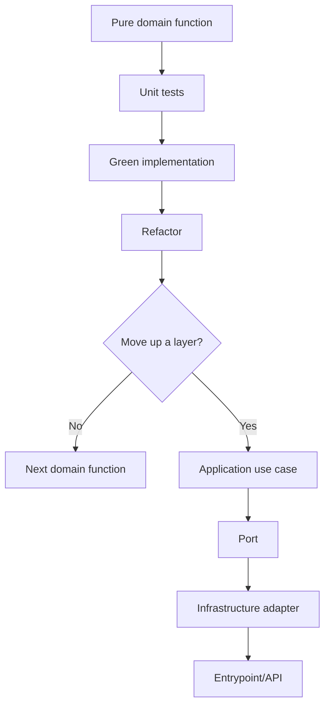
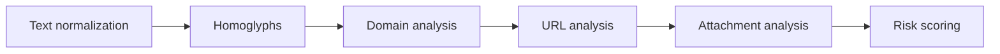

# Engineering Journey

## Purpose

This document records meaningful engineering steps in PhishShield.

It is not a changelog and it should not duplicate every commit.  
Its goal is to preserve architectural reasoning, TDD cycles, layer progression, and key decisions so the project can be reviewed visually and reused as a learning reference for future projects.

---

## When to add an entry

Add an entry when a relevant engineering step occurs, such as:

- completing a TDD cycle;
- making an architectural decision;
- deciding not to move up a layer;
- creating a new domain function group;
- adding a new port;
- adding a new adapter;
- introducing a new use case;
- changing folder architecture;
- adding a new project skill;
- creating or changing a testing strategy;
- making an important rejection decision.

Do not document every small code edit. Document meaningful engineering steps that explain how the project evolves.

---

## Entry template

```md
## YYYY-MM-DD - [Short title]

Type: TDD | Architecture | Testing | Skill | Documentation | Refactor  
Layer: Domain | Application | Infrastructure | Entrypoint | Cross-cutting  
Status: Proposed | Done | Rejected | Deferred

### Context

Why this step happened.

### Decision

What was decided or completed.

### Files changed

- ...

### Tests

Command:

```bash
...
```

Result:

```text
...
```

### Next step

...
```

---

## Architecture progression map



---

## Domain roadmap



---

## 2026-06-23 - Invisible character helpers TDD cycle

Type: TDD  
Layer: Domain  
Status: Done

### Context

The first production code snippet was intentionally kept small and pure.  
The selected domain group was `Text normalization`, starting with suspicious invisible Unicode characters.

The goal was to establish the first TDD cycle before moving to additional domain functions or upper layers.

### Decision

Implemented two pure domain helpers:

```python
contains_invisible_chars(text: str) -> bool
strip_invisible_chars(text: str) -> str
```

No ports were created because the functions are pure, deterministic, synchronous, and dependency-free.  
No Application use case was created yet because there is no higher-level workflow consuming the full text normalization group.

### Files changed

- `tests/unit/domain/services/text_normalization/test_invisible_characters.py`
- `src/domain/services/text_normalization/invisible_characters.py`
- `pytest.ini`

### TDD flow

```text
RED      -> ModuleNotFoundError: No module named 'domain'
GREEN    -> 13 tests passed
REFACTOR -> renamed constant and added docstrings
```

### Tests

Command:

```bash
python -m pytest tests/unit/domain/services/text_normalization/test_invisible_characters.py
```

Result:

```text
13 passed
```

### Next step

Continue the same domain group with:

```python
normalize_whitespace(text: str) -> str
```

Start with RED tests before implementation.