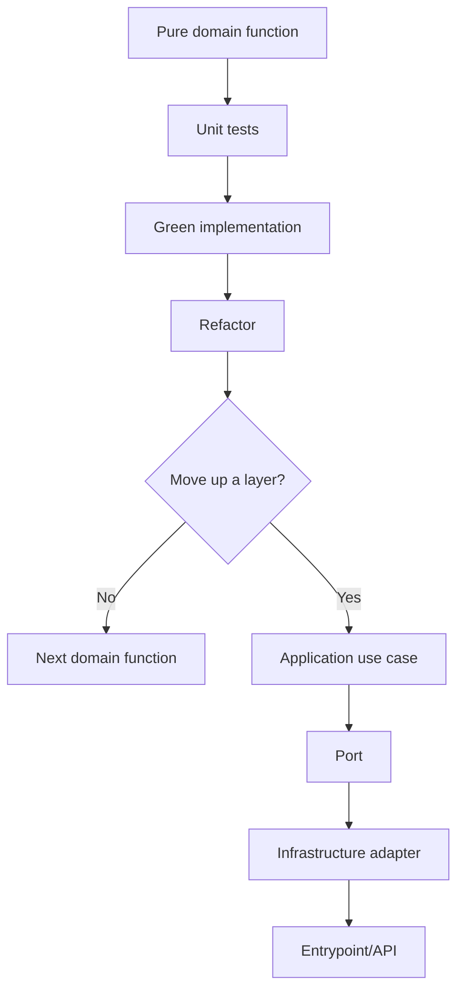
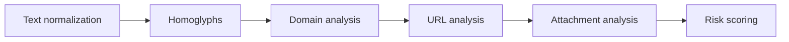

# Engineering Journey

## Purpose

This document records meaningful engineering steps in PhishShield.

It is not a changelog and it should not duplicate every commit.  
Its goal is to preserve architectural reasoning, TDD cycles, layer progression, and key decisions so the project can be reviewed visually and reused as a learning reference for future projects.

---

## When to add an entry

Add an entry when a relevant engineering step occurs, such as:

- completing a TDD cycle;
- making an architectural decision;
- deciding not to move up a layer;
- creating a new domain function group;
- adding a new port;
- adding a new adapter;
- introducing a new use case;
- changing folder architecture;
- adding a new project skill;
- creating or changing a testing strategy;
- making an important rejection decision.

Do not document every small code edit. Document meaningful engineering steps that explain how the project evolves.

---

## Entry template

```md
## YYYY-MM-DD - [Short title]

Type: TDD | Architecture | Testing | Skill | Documentation | Refactor  
Layer: Domain | Application | Infrastructure | Entrypoint | Cross-cutting  
Status: Proposed | Done | Rejected | Deferred

### Context

Why this step happened.

### Decision

What was decided or completed.

### Files changed

- ...

### Tests

Command:

```bash
...
```

Result:

```text
...
```

### Next step

...
```

---

## Architecture progression map



---

## Domain roadmap



---

## 2026-06-23 - Invisible character helpers TDD cycle

Type: TDD  
Layer: Domain  
Status: Done

### Context

The first production code snippet was intentionally kept small and pure.  
The selected domain group was `Text normalization`, starting with suspicious invisible Unicode characters.

The goal was to establish the first TDD cycle before moving to additional domain functions or upper layers.

### Decision

Implemented two pure domain helpers:

```python
contains_invisible_chars(text: str) -> bool
strip_invisible_chars(text: str) -> str
```

No ports were created because the functions are pure, deterministic, synchronous, and dependency-free.  
No Application use case was created yet because there is no higher-level workflow consuming the full text normalization group.

### Files changed

- `tests/unit/domain/services/text_normalization/test_invisible_characters.py`
- `src/domain/services/text_normalization/invisible_characters.py`
- `pytest.ini`

### TDD flow

```text
RED      -> ModuleNotFoundError: No module named 'domain'
GREEN    -> 13 tests passed
REFACTOR -> renamed constant and added docstrings
```

### Tests

Command:

```bash
python -m pytest tests/unit/domain/services/text_normalization/test_invisible_characters.py
```

Result:

```text
13 passed
```

### Next step

Continue the same domain group with:

```python
normalize_whitespace(text: str) -> str
```

Start with RED tests before implementation.

---

## 2026-06-23 - Whitespace normalization TDD cycle

Type: TDD  
Layer: Domain  
Status: Done

### Context

The project continued the `Text normalization` domain group after completing invisible character helpers.

The goal was to add another pure, dependency-free text normalization helper while preserving the TDD workflow.

### Decision

Implemented one pure domain helper:

```python
normalize_whitespace(text: str) -> str
```

No ports were created because the function is pure, deterministic, synchronous, and dependency-free.  
No Application use case was created yet because the text normalization group is still being completed inside the Domain layer.

### Files changed

- `tests/unit/domain/services/text_normalization/test_whitespace_normalization.py`
- `src/domain/services/text_normalization/whitespace.py`

### TDD flow

```text
RED      -> ModuleNotFoundError: No module named 'domain.services.text_normalization.whitespace'
GREEN    -> 8 tests passed
REFACTOR -> added docstring
```

### Tests

Command:

```bash
python -m pytest tests/unit/domain/services/text_normalization/test_whitespace_normalization.py
```

Result:

```text
8 passed
```

### Next step

Continue the same domain group with:

```python
normalize_unicode_text(text: str) -> str
```

Start with RED tests before implementation.

---

## 2026-06-23 - Unicode text normalization TDD cycle

Type: TDD  
Layer: Domain  
Status: Done

### Context

The project continued the `Text normalization` domain group after completing whitespace normalization.

The goal was to add Unicode normalization as a pure, deterministic helper before moving to suspicious Unicode or homoglyph detection rules.

### Decision

Implemented one pure domain helper:

```python
normalize_unicode_text(text: str) -> str
```

The function uses Python standard library Unicode NFKC compatibility normalization to normalize visually different but compatible text forms while preserving readable content.

No ports were created because the function is pure, deterministic, synchronous, and dependency-free.  
No Application use case was created yet because there is no higher-level workflow consuming the full text normalization group.

### Files changed

- `tests/unit/domain/services/text_normalization/test_unicode_normalization.py`
- `src/domain/services/text_normalization/unicode_text.py`
- `doc/ENGINEERING_JOURNEY.md`

### TDD flow

```text
RED      -> ModuleNotFoundError: No module named 'domain.services.text_normalization.unicode_text'
GREEN    -> 6 tests passed
REFACTOR -> added docstring
```

### Tests

Command:

```bash
python -m pytest tests/unit/domain/services/text_normalization/test_unicode_normalization.py
```

Result:

```text
6 passed
```

Command:

```bash
python -m pytest tests/unit/domain/services/text_normalization
```

Result:

```text
27 passed
```

### Next step

Continue the domain roadmap with the `Homoglyphs / suspicious Unicode` group, starting with a small TDD cycle for script detection or mixed-script detection.

---

## 2026-06-23 - Unicode script detection TDD cycle

Type: TDD  
Layer: Domain  
Status: Done

### Context

The project moved from the `Text normalization` domain group to the `Homoglyphs / suspicious Unicode` group.

The goal was to start detecting phishing-relevant Unicode script usage before implementing mixed-script or confusable-character rules.

### Decision

Implemented one pure domain helper:

```python
detect_unicode_scripts(text: str) -> set[str]
```

The function detects Latin, Cyrillic, and Greek script ranges using internal Unicode codepoint checks. Numbers, punctuation, hyphens, dots, and other neutral characters do not add scripts.

No ports were created because the function is pure, deterministic, synchronous, and dependency-free.  
No Application use case was created yet because the suspicious Unicode domain group is still being built from pure functions.

### Files changed

- `tests/unit/domain/services/homoglyphs/test_script_detection.py`
- `src/domain/services/homoglyphs/scripts.py`
- `doc/ENGINEERING_JOURNEY.md`

### TDD flow

```text
RED      -> ModuleNotFoundError: No module named 'domain.services.homoglyphs'
GREEN    -> 7 tests passed
REFACTOR -> not needed
```

### Tests

Command:

```bash
python -m pytest tests/unit/domain/services/homoglyphs/test_script_detection.py
```

Result:

```text
7 passed
```

Command:

```bash
python -m pytest
```

Result:

```text
34 passed
```

### Next step

Continue the same domain group with:

```python
contains_mixed_scripts(text: str) -> bool
```

Start with RED tests and reuse `detect_unicode_scripts` internally if the contract remains suitable.

---

## 2026-06-23 - Mixed Unicode script detection TDD cycle

Type: TDD  
Layer: Domain  
Status: Done

### Context

The project continued the `Homoglyphs / suspicious Unicode` domain group after adding Unicode script detection.

The goal was to create a pure domain rule that flags text containing more than one relevant Unicode script, a common signal in homoglyph phishing attempts.

### Decision

Implemented one pure domain helper:

```python
contains_mixed_scripts(text: str) -> bool
```

The function reuses `detect_unicode_scripts` and returns `True` when more than one relevant script is present. Neutral characters such as digits, punctuation, dots, and hyphens do not cause mixed-script detection by themselves.

No ports were created because the function is pure, deterministic, synchronous, and dependency-free.  
No Application use case was created yet because the suspicious Unicode domain group is still being completed inside the Domain layer.

### Files changed

- `tests/unit/domain/services/homoglyphs/test_script_detection.py`
- `src/domain/services/homoglyphs/scripts.py`
- `doc/ENGINEERING_JOURNEY.md`

### TDD flow

```text
RED      -> ImportError: cannot import name 'contains_mixed_scripts'
GREEN    -> 15 tests passed
REFACTOR -> not needed
```

### Tests

Command:

```bash
python -m pytest tests/unit/domain/services/homoglyphs/test_script_detection.py
```

Result:

```text
15 passed
```

Command:

```bash
python -m pytest
```

Result:

```text
42 passed
```

### Next step

Continue the same domain group with:

```python
contains_confusable_characters(text: str) -> bool
```

Start with RED tests and a minimal internal table for phishing-relevant confusable characters.

---

## 2026-06-23 - Confusable character detection TDD cycle

Type: TDD  
Layer: Domain  
Status: Done

### Context

The project continued the `Homoglyphs / suspicious Unicode` domain group after mixed-script detection.

The goal was to detect a small, explicit set of phishing-relevant Unicode characters that visually resemble common Latin characters.

### Decision

Implemented one pure domain helper:

```python
contains_confusable_characters(text: str) -> bool
```

The function uses a minimal internal table for Cyrillic and Greek characters commonly used in homoglyph-style phishing attempts. The table is intentionally small and dependency-free at this stage.

No ports were created because the function is pure, deterministic, synchronous, and dependency-free.  
No Application use case was created yet because the suspicious Unicode domain group is still being completed inside the Domain layer.

### Files changed

- `tests/unit/domain/services/homoglyphs/test_confusable_characters.py`
- `src/domain/services/homoglyphs/confusables.py`
- `doc/ENGINEERING_JOURNEY.md`

### TDD flow

```text
RED      -> ModuleNotFoundError: No module named 'domain.services.homoglyphs.confusables'
GREEN    -> 9 tests passed
REFACTOR -> not needed
```

### Tests

Command:

```bash
python -m pytest tests/unit/domain/services/homoglyphs/test_confusable_characters.py
```

Result:

```text
9 passed
```

Command:

```bash
python -m pytest
```

Result:

```text
51 passed
```

### Next step

Continue the same domain group with:

```python
find_confusable_characters(text: str) -> list[str]
```

Start with RED tests and preserve discovery order in the returned list.

---

## 2026-06-23 - Confusable character discovery TDD cycle

Type: TDD  
Layer: Domain  
Status: Done

### Context

The project continued the `Homoglyphs / suspicious Unicode` domain group after adding confusable character detection.

The goal was to expose the actual suspicious characters found in text, not only a boolean flag, so later application-level analysis can report concrete evidence.

### Decision

Implemented one pure domain helper:

```python
find_confusable_characters(text: str) -> list[str]
```

The function returns phishing-relevant confusable characters in discovery order and preserves duplicates. This supports later reporting without introducing application-level models prematurely.

`contains_confusable_characters` now reuses `find_confusable_characters` so the filtering logic has a single source of truth.

No ports were created because the function is pure, deterministic, synchronous, and dependency-free.  
No Application use case was created yet; the next step is an architectural checkpoint to decide whether the suspicious Unicode group is stable enough to move upward.

### Files changed

- `tests/unit/domain/services/homoglyphs/test_confusable_characters.py`
- `src/domain/services/homoglyphs/confusables.py`
- `doc/ENGINEERING_JOURNEY.md`

### TDD flow

```text
RED      -> ImportError: cannot import name 'find_confusable_characters'
GREEN    -> 14 tests passed
REFACTOR -> contains_confusable_characters reuses find_confusable_characters
```

### Tests

Command:

```bash
python -m pytest tests/unit/domain/services/homoglyphs/test_confusable_characters.py
```

Result:

```text
14 passed
```

Command:

```bash
python -m pytest
```

Result:

```text
56 passed
```

### Next step

Run an architectural checkpoint for the completed `Homoglyphs / suspicious Unicode` domain group and decide whether to introduce an Application use case or continue with the next pure domain group.

---

## 2026-06-23 - Domain label splitting TDD cycle

Type: TDD  
Layer: Domain  
Status: Done

### Context

The project continued with the next pure domain group after completing the initial `Homoglyphs / suspicious Unicode` helpers.

The goal was to start `Domain analysis` with a small deterministic helper for splitting host or domain text into meaningful labels before adding Punycode or structural domain rules.

### Decision

Implemented one pure domain helper:

```python
split_domain_labels(domain: str) -> list[str]
```

The function trims surrounding whitespace, removes leading and trailing dots, splits by `.`, and ignores empty labels caused by repeated dots. This keeps the function tolerant and useful for later forensic rules without performing DNS validation or IO.

No ports were created because the function is pure, deterministic, synchronous, and dependency-free.  
No Application use case was created yet because the `Domain analysis` group is just starting and its contracts are not stable enough to move upward.

### Files changed

- `tests/unit/domain/services/domain_analysis/test_domain_labels.py`
- `src/domain/services/domain_analysis/domains.py`
- `doc/ENGINEERING_JOURNEY.md`

### TDD flow

```text
RED      -> ModuleNotFoundError: No module named 'domain.services.domain_analysis'
GREEN    -> 6 tests passed
REFACTOR -> not needed
```

### Tests

Command:

```bash
python -m pytest tests/unit/domain/services/domain_analysis/test_domain_labels.py
```

Result:

```text
6 passed
```

Command:

```bash
python -m pytest
```

Result:

```text
62 passed
```

### Next step

Continue the same domain group with:

```python
is_punycode_label(label: str) -> bool
```

Start with RED tests and keep the implementation pure and dependency-free.

---

## 2026-06-25 - Punycode label detection TDD cycle

Type: TDD  
Layer: Domain  
Status: Done

### Context

The project continued the `Domain analysis` group after adding domain label splitting.

The goal was to add a pure helper for recognizing domain labels that use the Punycode `xn--` prefix before implementing full-domain Punycode detection.

### Decision

Implemented one pure domain helper:

```python
is_punycode_label(label: str) -> bool
```

The function checks whether a single domain label starts with the Punycode prefix in a case-insensitive way. It does not decode IDNA, validate DNS, resolve domains, or perform IO.

No ports were created because the function is pure, deterministic, synchronous, and dependency-free.  
No Application use case was created yet because the `Domain analysis` group is still being built from pure helpers.

### Files changed

- `tests/unit/domain/services/domain_analysis/test_domain_labels.py`
- `src/domain/services/domain_analysis/domains.py`
- `doc/ENGINEERING_JOURNEY.md`

### TDD flow

```text
RED      -> Tests added for missing is_punycode_label behavior
GREEN    -> 14 tests passed
REFACTOR -> not needed
```

### Tests

Command:

```bash
python -m pytest tests/unit/domain/services/domain_analysis/test_domain_labels.py
```

Result:

```text
14 passed
```

Command:

```bash
python -m pytest
```

Result:

```text
70 passed
```

### Next step

Continue the same domain group with:

```python
contains_punycode(domain: str) -> bool
```

Start with RED tests and reuse `split_domain_labels` and `is_punycode_label` internally if the contracts remain suitable.

---

## 2026-06-25 - Domain Punycode detection TDD cycle

Type: TDD  
Layer: Domain  
Status: Done

### Context

The project continued the `Domain analysis` group after adding single-label Punycode detection.

The goal was to detect whether any meaningful label in a domain uses the Punycode `xn--` prefix while keeping the behavior pure and dependency-free.

### Decision

Implemented one pure domain helper:

```python
contains_punycode(domain: str) -> bool
```

The function reuses `split_domain_labels` and `is_punycode_label` so domain splitting and label-level Punycode detection remain single-purpose helpers. It does not decode IDNA, validate DNS, resolve domains, or perform IO.

No ports were created because the function is pure, deterministic, synchronous, and dependency-free.  
No Application use case was created yet because the `Domain analysis` group is still being completed inside the Domain layer.

### Files changed

- `tests/unit/domain/services/domain_analysis/test_domain_labels.py`
- `src/domain/services/domain_analysis/domains.py`
- `doc/ENGINEERING_JOURNEY.md`

### TDD flow

```text
RED      -> ImportError: cannot import name 'contains_punycode'
GREEN    -> 21 tests passed
REFACTOR -> not needed
```

### Tests

Command:

```bash
python -m pytest tests/unit/domain/services/domain_analysis/test_domain_labels.py
```

Result:

```text
21 passed
```

Command:

```bash
python -m pytest
```

Result:

```text
77 passed
```

### Next step

Continue the same domain group with:

```python
has_suspicious_subdomain_depth(domain: str, max_depth: int = 4) -> bool
```

Start with RED tests and reuse `split_domain_labels` if the contract remains suitable.

---

## 2026-06-25 - Suspicious subdomain depth TDD cycle

Type: TDD  
Layer: Domain  
Status: Done

### Context

The project continued the `Domain analysis` group after adding domain-level Punycode detection.

The goal was to add a pure helper for detecting domains with unusually deep label structures before moving to IP-like host or suspicious TLD rules.

### Decision

Implemented one pure domain helper:

```python
has_suspicious_subdomain_depth(domain: str, max_depth: int = 4) -> bool
```

The function reuses `split_domain_labels` and returns `True` when the number of meaningful labels is greater than `max_depth`. It intentionally does not use public suffix lists, DNS lookups, or external services.

No ports were created because the function is pure, deterministic, synchronous, and dependency-free.  
No Application use case was created yet because the `Domain analysis` group still has host-shape and TLD helpers pending.

### Files changed

- `tests/unit/domain/services/domain_analysis/test_domain_labels.py`
- `src/domain/services/domain_analysis/domains.py`
- `doc/ENGINEERING_JOURNEY.md`

### TDD flow

```text
RED      -> ImportError: cannot import name 'has_suspicious_subdomain_depth'
GREEN    -> 30 tests passed
REFACTOR -> not needed
```

### Tests

Command:

```bash
python -m pytest tests/unit/domain/services/domain_analysis/test_domain_labels.py
```

Result:

```text
30 passed
```

Command:

```bash
python -m pytest
```

Result:

```text
86 passed
```

### Next step

Continue the same domain group with:

```python
looks_like_ip_address_host(host: str) -> bool
```

Start with RED tests and keep the implementation pure, using standard-library parsing if needed.

---

## 2026-06-25 - IP address host detection TDD cycle

Type: TDD  
Layer: Domain  
Status: Done

### Context

The project continued the `Domain analysis` group after adding suspicious subdomain depth detection.

The goal was to add a pure helper for identifying hosts that are valid IP addresses, which is useful before composing domain and URL indicators at the Application layer.

### Decision

Implemented one pure domain helper:

```python
looks_like_ip_address_host(host: str) -> bool
```

The function uses Python's standard-library `ipaddress` module to validate IPv4 and IPv6 host strings after trimming surrounding whitespace. It does not resolve DNS, call the network, parse URLs, or perform IO.

No ports were created because the function is pure, deterministic, synchronous, and dependency-free.  
No Application use case was created yet because the `Domain analysis` group still has suspicious TLD analysis pending.

### Files changed

- `tests/unit/domain/services/domain_analysis/test_domain_labels.py`
- `src/domain/services/domain_analysis/domains.py`
- `doc/ENGINEERING_JOURNEY.md`

### TDD flow

```text
RED      -> ImportError: cannot import name 'looks_like_ip_address_host'
GREEN    -> 39 tests passed
REFACTOR -> not needed
```

### Tests

Command:

```bash
python -m pytest tests/unit/domain/services/domain_analysis/test_domain_labels.py
```

Result:

```text
39 passed
```

Command:

```bash
python -m pytest
```

Result:

```text
95 passed
```

### Next step

Continue the same domain group with:

```python
has_suspicious_tld(domain: str, suspicious_tlds: set[str]) -> bool
```

Start with RED tests and keep the suspicious TLD list supplied as an argument instead of reading global configuration.

---

## 2026-06-25 - Suspicious TLD detection TDD cycle

Type: TDD  
Layer: Domain  
Status: Done

### Context

The project continued the `Domain analysis` group after adding IP address host detection.

The goal was to complete the planned pure domain helpers for structural domain analysis before deciding whether to introduce an Application use case.

### Decision

Implemented one pure domain helper:

```python
has_suspicious_tld(domain: str, suspicious_tlds: set[str]) -> bool
```

The function reuses `split_domain_labels`, inspects the final domain label, and compares it against a caller-provided set of suspicious TLDs. TLD values are compared case-insensitively, and entries with or without a leading dot are accepted.

No ports were created because the function is pure, deterministic, synchronous, and dependency-free.  
No Application use case was created yet; the next step is an architectural checkpoint for the completed `Domain analysis` group.

### Files changed

- `tests/unit/domain/services/domain_analysis/test_domain_labels.py`
- `src/domain/services/domain_analysis/domains.py`
- `doc/ENGINEERING_JOURNEY.md`

### TDD flow

```text
RED      -> ImportError: cannot import name 'has_suspicious_tld'
GREEN    -> 46 tests passed
REFACTOR -> not needed
```

### Tests

Command:

```bash
python -m pytest tests/unit/domain/services/domain_analysis/test_domain_labels.py
```

Result:

```text
46 passed
```

Command:

```bash
python -m pytest
```

Result:

```text
102 passed
```

### Next step

Run an architectural checkpoint for the completed `Domain analysis` group and decide whether to introduce an Application use case or continue with the next pure domain group.

---

## 2026-06-25 - Domain indicators application use case

Type: TDD  
Layer: Application  
Status: Done

### Context

The project completed the initial `Text normalization`, `Homoglyphs / suspicious Unicode`, and `Domain analysis` pure domain helper groups.

At this point the Application layer can add real value by composing multiple domain rules into a coherent domain-indicator analysis instead of wrapping one isolated helper.

### Decision

Introduced the first Application use case:

```python
AnalyzeDomainIndicatorsUseCase
```

The use case receives an `AnalyzeDomainIndicatorsCommand`, coordinates pure domain helpers, and returns a `DomainIndicatorsAnalysis` result with boolean indicators, discovered evidence, and finding codes.

The use case currently reports these finding codes:

```text
DOMAIN_CONTAINS_PUNYCODE
DOMAIN_HAS_MIXED_SCRIPTS
DOMAIN_HAS_CONFUSABLE_CHARACTERS
DOMAIN_HAS_SUSPICIOUS_DEPTH
DOMAIN_LOOKS_LIKE_IP_ADDRESS
DOMAIN_HAS_SUSPICIOUS_TLD
```

No ports or adapters were created because this use case does not cross an infrastructure boundary. It performs no IO, network access, DNS resolution, URL parsing, or framework work.

### Files changed

- `tests/unit/application/test_analyze_domain_indicators.py`
- `src/application/use_cases/analyze_domain_indicators.py`
- `doc/ENGINEERING_JOURNEY.md`

### TDD flow

```text
RED      -> ModuleNotFoundError: No module named 'application.use_cases.analyze_domain_indicators'
GREEN    -> normal-domain analysis passed
RED      -> Punycode finding missing
GREEN    -> DOMAIN_CONTAINS_PUNYCODE finding added
RED      -> Homoglyph findings missing
GREEN    -> mixed-script and confusable-character findings added
RED      -> structural findings missing
GREEN    -> depth, IP-address host, and suspicious-TLD findings added
REFACTOR -> finding codes extracted to module constants
```

### Tests

Command:

```bash
python -m pytest tests/unit/application/test_analyze_domain_indicators.py
```

Result:

```text
6 passed
```

Command:

```bash
python -m pytest
```

Result:

```text
108 passed
```

### Next step

Decide whether to continue with the next pure domain group (`URL analysis`) or extend Application analysis around URLs once the pure URL helpers exist.

---

## 2026-06-28 - URL scheme analysis helpers

Type: TDD  
Layer: Domain  
Status: Done

### Context

After completing the first Application use case for domain indicators, the next safe increment is to extend the pure Domain layer with URL analysis helpers.

The selected scope is intentionally small: URL schemes can be analyzed as strings without network access, DNS resolution, browser automation, URL visits, or framework dependencies.

### Decision

Implemented two pure domain helpers:

```python
is_url_scheme_allowed(scheme: str, allowed_schemes: set[str]) -> bool
is_suspicious_url_scheme(scheme: str) -> bool
```

The helpers normalize input by trimming whitespace and comparing case-insensitively. Suspicious schemes are limited to a deterministic built-in set for commonly abused schemes such as `javascript`, `data`, `file`, and `vbscript`.

No ports, adapters, or Application use cases were created because this step does not cross an infrastructure boundary.

### Files changed

- `tests/unit/domain/services/url_analysis/test_url_schemes.py`
- `src/domain/services/url_analysis/schemes.py`
- `doc/ENGINEERING_JOURNEY.md`

### TDD flow

```text
RED      -> ModuleNotFoundError: No module named 'domain.services.url_analysis'
GREEN    -> URL scheme helper tests passed
REFACTOR -> not needed
```

### Tests

Command:

```bash
python -m pytest tests/unit/domain/services/url_analysis/test_url_schemes.py
```

Result:

```text
20 passed
```

Command:

```bash
python -m pytest
```

Result:

```text
129 passed
```

### Next step

Continue the `URL analysis` group with embedded credential detection in URLs.

---

## 2026-06-28 - Embedded URL credential detection

Type: TDD  
Layer: Domain  
Status: Done

### Context

The `URL analysis` group already detects allowed and suspicious schemes. The next phishing-relevant URL signal is embedded credentials in the URL authority, which can visually mislead users about the real destination host.

This analysis can remain pure because it only parses the URL string with the Python standard library and does not visit the URL, resolve DNS, follow redirects, or perform network access.

### Decision

Implemented one pure domain helper:

```python
has_embedded_credentials(url: str) -> bool
```

The helper uses `urllib.parse.urlsplit` and checks credentials in the URL authority for HTTP and HTTPS URLs. This avoids treating `@` characters in paths, query strings, or mail addresses as embedded URL credentials.

No ports, adapters, or Application use cases were created because this step remains fully inside the pure Domain layer.

### Files changed

- `tests/unit/domain/services/url_analysis/test_embedded_credentials.py`
- `src/domain/services/url_analysis/credentials.py`
- `doc/ENGINEERING_JOURNEY.md`

### TDD flow

```text
RED      -> ModuleNotFoundError: No module named 'domain.services.url_analysis.credentials'
GREEN    -> embedded credential helper tests passed
REFACTOR -> not needed
```

### Tests

Command:

```bash
python -m pytest tests/unit/domain/services/url_analysis/test_embedded_credentials.py
```

Result:

```text
12 passed
```

Command:

```bash
python -m pytest
```

Result:

```text
141 passed
```

### Next step

Continue the `URL analysis` group with suspicious query density detection.

---

## 2026-06-28 - Suspicious URL query density detection

Type: TDD  
Layer: Domain  
Status: Done

### Context

The `URL analysis` group already detects suspicious schemes and embedded credentials. The next pure signal is query density: URLs with many query parameters can indicate tracking, redirection, or payload-heavy phishing links.

This helper remains deterministic and local because it only parses the URL string with the Python standard library.

### Decision

Implemented one pure domain helper:

```python
has_suspicious_query_density(url: str, threshold: int) -> bool
```

The helper uses `urllib.parse.urlsplit` to extract the query string and `urllib.parse.parse_qsl` to count parameters, including blank values. It returns `True` only when the number of query parameters is greater than the caller-provided threshold.

No ports, adapters, or Application use cases were created because this step performs no network access, DNS resolution, redirects, browser work, or framework integration.

### Files changed

- `tests/unit/domain/services/url_analysis/test_query_density.py`
- `src/domain/services/url_analysis/query.py`
- `doc/ENGINEERING_JOURNEY.md`

### TDD flow

```text
RED      -> ModuleNotFoundError: No module named 'domain.services.url_analysis.query'
GREEN    -> query density helper tests passed
REFACTOR -> not needed
```

### Tests

Command:

```bash
python -m pytest tests/unit/domain/services/url_analysis/test_query_density.py
```

Result:

```text
9 passed
```

Command:

```bash
python -m pytest
```

Result:

```text
150 passed
```

### Next step

Continue the `URL analysis` group with known shortener domain detection.

---

## 2026-06-28 - Known URL shortener domain detection

Type: TDD  
Layer: Domain  
Status: Done

### Context

The `URL analysis` group already detects suspicious schemes, embedded credentials, and dense query strings. The final planned pure helper for this group detects whether a domain exactly matches a caller-provided known URL shortener set.

The helper intentionally does not resolve redirects, perform HTTP requests, query DNS, or consult reputation services.

### Decision

Implemented one pure domain helper:

```python
has_url_shortener_domain(domain: str, known_shorteners: set[str]) -> bool
```

The helper normalizes the domain and known shorteners by trimming whitespace, removing trailing dots, and comparing case-insensitively. It requires an exact normalized domain match, so subdomains such as `sub.bit.ly` are not treated as the same shortener domain as `bit.ly`.

No ports, adapters, or Application use cases were created because this step remains fully inside the pure Domain layer.

### Files changed

- `tests/unit/domain/services/url_analysis/test_shortener_domains.py`
- `src/domain/services/url_analysis/shorteners.py`
- `doc/ENGINEERING_JOURNEY.md`

### TDD flow

```text
RED      -> ModuleNotFoundError: No module named 'domain.services.url_analysis.shorteners'
GREEN    -> shortener domain helper tests passed
REFACTOR -> not needed
```

### Tests

Command:

```bash
python -m pytest tests/unit/domain/services/url_analysis/test_shortener_domains.py
```

Result:

```text
10 passed
```

Command:

```bash
python -m pytest
```

Result:

```text
160 passed
```

### Next step

Run an architectural checkpoint for the completed `URL analysis` group and decide whether to introduce an Application use case.

---

## 2026-06-28 - URL indicators application use case

Type: TDD  
Layer: Application  
Status: Done

### Context

The project completed the planned pure `URL analysis` domain helper group: URL scheme analysis, embedded credential detection, suspicious query density detection, and known shortener domain detection.

At this point an Application use case is justified because it composes multiple cohesive URL indicator rules into a single analysis result. The use case still performs no network access, DNS resolution, redirects, browser work, adapters, or framework integration.

### Decision

Introduced the Application use case:

```python
AnalyzeUrlIndicatorsUseCase
```

The use case receives an `AnalyzeUrlIndicatorsCommand`, derives URL evidence with Python standard-library parsing, coordinates pure domain helpers, and returns a `UrlIndicatorsAnalysis` result with boolean indicators, derived evidence, and finding codes.

The use case currently reports these finding codes:

```text
URL_SCHEME_NOT_ALLOWED
URL_HAS_SUSPICIOUS_SCHEME
URL_HAS_EMBEDDED_CREDENTIALS
URL_HAS_SUSPICIOUS_QUERY_DENSITY
URL_USES_KNOWN_SHORTENER_DOMAIN
```

No ports or adapters were created because this use case does not cross an infrastructure boundary.

### Files changed

- `tests/unit/application/test_analyze_url_indicators.py`
- `src/application/use_cases/analyze_url_indicators.py`
- `doc/ENGINEERING_JOURNEY.md`

### TDD flow

```text
RED      -> ModuleNotFoundError: No module named 'application.use_cases.analyze_url_indicators'
GREEN    -> URL indicator use case tests passed
REFACTOR -> not needed
VERIFY   -> application tests and full suite passed
```

### Tests

Command:

```bash
python -m pytest tests/unit/application/test_analyze_url_indicators.py
```

Result:

```text
8 passed
```

Command:

```bash
python -m pytest tests/unit/application
```

Result:

```text
15 passed
```

Command:

```bash
python -m pytest
```

Result:

```text
168 passed
```

### Next step

Decide whether to continue with another pure domain group, such as `Attachment analysis`, or introduce higher-level Application composition once more indicator groups exist.

---

## 2026-06-28 - Executable attachment extension detection

Type: TDD  
Layer: Domain  
Status: Done

### Context

After completing the initial domain, URL, and Application indicator use cases, the next pure `Domain` group is `Attachment analysis`.

The first attachment helper intentionally operates only on filename metadata. It does not open files, read bytes, calculate hashes, parse Office/PDF content, run YARA, run OCR, or touch the filesystem.

### Decision

Implemented one pure domain helper:

```python
is_executable_extension(filename: str) -> bool
```

The helper detects executable filename extensions such as `.exe`, `.bat`, `.cmd`, `.scr`, `.ps1`, `.vbs`, `.js`, and `.jar`, comparing case-insensitively and supporting filenames with double extensions such as `invoice.pdf.exe`.

No ports, adapters, or Application use cases were created because this step remains fully inside the pure Domain layer.

### Files changed

- `tests/unit/domain/services/attachment_analysis/test_attachment_extensions.py`
- `src/domain/services/attachment_analysis/attachments.py`
- `doc/ENGINEERING_JOURNEY.md`

### TDD flow

```text
RED      -> ModuleNotFoundError: No module named 'domain.services.attachment_analysis'
GREEN    -> executable attachment extension tests passed
REFACTOR -> not needed
VERIFY   -> attachment tests and full suite passed
```

### Tests

Command:

```bash
python -m pytest tests/unit/domain/services/attachment_analysis/test_attachment_extensions.py
```

Result:

```text
15 passed
```

Command:

```bash
python -m pytest
```

Result:

```text
183 passed
```

### Next step

Continue the `Attachment analysis` group with Office document extension detection.

---

## 2026-06-28 - Office attachment extension detection

Type: TDD  
Layer: Domain  
Status: Done

### Context

The `Attachment analysis` group started with executable extension detection. The next pure helper detects Office document extensions from filename metadata only.

This remains a pure `Domain` rule: it does not parse Office files, inspect macros, read bytes, open files, run `oletools`, or touch the filesystem.

### Decision

Implemented one pure domain helper:

```python
is_office_document_extension(filename: str) -> bool
```

The helper detects Word, Excel, and PowerPoint extensions, including macro-enabled formats such as `.docm`, `.xlsm`, and `.pptm`, comparing case-insensitively.

Refactored attachment extension matching through a shared private helper because executable and Office detection now use the same deterministic filename-extension pattern.

No ports, adapters, or Application use cases were created because this step remains fully inside the pure Domain layer.

### Files changed

- `tests/unit/domain/services/attachment_analysis/test_attachment_extensions.py`
- `src/domain/services/attachment_analysis/attachments.py`
- `doc/ENGINEERING_JOURNEY.md`

### TDD flow

```text
RED      -> ImportError: cannot import name 'is_office_document_extension'
GREEN    -> Office attachment extension tests passed
REFACTOR -> shared private extension matching helper extracted
VERIFY   -> attachment tests and full suite passed
```

### Tests

Command:

```bash
python -m pytest tests/unit/domain/services/attachment_analysis/test_attachment_extensions.py
```

Result:

```text
31 passed
```

Command:

```bash
python -m pytest
```

Result:

```text
199 passed
```

### Next step

Continue the `Attachment analysis` group with PDF extension detection.

---

## 2026-06-28 - Attachment analysis domain group checkpoint

Type: TDD  
Layer: Domain  
Status: Done

### Context

The `Attachment analysis` group now contains the planned pure filename and extension helpers. The group stayed focused on metadata-only analysis and deliberately avoided file access, byte parsing, macro extraction, YARA, OCR, PDF tooling, Office tooling, archive tooling, and filesystem operations.

The smaller helpers after Office extension detection were not documented individually to avoid over-documenting repetitive pure helper work. This entry records the group checkpoint instead.

### Decision

Completed the initial pure `Attachment analysis` helper group with:

```python
is_pdf_extension(filename: str) -> bool
has_double_extension(filename: str) -> bool
has_suspicious_filename_chars(filename: str) -> bool
classify_attachment_extension(filename: str) -> str
```

The classification helper returns these stable categories:

```text
PDF
OFFICE
EXECUTABLE
IMAGE
ARCHIVE
TEXT
UNKNOWN
```

No ports, adapters, or Application use cases were created yet. The next step is an architectural checkpoint to decide whether `AnalyzeAttachmentIndicatorsUseCase` is justified now or whether another pure domain group should come first.

### Files changed

- `tests/unit/domain/services/attachment_analysis/test_attachment_extensions.py`
- `tests/unit/domain/services/attachment_analysis/test_attachment_filenames.py`
- `src/domain/services/attachment_analysis/attachments.py`
- `doc/ENGINEERING_JOURNEY.md`

### TDD flow

```text
RED      -> ImportError: missing attachment classification constants/helpers
GREEN    -> attachment classification tests passed
REFACTOR -> not needed
VERIFY   -> attachment tests and full suite passed
```

### Tests

Command:

```bash
python -m pytest tests/unit/domain/services/attachment_analysis
```

Result:

```text
66 passed
```

Command:

```bash
python -m pytest
```

Result:

```text
234 passed
```

### Next step

Run an architectural checkpoint for the completed `Attachment analysis` group and decide whether to introduce an Application use case.

---

## 2026-06-28 - Attachment indicators application use case

Type: TDD  
Layer: Application  
Status: Done

### Context

The project completed the initial pure `Attachment analysis` helper group. The helpers classify filename extensions, detect double extensions, and detect suspicious Unicode filename characters without reading files or invoking parsers, YARA, OCR, Office tooling, PDF tooling, archive tooling, or filesystem operations.

At this point an Application use case is justified because it composes multiple cohesive attachment metadata rules into a single analysis result.

### Decision

Introduced the Application use case:

```python
AnalyzeAttachmentIndicatorsUseCase
```

The use case receives an `AnalyzeAttachmentIndicatorsCommand`, coordinates pure domain helpers, and returns an `AttachmentIndicatorsAnalysis` result with extension category evidence, boolean indicators, and finding codes.

The use case currently reports these finding codes:

```text
ATTACHMENT_HAS_EXECUTABLE_EXTENSION
ATTACHMENT_HAS_OFFICE_DOCUMENT_EXTENSION
ATTACHMENT_HAS_DOUBLE_EXTENSION
ATTACHMENT_HAS_SUSPICIOUS_FILENAME_CHARS
```

PDF classification is preserved as evidence through `extension_category` and `has_pdf_extension`, but it does not emit a finding by itself because PDF attachments are common and not suspicious on their own.

No ports or adapters were created because this use case does not cross an infrastructure boundary.

### Files changed

- `tests/unit/application/test_analyze_attachment_indicators.py`
- `src/application/use_cases/analyze_attachment_indicators.py`
- `doc/ENGINEERING_JOURNEY.md`

### TDD flow

```text
RED      -> ModuleNotFoundError: No module named 'application.use_cases.analyze_attachment_indicators'
GREEN    -> attachment indicator use case tests passed
REFACTOR -> not needed
VERIFY   -> application tests and full suite passed
```

### Tests

Command:

```bash
python -m pytest tests/unit/application/test_analyze_attachment_indicators.py
```

Result:

```text
6 passed
```

Command:

```bash
python -m pytest tests/unit/application
```

Result:

```text
21 passed
```

Command:

```bash
python -m pytest
```

Result:

```text
240 passed
```

### Next step

Decide whether to continue with another pure domain group, such as `Authentication result analysis`, or defer until email header parsing infrastructure can provide computed authentication results.

---

## 2026-06-28 - Authentication indicators domain and application analysis

Type: TDD  
Layer: Domain | Application  
Status: Done

### Context

The project continued after the attachment metadata analysis group with another cohesive phishing signal family: already computed authentication results.

SPF, DKIM, and DMARC validation itself requires infrastructure concerns such as header parsing, DNS, and cryptographic verification. The selected scope avoids those boundaries and only interprets authentication result strings already provided by a future adapter.

### Decision

Implemented pure Domain helpers for authentication result interpretation:

```python
is_authentication_aligned(spf_result: str, dkim_result: str, dmarc_result: str) -> bool
has_authentication_failure(spf_result: str, dkim_result: str, dmarc_result: str) -> bool
classify_authentication_risk(spf_result: str, dkim_result: str, dmarc_result: str) -> str
summarize_authentication_findings(spf_result: str, dkim_result: str, dmarc_result: str) -> list[str]
```

The helpers normalize authentication values case-insensitively, preserve deterministic behavior, and classify risk with `DMARC` carrying the strongest weight:

```text
LOW
MEDIUM
HIGH
CRITICAL
UNKNOWN
```

Introduced the Application use case:

```python
AnalyzeAuthenticationIndicatorsUseCase
```

The use case receives an `AnalyzeAuthenticationIndicatorsCommand`, composes the Domain helpers, and returns an `AuthenticationIndicatorsAnalysis` result with original SPF/DKIM/DMARC evidence, booleans, risk level, and finding codes.

No ports or adapters were created because no IO boundary is crossed yet. Header parsing, DNS checks, DKIM cryptographic validation, and DMARC policy lookup remain future Infrastructure responsibilities.

### Files changed

- `tests/unit/domain/services/authentication_analysis/test_authentication_results.py`
- `src/domain/services/authentication_analysis/authentication_results.py`
- `tests/unit/application/test_analyze_authentication_indicators.py`
- `src/application/use_cases/analyze_authentication_indicators.py`
- `doc/ENGINEERING_JOURNEY.md`

### TDD flow

```text
RED      -> ModuleNotFoundError: No module named 'domain.services.authentication_analysis'
GREEN    -> authentication domain tests passed
RED      -> ModuleNotFoundError: No module named 'application.use_cases.analyze_authentication_indicators'
GREEN    -> authentication application tests passed
REFACTOR -> extracted combined failure/weak result set
VERIFY   -> targeted authentication tests and full suite passed
```

### Tests

Command:

```bash
python -m pytest tests/unit/domain/services/authentication_analysis tests/unit/application/test_analyze_authentication_indicators.py
```

Result:

```text
36 passed
```

Command:

```bash
python -m pytest
```

Result:

```text
276 passed
```

### Next step

Decide whether to continue with `Risk scoring`, which can now consume findings from domain, URL, attachment, and authentication analysis, or add another pure signal group first.

---

## 2026-06-28 - Risk scoring domain helpers

Type: TDD  
Layer: Domain  
Status: Done

### Context

The project already had cohesive findings from domain, URL, attachment, and authentication analysis. The next step was to add pure scoring helpers that can convert those finding codes into numeric risk evidence without introducing configuration files, infrastructure, ports, adapters, AI, external reputation, or global mutable weights.

### Decision

Implemented pure Domain helpers:

```python
calculate_indicator_score(indicators: list[str], weights: dict[str, int]) -> int
combine_risk_scores(scores: list[int]) -> int
cap_risk_score(score: int, min_score: int = 0, max_score: int = 100) -> int
classify_risk_level(score: int) -> str
has_critical_indicators(indicators: list[str], critical_indicators: set[str]) -> bool
```

The helpers keep weights and critical indicator sets explicit inputs. Unknown indicators are ignored, duplicate indicators are counted, and negative weights are allowed so future callers can model mitigating signals without adding special cases.

Risk levels are currently classified with fixed first-version thresholds:

```text
LOW      -> score < 25
MEDIUM   -> score >= 25 and score < 50
HIGH     -> score >= 50 and score < 75
CRITICAL -> score >= 75
```

No Application use case was introduced in this step. The cutoff is intentionally at completed Domain functionality so the next checkpoint can decide whether to add a separate risk score orchestration use case.

### Files changed

- `tests/unit/domain/services/risk_scoring/test_risk_scores.py`
- `src/domain/services/risk_scoring/risk_scores.py`
- `doc/ENGINEERING_JOURNEY.md`

### TDD flow

```text
RED      -> ModuleNotFoundError: No module named 'domain.services.risk_scoring'
GREEN    -> indicator score calculation tests passed
RED      -> ImportError: cannot import name 'cap_risk_score'
GREEN    -> score combination and capping tests passed
RED      -> ImportError: cannot import name 'classify_risk_level'
GREEN    -> risk level classification tests passed
RED      -> ImportError: cannot import name 'has_critical_indicators'
GREEN    -> critical indicator detection tests passed
REFACTOR -> not needed
VERIFY   -> risk scoring tests and full suite passed
```

### Tests

Command:

```bash
python -m pytest tests/unit/domain/services/risk_scoring/test_risk_scores.py
```

Result:

```text
28 passed
```

Command:

```bash
python -m pytest
```

Result:

```text
304 passed
```

### Next step

Decide whether to add an Application use case for risk score orchestration or continue with another pure signal group first.

---

## 2026-06-28 - Risk score calculation application use case

Type: TDD  
Layer: Application  
Status: Done

### Context

The `Risk scoring` Domain group was completed with pure helpers for indicator weights, score capping, risk level classification, and critical indicator detection.

At this point an Application use case is justified because risk score calculation composes multiple pure helpers into a single orchestration result while keeping weights and critical indicator sets explicit inputs.

### Decision

Introduced the Application use case:

```python
CalculateRiskScoreUseCase
```

The use case receives a `CalculateRiskScoreCommand`, coordinates the pure Domain helpers, and returns a `RiskScoreAnalysis` result with original indicators, raw score, capped score, risk level, and critical indicator evidence.

No default weights, global configuration, ports, adapters, or infrastructure were introduced. Score weights and critical indicator sets remain caller-provided data.

### Files changed

- `tests/unit/application/test_calculate_risk_score.py`
- `src/application/use_cases/calculate_risk_score.py`
- `doc/ENGINEERING_JOURNEY.md`

### TDD flow

```text
RED      -> ModuleNotFoundError: No module named 'application.use_cases.calculate_risk_score'
GREEN    -> risk score application tests passed
REFACTOR -> not needed
VERIFY   -> application test and full suite passed
```

### Tests

Command:

```bash
python -m pytest tests/unit/application/test_calculate_risk_score.py
```

Result:

```text
6 passed
```

Command:

```bash
python -m pytest
```

Result:

```text
310 passed
```

### Next step

Decide whether to continue with another pure signal group, such as `Social engineering heuristics`, or start defining higher-level analysis composition across existing use cases.

---

## 2026-06-28 - Social engineering domain heuristics

Type: TDD  
Layer: Domain  
Status: Done

### Context

The project continued after technical indicator and risk score analysis with deterministic text heuristics for social engineering signals. The selected scope avoids AI, external NLP libraries, prompt files, language models, configuration files, and infrastructure boundaries.

### Decision

Implemented pure Domain helpers:

```python
contains_urgency_terms(text: str, terms: set[str]) -> bool
contains_financial_pressure_terms(text: str, terms: set[str]) -> bool
contains_credential_request_terms(text: str, terms: set[str]) -> bool
count_social_engineering_signals(text: str, signal_terms: dict[str, set[str]]) -> dict[str, int]
classify_social_engineering_risk(signal_counts: dict[str, int]) -> str
```

The helpers perform case-insensitive deterministic matching over caller-provided term sets. Empty and blank terms are ignored, categories with no detected terms are preserved with zero counts, and negative signal counts are ignored when classifying risk.

Social engineering risk is currently classified with simple first-version thresholds:

```text
LOW      -> 0 total signals
MEDIUM   -> 1 total signal
HIGH     -> 2 total signals
CRITICAL -> 3 or more total signals
```

No Application use case was introduced yet. The cutoff remains at completed Domain functionality so the next checkpoint can decide whether to compose these heuristics in Application.

### Files changed

- `tests/unit/domain/services/social_engineering/test_text_signals.py`
- `src/domain/services/social_engineering/text_signals.py`
- `doc/ENGINEERING_JOURNEY.md`

### TDD flow

```text
RED      -> ModuleNotFoundError: No module named 'domain.services.social_engineering'
GREEN    -> urgency term tests passed
RED      -> ImportError: cannot import name 'contains_financial_pressure_terms'
GREEN    -> financial pressure term tests passed
RED      -> ImportError: cannot import name 'contains_credential_request_terms'
GREEN    -> credential request term tests passed
RED      -> ImportError: cannot import name 'count_social_engineering_signals'
GREEN    -> social engineering signal counting tests passed
RED      -> ImportError: cannot import name 'SOCIAL_ENGINEERING_CRITICAL'
GREEN    -> social engineering risk classification tests passed
REFACTOR -> extracted shared term matching helper
VERIFY   -> social engineering tests and full suite passed
```

### Tests

Command:

```bash
python -m pytest tests/unit/domain/services/social_engineering/test_text_signals.py
```

Result:

```text
31 passed
```

Command:

```bash
python -m pytest
```

Result:

```text
341 passed
```

### Next step

Decide whether to add an Application use case for social engineering indicator analysis or continue with another pure Domain group.

---

## 2026-06-28 - Social engineering indicators application use case

Type: TDD  
Layer: Application  
Status: Done

### Context

The `Social engineering heuristics` Domain group was completed with deterministic helpers for urgency, financial pressure, credential request wording, signal counting, and social engineering risk classification.

At this point an Application use case is justified because it composes the cohesive Domain helpers into a single analysis result while keeping term dictionaries explicit caller-provided inputs.

### Decision

Introduced the Application use case:

```python
AnalyzeSocialEngineeringIndicatorsUseCase
```

The use case receives an `AnalyzeSocialEngineeringIndicatorsCommand`, coordinates the pure Domain helpers, and returns a `SocialEngineeringIndicatorsAnalysis` result with original text, boolean indicators, signal counts, risk level, and finding codes.

The use case currently reports these finding codes:

```text
SOCIAL_ENGINEERING_HAS_URGENCY_TERMS
SOCIAL_ENGINEERING_HAS_FINANCIAL_PRESSURE_TERMS
SOCIAL_ENGINEERING_HAS_CREDENTIAL_REQUEST_TERMS
```

No default term dictionaries, ports, adapters, AI, external NLP, configuration files, or infrastructure were introduced.

### Files changed

- `tests/unit/application/test_analyze_social_engineering_indicators.py`
- `src/application/use_cases/analyze_social_engineering_indicators.py`
- `doc/ENGINEERING_JOURNEY.md`

### TDD flow

```text
RED      -> ModuleNotFoundError: No module named 'application.use_cases.analyze_social_engineering_indicators'
GREEN    -> social engineering application tests passed
REFACTOR -> not needed
VERIFY   -> application test and full suite passed
```

### Tests

Command:

```bash
python -m pytest tests/unit/application/test_analyze_social_engineering_indicators.py
```

Result:

```text
5 passed
```

Command:

```bash
python -m pytest
```

Result:

```text
346 passed
```

### Next step

Decide whether to start higher-level analysis composition across existing use cases or continue with another pure Domain group such as `Finding analysis` or `Hash analysis`.

---

## 2026-06-29 - Finding analysis domain helpers

Type: TDD  
Layer: Domain  
Status: Done

### Context

The project accumulated multiple Application use cases that return finding codes. Before introducing report composition or API output models, the project needed a small set of pure helpers for composing, filtering, counting, and ordering findings.

During this work, the design moved away from dictionary-based findings and introduced an immutable `Finding` value object for category and severity operations.

### Decision

Implemented pure Domain finding analysis helpers:

```python
deduplicate_finding_codes(finding_codes: list[str]) -> list[str]
filter_findings_by_category(findings: list[Finding], category: str) -> list[Finding]
count_findings_by_category(findings: list[Finding]) -> dict[str, int]
sort_findings_by_severity(findings: list[Finding]) -> list[Finding]
```

The `Finding` value object is immutable and carries:

```python
code: str
category: str
severity: str
```

Severity sorting uses this explicit order:

```text
CRITICAL
HIGH
MEDIUM
LOW
UNKNOWN
```

Sorting is stable, so findings with the same severity preserve their original order. Unrecognized severities are treated as `UNKNOWN`.

No Application report composition, API schema, finding registry, database access, or infrastructure was introduced.

### Files changed

- `tests/unit/domain/value_objects/test_finding.py`
- `src/domain/value_objects/finding.py`
- `tests/unit/domain/services/finding_analysis/test_findings.py`
- `src/domain/services/finding_analysis/findings.py`
- `doc/ENGINEERING_JOURNEY.md`

### TDD flow

```text
RED      -> ModuleNotFoundError: No module named 'domain.value_objects.finding'
GREEN    -> Finding value object tests passed
RED      -> ModuleNotFoundError: No module named 'domain.services.finding_analysis'
GREEN    -> finding code deduplication tests passed
REFACTOR -> renamed helper to deduplicate_finding_codes
RED      -> ImportError: cannot import name 'filter_findings_by_category'
GREEN    -> finding category filtering tests passed
RED      -> ImportError: cannot import name 'count_findings_by_category'
GREEN    -> finding category counting tests passed
RED      -> ImportError: cannot import name 'sort_findings_by_severity'
GREEN    -> finding severity sorting tests passed
VERIFY   -> finding analysis tests and full suite passed
```

### Tests

Command:

```bash
python -m pytest tests/unit/domain/services/finding_analysis/test_findings.py tests/unit/domain/value_objects/test_finding.py
```

Result:

```text
29 passed
```

Command:

```bash
python -m pytest
```

Result:

```text
375 passed
```

### Next step

Decide whether to add an Application-level report composition use case or continue with another pure Domain group such as `Hash analysis`.

---

## 2026-06-29 - Hash analysis domain helpers

Type: TDD  
Layer: Domain  
Status: Done

### Context

After completing finding analysis helpers, the project continued with pure hash analysis helpers for already calculated textual hashes.

Hash calculation from files or bytes is an infrastructure concern. The selected scope only normalizes and validates hash strings that a future adapter may provide.

### Decision

Implemented pure Domain helpers:

```python
normalize_hash(value: str) -> str
is_empty_hash(value: str) -> bool
is_valid_sha256(value: str) -> bool
```

The contract remains strict on `str` inputs. The helpers do not accept `None`, do not open files, do not read bytes, do not calculate hashes from content, and do not call external reputation services.

`is_valid_sha256` normalizes surrounding whitespace and casing before validating SHA-256 string format.

### Files changed

- `tests/unit/domain/services/hash_analysis/test_hashes.py`
- `src/domain/services/hash_analysis/hashes.py`
- `doc/ENGINEERING_JOURNEY.md`

### TDD flow

```text
RED      -> ModuleNotFoundError: No module named 'domain.services.hash_analysis'
GREEN    -> hash normalization tests passed
RED      -> ImportError: cannot import name 'is_empty_hash'
GREEN    -> empty hash detection tests passed
RED      -> ImportError: cannot import name 'is_valid_sha256'
GREEN    -> SHA-256 validation tests passed
REFACTOR -> not needed
VERIFY   -> hash analysis tests and full suite passed
```

### Tests

Command:

```bash
python -m pytest tests/unit/domain/services/hash_analysis/test_hashes.py
```

Result:

```text
15 passed
```

Command:

```bash
python -m pytest
```

Result:

```text
390 passed
```

### Next step

Decide whether hash string validation needs an Application use case now, or defer Application until an infrastructure adapter can provide calculated attachment hashes.

---

## 2026-06-29 - Analysis findings summary application use case

Type: TDD  
Layer: Application  
Status: Done

### Context

The project completed pure Domain helpers for `Finding` value objects, including category counting, severity sorting, and highest severity extraction.

At this point a small Application use case is justified to summarize already calculated `Finding` objects without parsing inputs, rendering reports, mapping string codes to metadata, or crossing infrastructure boundaries.

### Decision

Introduced the Application use case:

```python
SummarizeAnalysisFindingsUseCase
```

The use case receives a `SummarizeAnalysisFindingsCommand` with explicit `list[Finding]` input and returns an `AnalysisFindingsSummary` with original findings, severity-sorted findings, category counts, highest severity, and total finding count.

No finding code registry, default severity mapping, report rendering, API schema, ports, adapters, or infrastructure were introduced.

### Files changed

- `tests/unit/application/test_summarize_analysis_findings.py`
- `src/application/use_cases/summarize_analysis_findings.py`
- `doc/ENGINEERING_JOURNEY.md`

### TDD flow

```text
RED      -> ModuleNotFoundError: No module named 'application.use_cases.summarize_analysis_findings'
GREEN    -> analysis findings summary tests passed
REFACTOR -> not needed
VERIFY   -> application test and full suite passed
```

### Tests

Command:

```bash
python -m pytest tests/unit/application/test_summarize_analysis_findings.py
```

Result:

```text
6 passed
```

Command:

```bash
python -m pytest
```

Result:

```text
403 passed
```

### Next step

Decide whether to introduce a finding code registry for mapping existing string finding codes to `Finding` objects, or defer registry work until report composition needs it.
